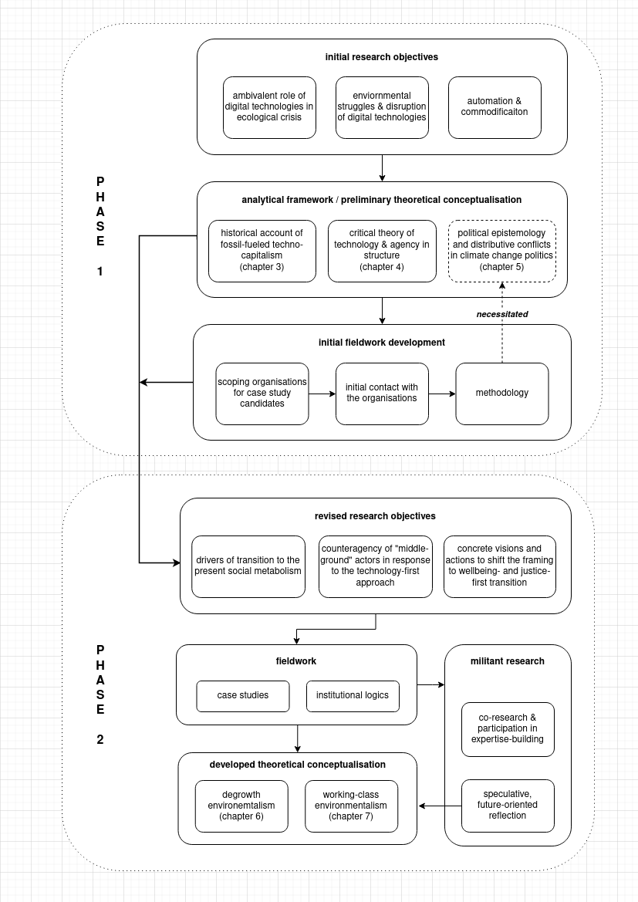

# Methodology

\minitoc

## Introduction: combining research approaches

The overall aim of the research for this thesis was to contribute to the understanding of whether the planetary technosphere can be politically steered toward a post-capitalist metabolism. I did so by looking to those organisations within capitalist societies that are neither governments, corporations, nor scientific bodies yet command some strategic capacity. By using environmental expertise, organising social constituencies, and developing practices and experiences of ecological transformation with them, they can disrupt the hegemonic framing of ecological modernisation that dominates in environmental politics. They have the capacity to push the collective action of societies into alternative directions, directions that do not rely primarily on technologies and markets but propose far-reaching economic, social, and political transformations to achieve socially just and environmentally safe futures for all.

The principal methodological approaches I used in conceptualising and analysing that strategic capacity were **iterative theory-building** and **embedded case studies**. These two approaches are complementary. The two case studies looked at the positions and actions of IPE and Unite and have focused my research on the substantive proposals of transformation they are advocating. However, looking only at agency from their perspective, a perspective I largely share, carried a methodological risk of leading to a voluntaristic assessment — one that would affirm their claims of transformative agency without bracketing it from a structural perspective. Therefore, I have bracketed their agency within an analysis of the constraining and enabling factors of the presently dominant industrial-capitalist social metabolism, the structures of the capitalist state, and the sustainability transition they need to undergo. Developing those analytical frameworks prior to my fieldwork thus enabled me to theorise the strategic agency of the "middle-ground" social actors in more general terms.

Case studies were done through fieldwork. While conducting fieldwork, I have sought to engage IPE and Unite in the spirit of **militant research**, attempting to directly support and amplify their counterproposals to the hegemonic ecological modernisation framing. This orientation toward the causes I share with the organisations primarily took the form of my participation in their research and expertise-building activities — through writing, dialogue, and organising work. Building on the direct engagement with the IPE and Unite, in the last step I have **speculatively reflected** on the challenges and opportunities their form of environmentalism, strategic agency, and interventions offer for the transformation of the fossil-fuelled industrial-capitalist social metabolism. These challenges and opportunities I analysed from the present conjuncture of climate action defined by the failing (trans/sub)national climate governance with its technology-first strategies and the parallel political defeats of the green new deal proponents.

The combination of these approaches — iterative theory-building, case studies, militant research, and speculative reflection — allowed my research to:

a) situate the first-hand accounts of strategic agency within technological, economic, and institutional factors that constraint and enable that agency;

b) extend the activist experience that initially motivated this research into an assessment of the future prospects of the proposals of these organisations;

c) navigate closeness and critical distance in supporting and analysing their work.

On that last point, the closeness in this research is also a reflection of the fact that it seeks to contribute to what it analyses — challenge to the hegemony of the technology-first approach. My research responds to the warnings of scientists that the already unfolding green technology transition, barring larger economic, political, and social transformations, might be insufficient to prevent a significant climate change and destabilisation of the biosphere. These warnings make interventions into the hegemony of the technology-first approach to steer environmental action into another direction necessary and urgent. For reasons of that necessity and urgency my research could not take a distanced view of the two organisations and the causes they advocate. However, analysing structurally and conjuncturally the present and future challenges they face could not be done only by directly engaging these organisations. Thus, to arrive at an adequate problem-setting of their strategic agency in the context of the technological, economic, and governance structures underlying the industrial-capitalist social metabolism required an indirect and iterative approach.

Over the following sections, I will detail the research process as it worked back and forth between the problem setting and my engagement with the two organisations to develop and refine the preliminary objectives, the fieldwork objectives, and the positionality of militant research. The final section is reserved for outlining how my research process has built trust with the organisations I engaged.


```{r echo=FALSE, fig.cap="Schema of iterative theory-building and methodological approaches in this thesis.", fig.scap="Methodology overview", out.width="100%"}


```


## Iterative theory-building

The back-and-forth in this research is based on the principles of iterative theory-building. In an iterative theory-building process, a preliminary theoretical conceptualisation and the initial cycle of empirical data gathering are used to reassess, redefine, and refine the research questions, analytical framework, and research strategies that are then taken into the next cycle of empirical research. Going back and forth between theory and empirical research, the process develops a new theory. According to the organisation researcher Kerssens-van Drongelen, iterative theory-building has the following two characteristics:

> - new theory is built during various research cycles, allowing for a (conscious) change in the research question if empirical material already gathered requires this; and
>
> - research strategies, data collection and analysis methods and tactics are selected based on the (changing) type of research questions and process phases. This often results in a combination of research strategies within one research project. [@kerssens-van_drongelen_iterative_2001, 510-511]

Such methodology is similar to the original inductive grounded theory [@glaser_discovery_2017], but greater importance is placed on the process of cycling back and forth between theorising and evidence-gathering [@orton_inductive_1997]. This back and forth is particularly suited for the development of new theory from first-hand, ethnographic accounts of a small sample of cases, as is the case in this thesis. As this thesis is building a theory of "middle-ground" social agency to shift the field of environmental action relying on an engagement with only two organisations, iterative theory-building was selected for that reason. As can be seen in *Figure 2.1*, the theory-building proceeded in two phases. In the first phase, the formulation of the historical, strategic and political-epistemic analytical framework, the selection of case study organisations, and the initial engagement with the primary and secondary publications documenting their work were used to revise the initial research objectives and recalibrate the analytical framing. In the second phase, during and after the completion of the fieldwork, the research resulted in a new theory that includes first-hand accounts of the organisations I engaged with in the fieldwork, as well as the future-oriented speculative reflections on the prospect of their strategies moving ahead.

Concretely, in the initial stages of research development, my theoretical conceptualisation focused on *digital technologies* and their ambivalent role in both accelerating ecological crisis and enabling agency and expertise that could overturn that acceleration. As I stated in my PhD proposal, the overall aim was:

> First, ...to theorise how digital technologies are helping drive the acceleration of global material and energy flows that is the hallmark of the Capitalocene. Second, ... to empirically examine how they, at the same time, open up space for the collective agency of social movements, communities of expertise and interest groups — allowing them to affirmatively disrupt and steer technological change toward a more equitable and sustainable post-capitalist social metabolism.

The research objectives derived from this aim were to hammer out, drawing on a variety of theoretical approaches, an analytical framework and apply it empirically on: "struggles around 1) environmental change and 2) automation of production in the context of 3) commodification of knowledge that shapes the availability of data, metrics and scientific knowledge".

As I began to engage with the existing literature to hammer out that analytical framework and to establish communication with the organisations I intended to conduct my research with, I have decided to shift the focus of my conceptualisation away from the ambivalent role of digital technologies *toward technologies and energy systems that are more fundamental to industrial-capitalist social metabolism*. The reason for this shift was that digital technologies are indeed the globally leading technological sector in terms of market valuations, investments in R&D, and the coordination of global economic flows. However, they are entangled with other more polluting and older sociotechnical infrastructures that are inert to transformation. The underlying energy and production systems typically have greater footprints and are pivotal for manufacture, food production, transport, heating and cooling, construction, and warfare. The role of these underlying systems thus merited greater attention than digital technologies to analyse the industrial-capitalist social metabolism.

## Reformulating research objectives

This shift resulted in a reformulation of my **first initial research objective**, with which I now aimed at providing an analysis of how we have arrived at the present social metabolism and the challenge it sets for future transitions in terms of path dependence, structural impediments, and global governance structures. Accordingly, the initial part of the theoretical conceptualisation, which I develop in chapter 3, proposes a historical frame of analysis, pointing to the transitional processes in the origins and subsequent development of fossil capitalism. The argument I make in chapter 3 denaturalises the notion that the presently dominant industrial-capitalist social metabolism has simply evolved through technological progress. I resort to *environmental history*, *ecological Marxism*, and *sociometabolic analysis* to show that it was an interplay of antagonistic class relations, environmental affordances, and contingent moments in history that have led to the accelerated technological modernisation process. Once that developmental path consolidated toward the end of the 19th century, technologies became a more dominant social force and have in the 20th century resulted in a global fossil-fuelled energy system, built around an increasing energy demand, inefficiencies of scale, and militarised geopolitical governance.

I do not provide a comprehensive history but outline a trajectory relevant for this thesis. I draw out materially, institutionally, and epistemically formative points along that trajectory. My inquiry is thus partly genealogical in its approach to history [@foucault_nietzsche_1977, 139]. As a bridge to the theoretical analysis in chapter 4, it provides historical evidence that the transitions can be driven by disruptive organised power from below, but also that such agency is conditioned by the accrued scale of fossil fuel technologies and attendant capitalist social metabolism.

My **second initial research objective** was to investigate the processes of automation and technology-driven commodification. However, with the shift from digital technologies to larger polluting energy and technology systems, I needed to reconceptualise the process of automation and the replacement of human labour with machines from an environmental viewpoint. My reconceptualisation drew on two insights. Firstly, inducing from the analysis of the historical consolidation of industrial-capitalist social metabolism in chapter 3, technological development could be theorised as a social process where technological choices reflect the relative power of various social actors that develop, regulate, and use technologies. To give an example, the energy transition away from coal in the UK was a disruptive political decision that has led to the decimation of large labour bases and the waning of organised labour's historical disruptive power. Energy transitions could thus be understood as waves of replacement of labour and its disruptive power in one sector with technologies in another sector. Secondly, my survey of literature on technology and degrowth led me to the work of the human geographer Alf Hornborg, who posits that asymmetries of power are created and reproduced by technologies. Namely, the anthropological function of technologies is to unload the sociometabolic labour onto other people, animals, or the rest of nature [@hornborg_global_2016]. In an interconnected capitalist world-system, technologies are used to relocate work to places where the workforce is cheaper and nature less protected, creating unequal ecological exchanges in and between societies [@hornborg_ecological_2014].

These insights on how technology and energy systems enable and reinforce social and biophysical domination led me to turn the perspective of the second objective on its head and look at the anti-dominative collective action aimed at these systems. My objective now was to develop an understanding of whether *social actors can be catalysts of technological and sociometabolic change* and give direction to such transitions toward socially just and environmentally sustainable futures. This objective is dealt with in chapter 4, where I develop a model from *theories of agency and structure*, *science and technology studies*, and *strategic-relational approach* that indicate how agency is conditioned and enabled by social structures, how it is constrained by the attained scale of interlocking technological systems, and how technological change itself is a social process. Within that analytical framework, the chapter develops a structural account of disruptive strategic agency, which is then refined from a perspective of framing struggles and organising around distributive conflicts in chapter 5.

Finally, the shift away from digital technologies left my **third initial research objective** concerning knowledge production to be addressed. As I began my fieldwork posting at IPE and began to receive primary publications from Unite, it became evident that both knowledge production and expertise-building were essential to how these organisations operated to affect change. These organisations, although neither scientific nor policymaking bodies, and operating between the (trans/sub)national climate governance and their social constituencies (thus operating in what I define as the social "middle ground"), develop research and expertise of their own to translate environmental science into the lived reality of their constituencies and that lived reality into environmental action. They actively produce knowledge, epistemic tools, and public arguments on why alternative pathways to both socially just and ecologically sustainable futures are needed and how they can be achieved timely. This realisation necessitated that I analyse the context of knowledge production and governance around climate change as a *political epistemology* that developed since the late 1980s within the global liberal order and laid the foundations of an institutional field in which various climate actors operate, including the "middle-ground" actors. Thus, in chapter 5, I ground climate change politics in *institutional logics theory* [@friedland_bringing_1991; @ansari_constructing_2013] and the epistemic positionality of social actors such as IPE and Unite in *post-normal science theory* [@funtowicz_post-normal_2001]. These two theoretical approaches elucidate, on the one hand, the larger organisation-field dynamics in the construction of the legitimating framing of global collective action to mitigate climate change and, on the other, why the urgency, scale, and social consequences of that global collective action require the participation of social constituencies whose material interests and ideational resources are at stake in climate (in)action. Namely, the "middle-ground" actors work with these constituencies to develop prefigurative practices and experiences of ecological transformation, articulating them from the perspective of distributive conflicts.

## Selecting organisations for fieldwork

The first phase of theory-building and the reformulation of the overall research goal allowed me to adjust the selection of organisations for my fieldwork. From the moment I started developing my PhD research proposal, it was clear that I would continue to develop my collaboration with IPE and that I could quickly negotiate a modality to tightly integrate my research within their research and educational efforts. The shift away from digital technologies benefitted that planned engagement, as IPE's work pivots around comprehensive transformations of social metabolisms — including their technological foundations. However, it also led me to conclude that for my second fieldwork I needed to engage with an industrial trade union that has a strong presence in polluting sectors such as transport, manufacturing, and energy, as well as a trade union that espouses an environmentally progressive green new deal agenda, whose political proponents in the US and the UK at the time were contending for the highest offices of power. The selection of these two organisations also allowed me to formulate my third, fieldwork-oriented objective, asking how the pro-environmental "middle-ground" organisations concretely envision and work to advance a frame of collective action to steer toward alternative sociotechnical and sociometabolic pathways and what the future potentials and prospects are of those proposals.

My selection was motivated by a number of characteristics that define these organisations. They build on two different forms of environmentalism that are typically conceived as opposing and conflicting: on the one side, the social-movement environmentalism rooted purportedly in "post-materialist" values [@inglehart_silent_2015], although in the case of degrowth concerned with social metabolism and grounded in the realistic acceptance of limitations of Earth's bioregenerative capacities; on the other, the working-class environmentalism rooted purportedly in "materialist" concerns over health and safety of the workplace, although concerned equally with the larger, now planetary ecological harms to the working-class communities and environmental stability of the economy. Engaging two contrasting environmentalisms and two organisations rooted in them provided me with an opportunity to offer a more nuanced account of how the two environmentalisms necessarily need to work together in the future to tackle, as I will claim in chapter 7, a unitary ecological crisis. The two organisations also take contrasting positions on the ecological modernisation framing: as I will show, IPE is directly critical of ecological modernisation, calling instead for a comprehensive sociometabolic transformation; Unite is conversely subscribing to some technological but few of the market underpinnings of ecological modernisation.

Alongside these contrasts in the type of environmentalism, there are apparent contrasts in the organisational form and the mode of operation between the two. Unite is the largest industrial trade union in one of the central countries of European capitalism (Brexit notwithstanding), affiliated to the largest oppositional party, and a participant in various industrial bargaining, national consultation, and advocacy processes. IPE is a small research and educational unit working from a post-socialist European semiperiphery, but with the capacity to participate both in the national and international environmental agenda-setting and with various activities with different constituencies in the Eastern Europe. These two organisations thus present two very different entry points to explore the strategic agency of "middle ground" organisations: one commanding a disruptive power of mass union membership and attendant bargaining power; the other primarily oriented toward framing struggles and local communities, social movements, and emerging political actors.

These complementarities and contrasts have allowed me to apply the analytical frameworks that I have developed through the conceptualisation onto two different contexts, exploring the frameworks' generalisability. However, this initial sample and the framework can be, in future research, extended in multiple ways that I explore in the last chapter (see section 8.5).

## Conducting a multimethod fieldwork

My fieldwork with IPE and Unite was conducted by combining qualitative, interpretivist, and inductivist case study strategies to gather findings needed for a cross-case comparison of their positions and actions in their larger environmental, social, and geo-economic contexts. As an *embedded two-case case study*, my inquiry draws on the strengths of case study methods to collect "multiple sources of evidence, with data needing to converge in a triangulating fashion, ... benefit[ting] from the prior development of theoretical propositions to guide data collection and analysis" [@yin_case_2003, 13-14]. The principal methods I used in conducting my case studies were the analysis of primary and secondary publications and documents, participant observation, and semi-structured interviews. The interview questionnaires were developed in the first phase of research, drawing on the preliminary theoretical conceptualisation and the analysis of primary and secondary publications related to the work of these organisations, and then refined in the fieldwork.

In developing my argument on frame-shifting and expertise-building as significant elements of the disruptive strategic agency in response to the ecological modernisation framing, I benefitted from the *institutional logics perspective* developed within the field of organisational theory. This approach seeks to analyse institutional orders (e.g. capitalism, state bureaucracy, and democracy) as patterns of activity "rooted in material practices and symbolic systems by which individuals and organisations produce and reproduce their material lives and render their experiences meaningful" [@thornton_institutional_2008, 101]. The central logic of each order "guides its organising principles and provides social actors with vocabularies of motive and a sense of self" [ibid.; see also @friedland_bringing_1991]. Crucially for my research, ecological modernisation establishes a hybrid logic, combining technology, science, state, and markets, to frame the problem of climate action [@ansari_constructing_2013, see also section 5.2]. This field-level logic is subject to a social process of construction, negotiation and antagonism. IPE and Unite contest that field-level framing by articulating alternative framings, trying to open up a strategic terrain to shift the logics legitimating and guiding climate action. I analysed the significance of these strategic interventions in legitimating narratives inductively from statements and actions of the two organisations [@reay_qualitatively_2016], feeding back into my conceptualisation of a political epistemology of climate governance (see chapter 5).

Beyond these case-study methods, a fundamental aspect of my fieldwork was to allow me to contribute to the cause of these organisations through my participation in their expertise-building activities. Entry points into this participation were my earlier experiences of organising with environmental groups and trade unions (see section 1.3), as well as my exchanges with such organisations, where I was asked to contribute my research on technological change to the analysis that they continuously pursue to understand their own strategic terrain. While this thesis is being developed in a formal academic context, with the requirement of a contribution to disciplinary knowledge, its orientation is likewise moulded on the aspiration to ally with the work of the actors that are "objects" of study. The thesis thus pushes in two directions. It contributes to how social theory can better conceive of the strategic capacity of "middle-ground" organisations in environmental action. However, it also seeks to contribute directly to their cause and their work on producing research, disseminating knowledge, and developing practices with their constituencies.

## Positionality: militant research

This double orientation is a common feature of various forms of militant research — ranging from worker's inquiry, over participatory action research, to feminist standpoint research [@haier_workers_2013; @mctaggart_principles_1991; @harding_feminism_1987; @naples_feminist_2007]. Militant research is committed to critically fleshing out the extant relations of domination while directly augmenting the agency of groups that are subjected to or contest that domination. It reflects critically on the neutrality and objectivity of scholarly knowledge, as these precepts are normative transpositions of codified material practices of research in the institutionalised science, structured by research formats (including the long-form thesis), the scholarly publishing system, attendant peer-review procedures, hierarchies of authority, funding-body policies, institutions' economic priorities, and other processes that sediment asymmetries of power within the academic knowledge production system. Militant research, on the contrary, is from the outset explicitly partisan. It constructs situations where objects of research are transformed into subjects of the research process. This reversal helps militant research to both document situated knowledges and to contribute to the practices of the groups studied. As the radical geographer Bertie Russel — reflecting on her research within the UK climate movement — contends, the purpose of such orientation is transforming research into an "art of producing tools you can fight with" [@russell_activismacademia_2015].

The Argentinian theory action group Colectivo Situaciones suggests that a starting point for militant research is the *creation of an encounter*, a situation that gathers participating actors and their differences around a shared problem, elaborating a common plane from which struggles can "read themselves", produce knowledge from within the situation, and integrate knowledges from other social practices [@colectivo_situaciones_researcher-militant_2003; see also @colectivo_situaciones_something_2005]. It is a compositional process in which the matter of research is not given but produced, a process in which the research supports, organises, and empowers political practices. The ultimate objective of such militant research is "establishing compositions that endow with *potencia* the quests and elements of alternative sociability" [@colectivo_situaciones_researcher-militant_2003]. Ostensibly, my research aspires to much less, as it is nested in collaboration with organisations that already have an established mode of operation, and unlike the work of Colectivo Situaciones, it is still conducted partly within the academic institutional remit. Nevertheless, the inquiry in this thesis was defined by an encounter, a process of learning and transformation of objectives that resulted from the standpoint of the organisatiosn that I have engaged in this research. It was also oriented toward creating openings for the construction of new avenues of analysis and an analysis of new avenues of action emerging from their work. And lastly, it is directed by the quest to contribute, in modest ways, to building alternative, justice-oriented pathways within uncertain climate futures.

The risk with militant research is that it reduces its objective of creating new knowledge and collective action to a mere echoing of the positions the researcher is engaging with as face-value truth claims [@frideres_participatory_1992]. In this thesis, however, I am engaging with organisations that have their own research agendas to interpret the framing of the field of environmental action they operate in. This makes the encounter of our two approaches not one of the different competencies of a would-be theorist bringing authority to help practitioners in producing "tools you can fight with", nor one of the different levels of analysis as these practitioners themselves are analysing and gauging the organisation-field dynamics in which they operate. It is rather one of a subtle difference in the focus of research — as mine places emphasis on the structural challenges and opportunities that technologies, the capitalist state, and distributive conflicts present for IPE and Unite's proposals. For this subtle difference in focus to benefit both my analysis and my contribution to their work, I have chosen to develop a provisional theoretical conceptualisation and analytical frameworks for understanding their agency prior to engaging them. This is not typical for participatory and collaborative research. However, working out my own frameworks for understanding the challenges that a technology-first approach poses and the opportunities that the terrain of environmental action affords allowed me to build a vantage point for my fieldwork. By taking my own preliminary historical, structural, and political-epistemic analysis into the fieldwork with IPE and Unite, I could provide these organisations with a perspective that is differentiated out from theirs but also transform that preliminary conceptualisation in the encounter with these organisations.

I was able to implement this approach only partially. With IPE I managed to agree and pursue a number of activities in support of their research, expertise-building, and public outreach. I participated in the development of their Degrowth Doughnut [@ipe_degrowth_2019], championed the model in my public talks, contributed in a minor role to their academic publications based on it [@domazet_degrowth_2020], lead-authored a chapter on "Degrowth" for the *Encyclopedia of the World's Biomes* [-@medak_degrowth_2020], translated texts on degrowth and green new deal for their website, and participated in organising research meetings and public activities of the organisation.[^2.2] Part of that work found its way into this thesis, serving as the basis for an account of degrowth environmentalism (see chapter 6).

However, it was not possible to arrange a tightly-integrated process of collaboration with Unite in the same way. My initial attempt to establish access to Unite did not succeed. It was only in my second attempt that I managed to detect an interlocutor in the Unite with whom I immediately established a collaborative rapport. That contact provided me with primary documents, and we arranged an interview and started planning my future participation in the environmental activities of Unite. This was in the autumn of 2019, briefly before the onset of the COVID-19 pandemic, which suspended all in-person activities for a while, placed additional pressure on trade unions to buffer the fallout of the crisis on their members, and led me to suspend my research for half a year. These events necessitated that I take a different approach. Therefore, the chapter based on the initial elements of the case study conducted with Unite was adapted to account for the environmental vulnerability of the working class (of which the COVID-19 crisis is an example) and to account for the prospects of working-class environmentalism in the wake of Brexit, the COVID-19 pandemic, and the defeats of the green new deal proponents in the British parliamentary and US presidential elections — all significant developments that have occurred since I established initial communication with Unite.

The goal of theory-building in this thesis is not exhausted in the research effort to find the evidence in support of the initial hypothesis that the proponents of alternative pathways have the necessary strategic capacity to help shift climate action away from the ecological modernisation framing. Nor is it exhausted in denaturalising the techno-developmentalist doxa. My research goal is likewise to direct that theory of social change toward a mode of speculative reflection. Out of the engagement with IPE and Unite it teases out the potentials, challenges, and prospects that their environmentalisms and proposals face in the near future. Thus, by thinking through the circumstances that urgently necessitate alternatives to technology-first strategies, which place seemingly insurmountable political obstacles in front of these alternatives, I am engaging in speculative thinking about what can be done beyond what might be immediately plausible. Thereby, I am following through a commitment to the cause of urgent action to enable such futures. The feminist science and technology scholar María Puig Della Bellacasa suggests that:

> engaged speculative responses are situated by what appears as a problem to standpoints/visions resulting from practical commitments and inheritances. We become susceptible to be affected by some issues and not others. As such, situated responses to a problem affect a production of collective subjectivity and political consciousness. [@puig_de_la_bellacasa_touching_2009, 307]

The concluding parts of both case study chapters tackle the problem resulting from my practical commitments to the causes of IPE and Unite. The thesis offers readings of an unfavourable political conjuncture where these environmentalisms and their proposals continue to be necessary and urgent: in chapter 6 a speculative reflection on degrowth's potential as a new political imaginary and a transformative combination of real-utopian proposals [@wright_real_2011], whereas in chapter 7 a speculative analysis of the post-green new deal political terrain indicating the need for social-movement environmentalism to help re-build the disruptive power of the labour movement and the need for the trade unionism to embrace more radical, community-oriented proposals of transition.

## Ethics

The research process for this thesis has followed Coventry University's guidelines that are designed to safeguard that research upholds the highest ethical standards, research integrity, and inviolability of participants [@coventry_university_research_]. However, fostering substantive and mutually sustaining collaborative rapports with organisations through fieldwork also requires trust-building, accountability, and commitment beyond formal procedures. Breaking down the fieldwork in this thesis into the four steps — getting in, getting on, getting out, and getting back — that @buchanan_getting_1988 have proposed as a shorthand for engaging organisations and their members in research, these are the steps I have taken to foster trust and mutuality:

**1. Getting in**: Access to IPE I had established already through earlier collaborations, including personal acquaintance with several of its members. With IPE's research lead I have agreed on the modalities of my engagement (participant observation, participation in their research on Degrowth Doughnut, contribution to their organising work) a year prior to fieldwork. The access to the organisation and its associates I have agreed on with the organisation's managing director. Access to Unite took me two attempts to establish, and I was helped through my friends in the Croatian labour movement who had previously interned at Unite and had recommended the head of education as a contact. This led to a welcoming exchange that provided me with initial information, primary documents, and an interlocutor through whom I could conduct my two semi-structured interviews (one was received in writing from another collaborator of Unite, specialising in environmentalism). In approaching both organisations, I have explained the purposes and intents of my research, as well as the desire to engage in an exchange over common issues for my research and their work.

**2. Getting on**: to gain trust and conduct participant observation within IPE, I have worked, for a period of time, in their Zagreb offices. However, most of my contribution unfolded through the meetings, texts, and interfaces used to develop their doughnut model. With Unite, conversely, due to the intervening COVID-19 pandemic, I chose to set up my engagement in a different way, primarily by developing reflections on trade-union strategies after the political defeats of the green new deal proponents, seeking to contribute to their strategic analysis of the situation in the present conjuncture. With members of both organisations I have conducted semi-structured interviews based on my theoretical conceptualisation and the analysis of primary and secondary documents on their organisations. The interviews were conducted respecting ethical norms — interviewees were provided with a participant information sheet in advance, including data retention, privacy and the right of withdrawal provisions, as well as with the questionnaire itself. My primary contact in Unite used the questionnaire to source written answers from a Unite's environmental expert, thus providing me with two interviews. In the interviews I always left ample opportunity for an open discussion and explicitly asked the interviewees to respond to questions I did not ask and to assess the interview and my involvement with their organisations. In the interviews I asked participants (all of whom bar one have leading roles in their organisations) about the specific positions and actions of their organisation, not their own, as this was the focus of research, thus limiting their personal exposure.

**3. Getting out and getting back**: as I wrote up chapter 6, which is based on my fieldwork with IPE, I provided three of my interlocutors with the draft chapters to receive their authorisation and feedback. They voiced their approval of the selection of included materials from the interviews and the general account of their organisation's work. Since the fieldwork was completed, we have continued collaborating on an on-and-off basis, but much of our spare time efforts went into the political work that was described in the Introduction (see section 1.3). With Unite, as of this writing, I am exploring an appropriate occasion to organise an exchange where I could present my thoughts on the future prospects of environmental trade unionism given the defeat of green-new-deal proponents and a renewed domination of market-driven technology-first approaches.


[^2.2]: Concretely, this includes a talk on "Modeling the Climate" at King's College (London) in March of 2019, a presentation on "Technology and Ecology" within IPE's series of talks in KNAP (Zagreb) in May of 2019, and the translation into Croatian for IPE's website of Giorgos Kallis's "A Green New Deal Must Not Be Tied to Economic Growth" (https://ipe.hr/rasprave/giorgos-kallis-green-new-deal-ne-smije-biti-vezan-uz-ekonomski-rast/).
