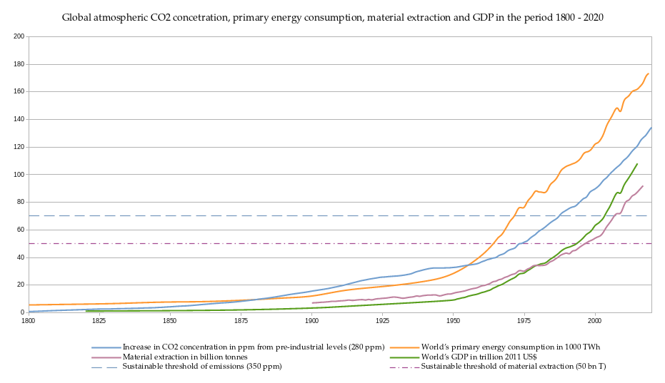

#  History of fossil-fuelled industrial capitalism

\minitoc

## Energy transitions: technological or social?

In this chapter I intend to bring together various disciplinary perspectives — including environmental history, historical materialism, and sociometabolic analysis — to weave a historical account of the alternating primacy of technological change, structures of the capitalist state, and social antagonism (primarily, class struggle) in the transitions that have led to the consolidation of the fossil-fuelled industrial-capitalist social metabolism. These different disciplinary perspectives give more weight to one or the other aspect of these transitions: environmental history to the reproduction of societies in nature, historical materialism to class and property relations, sociometabolic analysis to technological processes and material flows. Here I will provide a historical reading of the interplay between these factors, developing a genealogy of how the presently-dominant thermocapitalist metabolism emerged, what are its economic, regulatory, and institutional catalysts, and the challenges it presents for the efforts to transform it. To the catalysts and challenges resulting from that history I will return in the next chapter to conceptualise how the "disruptive" social actors can intervene in that sociometabolic regime and its future transformations.

Telling that history will help to circumscribe the impasse created by the hegemonic orientation of (trans/sub)national environmental governance toward technologies while ignoring the economic, political, and social transformations. Even when the science acknowledges that significant social and even systemic changes are necessary and urgent, the actual policy proposals are focusing narrowly on the restructuring of the present technological base supported by carbon markets. The primary objective of this thesis is to conceptualise and examine the ways in which the environmental groups and trade unions — as "middle-ground" actors situated between the (trans/sub)national governance and social constituencies — can act against the hegemony of that policy approach and intervene into its legitimating framing of ecological modernisation, thereby contributing to a more timely shift away from the present metabolism and toward more sustainable, more just, and more plural social worlds. But before I go there, let us first discuss the road that has led to the current predicament.

Apart from the nuclear arms race, since WWII no other threat than the climate crisis has rattled more on the belief that technological modernisation necessarily leads to social progress. As the prospects of planetary environmental destabilisation are increasingly becoming tangible, there is widespread grief over the loss of human safety, biodiversity, and ecosystems [@cunsolo_ecological_2018] and anxiety over how societies will tackle climate change [@clayton_climate_2020]. Those apprehensive reactions are not unwarranted: more than three decades have passed since the climatologist James E. Hansen warned US decision-makers that the rising global temperatures are a consequence of anthropogenic greenhouse gas emissions. Yet little has been done. As can be seen from *Figure 3.1*, since that Congressional hearing in the scorching summer of 1988, the continued burning of fossil fuels has put more CO<sub>2</sub> into the atmosphere than it did between 1800 and 1988 [@boden_global_2017]. The world's yearly cumulative CO<sub>2</sub> emissions have almost doubled [@climate_watch_historical_2018], while the observed average global temperature has risen by 1.09°C compared to the pre-industrial period [@ipcc_summary_2021]. Over the last decade, the yearly emissions have hovered around 40GtC0<sub>2e</sub>, with a 7% drop for the pandemic year 2020 and a rebound in 2021 [@friedlingstein_global_2020; @friedlingstein_global_2021], leaving the world a budget of around 440GtC0<sub>2e</sub>, or effectively a decade of current emissions, for a 33-67% chance to limit the warming in this century to 1.5°C [@matthews_integrated_2021]. A daunting task. In fact, without radical decarbonisation, the global temperature will keep rising well beyond the benchmark year 2100 [@lyon_climate_2021], as it will take centuries for Earth's natural sinks to absorb the greenhouse gases resulting primarily from the burning of fossil fuels.


```{r echo=FALSE, fig.cap="Historical growth of CO2 concentrations, primary energy consumption, material extraction, and GDP. Sources: material extraction — UN International Resource Panel and Krausman et al. 2009; historical and observed CO2 emissions — CO2 Earth; primary energy consumption and GDP growth — Our Wolrd in Data; sustainable threshold of emissions — 350.org; sustainable threshold of material exctraction — Bringezu (2015).", fig.scap="Historical emissions, energy consumption, material extraction, and GDP", out.width="100%"}


```

While the effects might be long-lasting, the window for collective action to keep not only atmospheric greenhouse gas concentrations but also Earth's other biophysical processes such as biodiversity and phosphorus and nitrogen cycles within the boundaries of what is considered a "safe operating space for humanity" [@rockstrom_planetary_2009] is counted in years and decades. As of November 2021, both the pledges and the more concrete nationally determined contributions (NDCs) by the signatories of the 2015 Paris Climate Agreement have set the world on a path of global temperature rise that will, by the end of this century, go well beyond the targeted 1.5°C above the pre-industrial levels [for the latest projections based on actual NDCs and policies, see @climate_action_tracker_cat_2021]. These NDCs are primarily pivoting around technological change, most of all on an energy transition away from fossil fuels, and are designed to avoid politically challenging interventions into the patterns of production, social needs, and redistribution of wealth, let alone into the larger-still patterns of intensive extraction from Earth's ecosystems. A notable role in these carbon-reduction scenarios is reserved for negative emission technologies [@anderson_trouble_2016]. These technologies, meant to capture and store existing and future atmospheric CO<sub>2</sub> emissions, have not yet reached maturity and, even if successfully developed, might never be deployed at the projected scale. Nevertheless, they are necessary to allow countries to legitimate their continued use of fossil fuels well into the 21st century until, so they pledge, renewables replace fossil fuels. Ironically, climate policies that are supposedly guided by political realism rely in these pledges on potentially unrealistic advances in technology. Be that as it may, a radical technological restructuring over the next decades seems inevitable. Either because the climate disruption unleashed by the continued use of fossil fuels will make large parts of the planet uninhabitable and will require significant societal and technological adaptation or because a planned and coordinated effort to exit from the fossil-fuel economy will make it so.

The main protagonist in these scenarios is thus technology. Technology serves both as the culprit and the saviour. And while climate change might have rattled the belief that technological modernisation is necessarily a progress in the right direction, technologies' central role in the public imaginary as a driver of social transformations has remained unchallenged. This techno-developmentalist worldview [@medak_technologies_2018] is grounded in the way the history of previous transitions is commonly perceived. For example, the canonical narratives of the Anthropocene [cf. @crutzen_anthropocene_2000; @steffen_anthropocene_2011] — the story of a geological age where the impact of human actions on Earth's subsystems has assumed planetary proportions — typically start with the Industrial Revolution, presided over by James Watt's invention of the steam engine with a separate condenser and the transition to coal as a primary source of energy. While climate scientists do not fail to note that there were larger societal changes underway around the period, they understandably zero in on energy bottlenecks that purportedly limited social development before the onset of the fossil-fuel era. This functionalist approach allows scientists to focus on the narrower problem of greenhouse gas emissions. However, that does not set the historical record straight. Thus, to complicate the centrality that is allotted to technologies in the processes of historical change, in this chapter I will scrutinise the trajectory of past energy transitions, starting with the transition to coal and then to oil, to claim that the processes other than technological change catalysed significant aspects of the capitalist social metabolism.

The urgency of climate change enjoins us to look at how the historical processes of energy transitions actually unfolded. A lot is at risk in the coming decades and centuries if the technology-first approach proves to have been too inadequate and too untimely to prevent the worst consequences of climate destabilisation. Against the technology-first approach of policymakers, the following sections seek to ascertain that such *transitions cannot be reduced to the replacement of dominant technological and energy systems but entail and require changes in social, economic, and political relations* [similar point is also made by @podobnik_global_2008]. This is particularly the case if these changes have to be directed against the existing cheap, abundant, and locked-in energy systems and if the significant reductions in existing forms of energy use are necessary to safeguard an ecologically livable and socially just future. By looking at both social and technological processes at play in the transition to "fossil capitalism" [@altvater_social_2007], at how they structured each other while transforming the ways in which the society harnesses energy and metabolises matter, I will argue that we can arrive at a better understanding of what were the multivariate processes of historical causation in the transition to fossil fuels. The salient point in my argument is that the relative weight of technological development, environment, social structure, and social agency changed over time as innovations, institutions, environmental degradation, and class antagonism impinged on each other.

Foundational for the interplay of these factors is the emergence of capitalism as a social formation. Starting from the positions of those historians who maintain that capitalism originated prior to industrialisation and the industrial use of fossil fuels, I will establish *three defining aspects of capitalist formation that developed in relation to energy transitions*. Firstly, the transitions to first coal and then oil have cemented the central features of capitalism — the separation of workers from the means of subsistence and the commodification of non-human nature, a process that started before the Industrial Revolution. Secondly, the growth dynamic achieved by emerging industrial capitalism could not be sustained without the continued colonial appropriation of human labour and land, which later consolidated into a neo-imperial world-system predicated on unequal exchange. Thirdly, the global expansion of capitalist social relations would not have been possible without fossil-fuelled technologies, just as fossil-fuelled technologies are not dissociable from the global expansion of capitalist social relations, resulting in a spiral of economic growth, expanding frontierism, and the extraction of energy and matter (to that spiral I return in section 7.2).

While this chapter outlines the historical interplay that has led to the formation of fossil-fuelled techno-capitalism, in the next chapter I will put forward a model to understand the lock-ins of the industrial capitalist social metabolism and strategic capacity of environmental groups and trade unions to disrupt and intervene into sociometabolic regimes in a way that is not limited to *power from above* — (i.e., actions of governments, (trans/sub)national governance structures, or capitalist enterprises) — but equally includes disruptive *power from below* [@piven_can_2008] — i.e., actions of organised labour, activists, scientists, educators or, simply, users.


## The transition to capitalism and the subsumption of nature

### Capitalism before industrialisation

Prior to the onset of industrialisation, larger changes were apace that set the stage for the transition to capitalism. Capitalism in Europe emerged under a number of enabling circumstances: stabilisation of borders inside the post-Westphalian Europe with the attendant imperial frontierism and plunder outside of Europe [@mezzadra_border_2013]; integration of national markets and expansion of overseas trade; mutual lockout between the Habsburg and Ottoman empires giving way to the Dutch and British hegemony [@anievas_how_2015]; waning power of the Church, growing Enlightenment, rationalisation, and development of science; consolidation of individual and private property rights. However, capitalism as a historically specific mode of production did not evolve out of these circumstances.[^3.1] Rather, as political economists Maurice Dobb [-@dobb_studies_1947], Robert Brenner [-@brenner_origins_1977], and Ellen Meiksins Wood [-@meiksins_wood_origin_2002] have argued in the seminal "transition debate" [@sweezy_transition_1978; @laibman_modes_1984], capitalism originated out of the specific property and class relations in the British countryside.

In the period 1350-1500, as a consequence of bubonic plague and peasant revolts, labour across Europe became scarce. Its value rose manifold, as did its access to feudal land. The shortage of labour and the growing power of labourers weakened the coercive power of feudalism, ending serfdom in many corners of Europe, and drastically improving the lives of the agricultural and urban proletariat [@marx_capital_1867, 666ff; @federici_caliban_2004, 44]. Yet, by the end of that period, a backlash of repression and enclosures against the peasants overturned that process [@federici_caliban_2004, 68ff; @hickel_less_2021, 39ff]. Specifically in Britain, by the 16th century aristocracy was demilitarised and commanded a limited coercive power to extract surpluses from their tenants compared to its continental counterparts. However, it held a large proportion of land, made increasingly scarce for peasants by enclosures. Peasants now had to compete with each other for access to land, motivating the landlords to lease the land on a shorter-term leasehold basis. Variable rents, in turn, compelled farmers to work on increasing the productivity of land not to be outbid by competing farmers. This had the effect of pushing out the less successful from land, hence creating a class hierarchy between landholder rentiers, small agricultural entrepreneurs, and landless proletariat.

In the 17th and 18th centuries, this process generated a mutually reinforcing dynamic of growing agricultural productivity and growing demand for traded agricultural products that the landless proletariat depended on for its subsistence. The distinctive character of these emerging market relations regulating land, labour, and commodities was that their development was not grounded in the opportunity to buy cheaply and sell dearly as was the commerce hitherto. This was rather "a type of market with no historical precedent" [@meiksins_wood_origin_2002, 102-103], grounded in the dependence of large strata of society on the products in the market for their subsistence. Additionally, this process spawned a reserve army of labour that had no access to land and depended for its survival on selling its labour-power, a key pre-condition for the ensuing development of industrial capitalism.

The separation of landless peasants from the means of production portended a larger shift in the forms of social domination in the transition to capitalism, a shift from the personal power of the feudal lord over his subjects to the impersonal power of the market mechanisms over all social actors [@heinrich_introduction_2012, 203f]. Direct domination was supplanted by indirect domination through the ownership over the means of production, including land and tools, that landless peasants found themselves disappropriated of. Accumulation by dispossession and violence would thereby not disappear from the stage of history, nor the direct domination (or even ownership over people), but once separated from land and tools, the growing proletariat was set free, or rather had no choice but to seek waged-employment to survive.

### Social metabolism of agrarian societies

Before industrialisation, the principal sources of energy were animal labour (including human), wind, water, and biomass. Clearing of natural vegetation, planting of staple crops, and improvement of farming techniques allowed peasants to actively utilise solar energy and increase the carrying capacity of land, the productivity of human and animal labour, and crop yields. Before the onset of industrial capitalism, agrarian societies in Europe were drawing around 40-70GJ of energy and 3-6t of materials per capita per year [@krausmann_global_2008]. Such "agrarian mode of subsistence" [@sieferle_subterranean_2001], though, did not allow for sustained long-term growth. Consecutive poor harvests would occur, soils would deplete, and local ecosystems would destabilise, generating diseconomies in the amount of labour that had to be invested in securing food and, in return, creating pressures on human wellbeing. Hence, agrarian economies tended toward stationary states [@sieferle_subterranean_2001, 191ff]. The capacity to utilise solar energy, the improvement of productivity of land, and the availability of mineral resources were limited, so the principal approach was conservation and reuse that maximised frequently scarce and intermittent resources.

Agrarian capitalism brought significant pressures on the environment. With the onset of commodity production, the monocropping techniques oriented at increasing crop yields, as well as the growing geographic distancing between where food is produced and where it is consumed, created a metabolic rift in the cycle of nutrients first observed by Justus von Liebig [@foster_ecological_2011]. This rift had to be compensated for by adding increasing amounts of fertiliser brought from elsewhere, such as guano, whose fertilising properties were discovered in 1802 by Alexander von Humbolt in Peru, leading later in the century to a trans-continental trade in fossilised bird excrement [@cushman_guano_2013].

Similarly, the use of wood in furnaces for iron smelting, as well as for domestic use, led to large-scale deforestation, requiring that the use be strictly controlled. Amongst others by the introduction of wood theft laws, which the young Karl Marx famously wrote about for the *Rheinische Zeitung*. Rivers and streams were the motive power of early cotton mills, the first truly accumulative capitalist industry. Mills required that the water flows be harnessed by dams, leading to a transformation of riverine habitats and a collapse of fish populations that hitherto provided a staple in the subsistence diet for much of the population [@steinberg_earth_2002]. These physical and regulatory interventions were a continuation of the enclosure process that not only privatised the land but fenced off natural resources for particular uses while excluding others [@linebaugh_stop_2014], gradually transforming them to fit the needs of capitalist production — a process that could be analogised to Marx's notion of "formal subsumption" [@marx_capital_1867; @boyd_industrial_2001]. While these natural resources were being harnessed for production, they were still dominated by their geographically expansive and temporally intermittent profiles, thus limiting the patterns of intensive growth in extraction and accumulation. These limitations would only be overcome with the introduction of fossil fuels.

However, well into the 19th century the use of fossil fuels, of peat and coal, in Europe was largely for domestic use — heating and cooking — and was secondary to other sources of energy. At the height of the Dutch commercial power around 1650 peat peaked around 18% of primary energy use [@fischer-kowalski_sociometabolic_2014]. In Britain around 1700 coal stood only at 15% of primary energy use [@krausmann_socio-ecological_2008], its uptake driven primarily by deforestation. Even at the cusp of the Industrial Revolution in the 1830s, the domestic use accounted still for 46% of the overall coal consumption [@mitchell_british_1988; citation in @huber_energizing_2009].

In agrarian capitalism the human hand was guiding the plough and tilling the land, and thus the means of production depended directly on human labour. Another transformation was necessary for the system of impersonal domination to be consolidated: the replacement of human labour by mechanised tools powered by inanimate sources of energy [@huber_energizing_2009]. At a scale needed for sustained growth that capital accumulation necessitates, that was only made possible by the development of the factory system and of the much more powerful prime movers such as turbines and steam engines powered by water or coal. The separation from the means of production and the generalisation of wage labour was not complete until those technology and energy transitions took off. The increasingly cheap energy driving industrial machines and suppressing human labour was the prerequisite for sustained capital accumulation and the expansion of capitalism to the rest of the world.


## The transition to coal and the subsumption of energy

### The transition's prime mover: class struggle or technological change?

So far I have outlined changes in the structure of social relations and social metabolism in the transition to capitalism prior to industrialisation and the introduction of fossil fuels, highlighting specifically two distinctive features of this transition: the changing structural character of human labour and the subsumption of non-human nature to capitalist processes. Next, I will argue that *the ensuing transition to the industrial use of coal was not simply the result of technological innovations and coal's superiority as a source of energy, but of the interaction of class antagonism and technological change, and that the weight of causation shifted toward technologies as industrial development gathered pace*. Furthermore, I will contend that the transition to industrial capitalism and its much higher demand for energy and matter would not have been sustainable *without the colonial appropriation of labour and land that subsidised — both economically and ecologically — its development*.

Capitalism is a system of self-perpetuating growth. As it grows, it ingests ever-greater quantities of energy and matter to produce more and more commodified goods and services. For this cycle of compounding growth to become truly continuous and grow at ever-larger geographic and metabolic scales, it requires sources of energy much denser than animate force, wood, wind, or water. The conventional narrative has it that it was the steam engine and coal that broke that bottleneck, marking the historical onset of industrial capitalism or even capitalism proper. In that account, capitalism has organically emerged out of the development of productive forces, and it is the technological advances that continue to be the prime mover behind its development. The role of organised labour in this transition to fossil capitalism remains but a footnote in a history of great inventions, in some accounts even a wrongheaded outburst of Luddite retrogradism [@mokyr_political_1998]. On closer inspection, that is not entirely correct. As I will argue, focusing on examples of disruptive power from below (which I ground theoretically in section 7.3.1), organised labour played a catalysing role.

In his *Fossil Capital* [-@malm_fossil_2016], an extraordinary account of the origins of fossil capitalism in 19th century industrial Britain, Marxist ecologist Andreas Malm brings together a large body of evidence to show that the arrow of historic causation ran in the opposite direction of how the techno-determinist positions propose to view it. By remaining attentive to the social relations of production, Malm is able to discern what historiography [e.g. @sieferle_subterranean_2001] has remained largely blind to: that there was no actual energy bottleneck at the moment when coal became the dominant source of energy and that the rise of coal cannot simply be attributed to technological advances or specific spatio-temporal properties of coal. The cycle of self-perpetuating growth initially appeared in the cotton industry, making it the first properly capitalist industrial sector. However, at the end of the 18th century, the primary source of energy in British and even US cotton mills [@steinberg_earth_2002a] was neither wood nor coal — but water. The energy of streams and rivers, on which cotton mills were initially built, remained, in fact, more abundant, underutilised, efficient, and cheaper well after coal finally did become the dominant source of energy around 1835 [@malm_fossil_2016, ch. 5], almost fifty years after Watt's invention. So, why did coal — the energy of stock — prevail over water — the energy of flow — if not for the superiority of coal as an energy source and the steam engine as a motive power?

Malm's analysis attributes the transition of industrial production to coal to a confluence of three major factors. Most prominently, the emergence of the organised labour movement as a consequence of the increasingly integrated factory production. The actions of the emerging labour movement led to the repeal of the Combination Laws in 1824, the Factory Act of 1833, the Chartist general strike of 1842, and the Ten Hours Act of 1847. These struggles and gains, however, left the water-powered capital in the countryside in an inferior position compared to the coal-fired capital in towns that could draw on a large reserve army of labour to hire and fire. The growing power of organised labour to make demands and limit the drudgery of factory work thus has made coal a better proposition for the capitalist.

Unlike water, coal was not bound to a specific location and, as a resource, did not need to be managed as a commons. It was not subject to the intermittence of the natural cycles of rain and drought. Regardless of its higher price, it afforded the factory owners more flexibility to act against organised labour and to compete against other capitalists. Thus coal's "spatiotemporal profile", as a second factor, enabled capitalists to employ labour wherever and whenever it best suited their interests. Coal's capacity to abstract factory production from constraints of geography and weather made it ultimately more pliable to the process of accumulation, particularly as it enabled the development of rail and water transport. This pliability allowed capitalists to deploy machinery and automation to discipline the workers into an organisation of production that was fully apposite to the needs of capital. As Marx noted, "the labourer becomes a mere appendage to an already existing material condition of labour" [@marx_capital_1867, 389]. The shift from a merely formal to real subsumption of labour was thus accomplished.

Finally, the integration of coal into capitalist accumulation required that the energy source extraction itself becomes organised as a capitalist enterprise, extracted by the use of human labour, technologies, and energy — and thus that its supply be made controllable. Unlike the energy of the flow that depended on seasons, the energy of the stock could be actively explored, extracted, and produced to follow the market demand and the needs of what Malm calls "fossil capital". Fossil fuels thus enabled that energy itself becomes produced as a commodity and its production organised as an industrial capitalist enterprise. *The capitalist relations of production have thus made the real subsumption of fossil fuels a prerequisite for their future development*. Fossil capital and its exceptional importance in the reproduction of capitalist relations was hence unleashed onto the world.

In *Fossil Capital* Malm places class conflict, and not technological innovation or the superiority of an energy source, at the head of the transition to fossil fuels. Yet, as the capital adapts to the opposition and opts for technologies that undercut organised labour, the arrow of historical causation partly reverses. As I will argue in the next chapter, *the technology, amplified through the mechanisms of the capitalist market, assumes no longer merely a catalysing but a strongly determining role.* An increasingly specialised and semi-autonomous process of technological development arises, leading from the Gilded Age of great inventors to corporate R&D and publicly funded systems of techno-science, all partially separate from the relations of production in the factory [@fisk_working_2009; @braverman_labor_1998]. The ensuing flurry of inventions set the tone for the techno-determinist worldview that already Lewis Mumford [-@mumford_myth_1967] detected as an outgrowth of that shift in the 19th century, a worldview that reduces human development to a function of technological development and that seems to remain hegemonic until today. For that particular period, though, that techno-developmental worldview was not completely unwarranted: with the real subsumption accomplished and the technological development seemingly promising endless progress [@scranton_determinism_1995], technology did become a distinct and significant factor of the historical acceleration of social modernisation [@rosa_social_2013].


### Social metabolism of early industrial capitalism

The trajectory of fossil-fuelled industrial development unchained the social metabolism from the limits of the carrying capacity of a territory, agricultural productivity, and steady-state economy, leading to an exponential expansion in energy use and material extraction. The dispersed energy of solar flow was replaced by the concentrated energy of mineral stocks, now providing principal sources of energy for the production and circulation of commodities on which the satisfaction of social needs became dependent. Whilst the metabolic rates from modern energy carriers in the early industrialising countries around 1500 have been around 0.3 GJ/capita per year, by 1900 this rose to 85 GJ/capita per year [@fischer-kowalski_sociometabolic_2014]. Fossil-fuelled industrialisation radically transformed the environmental, geographic, and colonial aspects of capitalist social metabolism.

Firstly, it scaled up environmental impacts: the anthropogenic processes no longer entailed only a geographically-limited depletion of resources, such as forests, soils, or animal populations, but *now they attained indirect consequences at much larger scales through their wasteful side-effects such as air pollution, runoff of chemicals into soil, riverine and marine habitats, or inchoate greenhouse gas emissions*. The shift was from input-related to output-related impacts, creating pressures "on the regional and global absorptive capacity of natural ecosystems" [@krausmann_global_2008, 644]. Capitalism revealed its double character: as an economic system of self-perpetuating value creation and a metabolic system of inflows of resources and outflows of waste. While natural resources extracted as inputs for production are part of the economic process, the indirect consequences of their extraction, production and consumption are not. However, both internal and external impacts are the result of the economic rationality of investment, prices and profits that governs capitalist development [@altvater_controlling_2014], and for as long as the resource depletion or environmental degradation does not impact the conditions of production that rationality will tend to prevail (more on capitalist rationality in section 5.6, on external and internal nature in section 7.2).

Secondly, agrarian capitalism's immediate effect was the expulsion of landless peasants into the cities in search for work, who settled there amidst the squalor of housing, soot, and sewage effluents [@engels_condition_1892]. The expulsion of peasants from land combined with the fossil-fuelled industrialisation to create a dynamic of rapid urbanisation that persists to the present day. Over the course of the 19th century, the population of Manchester grew by a factor of seven, of London by a factor of five, with over half of England and Wales urbanising by 1860. In the United States, from 1790 to 1860 urban population expanded by a factor of thirty [@steinberg_earth_2002a]. *Rapid urbanisation and industrialisation created a new degraded ecosystem of cities whose impact now reverberated through a network of metabolic links far across an increasingly global territory*. Metabolic processes in the cities were transforming hinterlands without a historical precedent, a process William Cronon memorably documented in his environmental history of Chicago as *Nature's Metropolis* [-@cronon_natures_1992].

Thirdly, while industrial-capitalist social metabolism was marked by the transition from human labour as a prime mover to technologies fuelled by mineral sources of energy, personal domination continued to have a significant role in the metabolic viability of capitalist accumulation. Textiles were the first mass-produced capitalist commodity creating a growing demand for raw cotton. However, picking cotton in the fields was a labour-intensive process that could not be organised industrially. The shortage of labour in the New World colonies, once the Indigenous populations were decimated and the indentured slaves were freed to become farmers, combined with a growing demand for textiles to generate a pull factor for the slave trade with Western Africa. Slave labour in the Americas and colonial mercantilism in India subsidised the British industrial revolution with enormous transfers of cheap labour that would, if performed by settler populations or populations at home, have cost incomparably more. This amounted to a significant appropriation of embodied labour from Africa, the Americas, and India to the centre of the emerging capitalist world-system.

And it was also an appropriation of the productivity of land. To substitute with wool the cotton that Britain imported in 1830 would have required another 9.3 million hectares of pastures or almost 40% of its entire territory [@pomeranz_great_2000]. The growing demand for consumables such as sugar, tobacco, or coffee to keep the industrial populations fed and stimulated would have required additional cheap labour and land that were simply not be had in Britain. These imports were financed by exports of textiles and other industrial commodities, constituting an exchange between the zones with highly unequal values of labour and land, further made unequal by the imperial system of tariffs that effectively reduced India from a textile giant into a purveyor of cheap raw materials and importer of produced goods, consolidating within the emerging capitalist world-system a system of asymmetric economic and ecological unequal exchange [@emmanuel_unequal_1972; @hornborg_global_2012].

Unleashing an enormous wasting of human lives, the colonial conquest led to the "collapse of Indigenous ecologies" [@merchant_theoretical_1987]. It led to a reduction of diversity in ecosystems, the subsumption of agriculture to an industrial system of production, and a form of disciplining of labour whose methods would later be applied in the organisation of factories, laying the foundations for what Donna Haraway has proposed to call Plantationocene [@haraway_anthropocene_2015] — a geological age defined by colonial legacies and continued racialised accumulation that troubles the conventional narrative of the Anthropocene centring on the Old World [@yusoff_billion_2018] and modernity's fall from grace. *This dependence of capitalist metropolis on cheap labour and transformable habitats in the colony paved the way for the future neo-imperial economic order, whose legacies are still detectable in the "carbon colonialism" of offset trading that constitutes a pillar of ecological modernisation*.


## The transition to oil and the globalisation of growth

### The governance of growth and the institutional foreclosing of systemic change

In the previous section I have argued that the weight of causation shifted from class conflict to technology as the technological advances integrated with the capitalist economy into a system of industrial production and later assumed an increasingly autonomous character. In this section, focusing on the transition to oil, I will complicate that assertion and bring in another historically emerging element to bear on the energy transitions — economic and geopolitical governance — to elaborate on how the transition to oil catalysed many institutional and metabolic features of the contemporary neoliberal capitalism characterised by highly wasteful energy systems that present significant obstacles for creating another, more sustainable and just metabolism.

To qualify that assertion with which I finished the account of the transition to coal, the arrow of causation did not *lastingly* reverse in the opposite direction once fossil-fuelled industrialisation took off. Technologies, amplified through the capitalist competition, certainly became a more determining factor in social development, but the power of organised labour did not vanish under techno-capitalist domination. In fact, *the conditions of industrial production created a concentrated and skilled mass labour force, enabling the labour movement to gain in capacity to disrupt capitalist processes and significantly reshape the emerging industrial states* (more on this disruptive power in section 7.3.1). After the transition to coal in the 19th century, the labour movement strategically used the chokepoints of fossil capitalism — coal mines, railways, ports, and heavy industry — to bring entire sectors of the economy to a standstill. Given that there was limited trade in coal across borders, that the transport of coal and goods depended largely on railways, that the blast furnaces could suffer significant damage if left without the coal feedstock, strikes and sabotage in the emerging industrial system had at their disposal instruments of significant bargaining power. As the political scientist Timothy Mitchell [-@mitchell_carbon_2011] argues, the period from 1870 on saw an unprecedented wave of industrial action sweeping across the industrialising world, with strikes of miners being more frequent and lasting than in any other industry. The labour movement embraced that vital position of agency to achieve momentous gains in labour, social, and democratic rights for the working class and society at large, making organised labour the determining factor in the development of democracies [@usmani_democracy_2018].

The initial decades of oil extraction saw, amongst numerous unrests, the 1905 revolution that was sparked off by oil worker strikes in Baku and Batumi and that managed to cripple the entire Russian empire. With the risk of the labour movement's disruptive power looming large, the oil barons and governments decided to conduct the oil transition in a much more coordinated fashion to minimise labour militancy. Oil's physical profile was conducive to such control: reserves could be tapped far from the sites of concentrated labour, extracted with fewer workers, and primarily using technology. Given its fluid form, oil could be moved flexibly by pipelines or ships, making it easily transportable and tradeable in the global market. For these reasons, the Truman administration did the oil industry's bidding and through its post-war recovery programs pushed the accelerated adoption of oil onto the rest of the world, and particularly Europe [@mitchell_carbon_2011, 29]. These developments had two immediate effects. Firstly, they globalised the energy system, characterised by the US's post-WWII control over the oil-producing territories and oil logistics, the denomination of oil prices in US dollars, and the US military hegemony. Secondly, they necessitated a new form of institutional regulation of the economy that would stabilise a highly volatile capitalist geopolitical environment, pacify the restless working classes at home, and create a geopolitical reality of economic interdependence.

As concerns the first effect, global capitalism emerged from World War II battered and threatened by the expansion of socialist projects across Eastern Europe and the post-colonial world. In order to stave off that threat, the US assumed the role of the capitalist hegemon. This hegemony received its institutional expression in the Bretton Woods system and the convertibility of other currencies against the dollar as the global "reserve currency". However, with the US's towering productive capacity [left intact in the war, in 1952 it commanded around 60% of all industrial production of advanced capitalist countries, cf. @hanieh_capitalism_2011, 30] – and with its overwhelming trade surpluses, the new Bretton Woods system quickly resulted in the inability of other countries to maintain trade balances with the US and a shortage of US dollars to buy goods. To counter this imbalance, the US set up its post-war reconstruction programs, such as the European Recovery Plan, aiming to transfer its surpluses abroad, bolster the destroyed post-war economies, and stabilise capitalism and its own international political leadership. The effect was an accelerated restoration of the productive capacities of Asian and European economies outside of the Soviet bloc. After the destruction of large swaths of capital stock in the war, the reconstruction programmes, and the technological transfer created conditions for a long period of growth in productivity, stable profit levels, and the development of free trade. Between 1948 and 1966, world trade grew at an annual rate of 6.6% and between 1967 and 1973 at a rate of 9.2% [@hanieh_capitalism_2011, 34].

As concerns the second effect, amidst the post-war boom and its leadership expansion, the US was seeing an intense rise in labour militancy at home [@noble_forces_2011]. The legitimacy of demands for higher wages and full employment became increasingly difficult to recant. Therefore, the Truman administration decided to introduce reforms to economic governance that would have the lasting effect of curtailing the political efficacy of such demands. As Mitchell analyses in his article "Economentality: How the Future Entered Government" [-@mitchell_economentality_2014], in 1947 the Truman administration formed the Council of Economic Advisers (CEA). By the time the CEA published its 2nd annual report in 1948, the notion of the economy was changing its meaning in the public discourse — the economy was no longer conceived of as a method of managing resources but as a dynamic system that was itself an object of policymaking. The CEA took it upon itself to monitor that system and to advise economic policymakers on how to steer it. This achieved several things: firstly, it placed the production of economic knowledge institutionally outside of the arena of democratic governance [@mitchell_economentality_2014, 490]. Secondly, it conjured up the economy as a dynamic system of interacting units, whose total value could be estimated by means of national income accounting and measured in gross national product. Its stability and growth had to be continuously maintained and shielded against any destabilising factors [@mitchell_economentality_2014, 485]. Thirdly, to express this dynamic instability, economic growth could not be represented as an exponential curve of cumulative growth that would have made evident the accumulating social wealth but rather as a more flat line of the rate of growth that always seemed constantly at risk of dropping. This epistemic choice effectively undercut the demands of the labour movement for a greater share of the existing social wealth and brought the popular demands in line with the interests of capital: a compact where labour could not demand the wealth that was already in existence but only a limited share of whatever growth was to be generated in the future.

From that moment of institutional and epistemic formalisation on, sustaining and spurring growth in a national economy became the central imperative and benchmark of political governance. One could even claim that the future, only decades earlier the temporal horizon of revolutionary transformation [@buck-morss_dreamworld_2002], now mutated into an effort to maintain the social and economic order as stable as possible, limiting democratic interventions into the economy and effectively foreclosing the horizon of systemic change (to that foreclosed horizon of the future I will return in chapter 6). The Truman doctrine — with its peacetime militarism aimed at consolidating its hegemony over the capitalist world, its development policy it promoted through international recovery programs, and the activities of Bretton Woods institutions — injected this mechanism of economic governance into the rest of the capitalist world. It was this regime of governance, globalising what Karl Polanyi [-@polanyi_great_1944] analysed as the disembedding of market economy, that locked in the post-war world institutionally into the imperative of growth and the limitations it places on social transformation. And, as I will argue in chapter 5, *it is this regime of governance that undercuts the ability of contemporary societies to respond to and mitigate the destabilisation of planetary ecosystems*.

### Oil and economic instability

A fundamental characteristic of capitalist development is the growing geographic distancing between the location of production and the location of consumption. This separation creates commodity exchanges and metabolic relations between the town and the countryside, as well as between a town and a town in a network of towns. With the introduction of coal and oil, the circulatory system of goods, energy, and raw materials underwent a manifold speed-up, significantly reducing the turnover time, barriers to markets, and prices of commodities [@harvey_limits_2018]. But equally, with the post-WWII logistics revolution, catalysed by the advances in containerisation and computerisation, this circulatory system enabled the creation of value chains of just-in-time production operating across ever-larger global geography. This circulatory system exploits differentials in prices and protections of labour and environment, frequently following old or creating new extraterritorial spaces of imperial, racialised, and militarised unequal exchange [@cowen_deadly_2014; @easterling_extrastatecraft_2014; @khalili_sinews_2021]. Pivotal for this circulatory intensification was the transition from coal to oil.

Oil was a quintessential commodity of globalisation: it fuelled the global circulatory system, it was globally traded, and it bootstrapped globalised finance. By 1949 hydrocarbons accounted for 49% and by 1960 for 72% of all energy use in the US [@hanieh_capitalism_2011, 35]. The rest of the world was slower to transition, but by 1960 hydrocarbons became the globally dominant source of energy, peaking two decades later at around 60% of all energy use [@ritchie_energy_2020]. In the 1950s, the world's production of crude oil expanded from 10 to 20 million barrels per day, continuing with rapid growth into the 1970s, by which time the Middle East's production surpassed that of Europe and North America combined [@hanieh_capitalism_2011, 36]. With a tide of anti-colonial liberation movements, the oil-producing countries would come together in 1960 to form the Organization of Petroleum Exporting Countries, assuming control over crude oil prices and nationalising their fields from the colonial oil companies. Acting through its regional ally Saudi Arabia, to whom it was providing military and political support, the US managed to secure that all trade in oil at least continues to be denominated in US dollars and that Saudi petrodollars be invested in "US-denominated bank accounts, equities and Treasury bonds" [-@hanieh_capitalism_2011, 44].

These developments had a profound effect on the geopolitical order and the emergence of a new global financial system. By the 1970s, the economic activity in the core of the capitalist system had slowed down. The over-accumulation resulted in high inflation and reduced profit rates. With the technologies of the immediate post-war period having become generalised, with the expectations of the social standard by the industrial workforce still rising, and with the capitalist expansion limited by the socialist and post-colonial national liberation movements, post-war capitalism was entering its first big crisis. The rising price of crude oil, particularly after the Arab-Israeli war in 1973 and the Iranian Revolution in 1979, which have unleashed two oil shocks, dramatically expanded the financial capacity of oil-producing countries of the Middle East and particularly of the Gulf region. Their reserves were primarily being invested in creating new financial markets [and so-called "paper oil" that now, instead of the physical supply, regulated the price of oil, cf. @altvater_social_2007], offering a novel way to avoid restrictions on government lending and baking reserve requirements. This set off an explosion in offshore shadow finance and credit activity that allowed multinationals to fully internationalise their operations and the developing countries of the South to gain access to affordable credit. However, once the energy prices doubled in 1979 and the Volcker Shock radically increased the interest rates to battle inflation, money became expensive for both corporations and countries. Structural adjustment programs were imposed by the Bretton Woods institutions, socialism started to collapse, markets were deregulated. After the oil boom arrived the neoliberal bust.

### Cheap and stable energy

The dissemination of fossil-fuelled technologies was rapid. While in the 1800s, the world's fossil-fuel production stood at around 100, by 1870s it reached 1,850, by 1950s 21,000, and presently it is approaching 100,000 million tonnes of oil equivalent per decade [@pirani_burning_2018, 10]. In Britain from 1800-1870 the installed capacity of motive power grew from 0.17 to 2.2 million horsepower [@mitchell_carbon_2011, 15], powering steam engines, spinning jennies, and blast furnaces. The following decades saw the Second Industrial Revolution with innovations in electricity and internal combustion engines, so that by 1950 the installed capacity, powered mostly by fossil fuels, reached 22 million horsepower. This expansion has resulted in drastic increases in the social appropriation of energy and matter from nature. Presently, the average energy use in developing and developed industrial economies ranges between 100-400 GJ and material use between 15-25 tonnes per capita per year [@krausmann_global_2008; @krausmann_growth_2009; @fischer-kowalski_sociometabolic_2014]. The shift to mineral sources of energy cemented a metabolic spiral between industrial capitalist societies and planetary ecosystems premised on the high throughput of energy and matter. These processes are tied in with economic growth: since 1800, the world's Gross Domestic Product (GDP) has grown by a factor of a hundred, and the patterns of energy, emissions and material extraction have followed the trajectory of growth (see *Figure 3.1*), making the prospect of decoupling the economic growth from environmental impacts highly dubious (see section 6.2.2).

This rapid metabolic expansion depended on a cheap and stable energy supply. *Cheap energy has guaranteed that labour could be technologically either replaced or intensified to increase productivity, keep the competitive edge, and reduce wages, while at the same time ensuring that the prices of commodities, transport, heating, cooling, and cooking be kept down.* The principal instrument to cheapen energy are subsidies, in use since the early 1900s [@johnson_long_2011]. A group of researchers [@coady_how_2017] has calculated that only in 2015 the global fossil fuel subsidies, with the largest part going to coal, stood at US$5.3 trillion or 6.5% of the global GDP. They suggest that eliminating subsidies would reduce greenhouse gas emissions by 21% and air-pollution-related deaths by 55%. Yet lavish subsidies have led to the continued development of inefficient, polluting, and wasteful energy systems that the world is now locked into.

The stability of supply in the present energy systems is designed to rely on the large, centralised power generation and the long-distance energy infrastructures such as grids, pipelines, and ports. Such an approach to stability created inadequate uses of energy that the physicist Amory Lovins, at the time member of Friends of the Earth, has once called "hard energy paths" [@lovins_soft_1979]. Lovins' *Soft Energy Paths: Towards Durable Peace* argued against the still-dominant view that societies need to sustain an ever-growing energy demand, which implies substantial inefficiencies, wasteful centralised energy generation, and militarised energy security. Lovins instead proposed to pursue "soft energy paths", which would rely on renewable energy from the sun, wind, and vegetation — and, importantly, *energy conservation*. Soft energy paths would be built on flexible low-tech systems that could be installed by non-experts; systems that would be distributed, matching in scale, and produced close to the point of use; and systems that would match the energy quality to the end-use needs [@lovins_soft_1979, 39]. For instance, a high-temperature nuclear reactor need not be used to heat a home at a much lower temperature, instead of using passive design, heat pumps, or solar panels, with smaller losses of energy in conversion and none in transmission. Technologies for "soft energy paths" were already available at the time of Lovins's writing. However, with Reagan's rabidly anti-environmental administration and the onset of neoliberalism, the subsidies for renewables and conservation of energy put in place during the oil shocks were dismantled. The world, particularly the US, continued on the hard energy path, contributing, amongst others, to the geopolitical destabilisation of the Middle East that since the 1990s has claimed the lives of almost a million people [@watson_institute_cost_2021]. The soft path was not taken not because it was technologically unfeasible but because of the "political economy of incumbency" — the governments were too tied in with the existing interests of fossil capital and unable to grapple with the issues of just transition [@newell_political_2018], meaning that subsidising financially and militarily the hard path continued to present a politically easier path. *Forty years later, energy policies are returning to decentralised and conservation systems, however still clinging to the imperative of growing the energy supply — setting themselves up, as I will elaborate next, for a potentially impossible task.*


## The next transition

### Social metabolism of destabilised status quo

In this chapter, I have retraced the trajectory of technological changes, class struggles, and the institutionalisation of capitalist regulation that have interacted since the beginning of the industrial use of fossil fuels to create the contemporary energy systems, industrial-capitalist social metabolism, and the planetary ecological crisis. *The central axes of analysis have focused on the application of fossil-powered machines to extend the separation of labour from the means of production, the continued colonial appropriation of labour and land, and the imbrication of capitalist growth with the growing throughput of energy and matter and its wasteful impacts.* I have argued that the fossil energy transitions were not simply technological but were driven by social antagonisms and institutional governance. In these concluding passages, I will begin to outline the challenges facing the current technology-first transition, claiming that its goals — stabilisation of planetary ecosystems — will unlikely be achieved without a significant change in the purposes and patterns of production and consumption, potentially leading away from the capitalist social metabolism.

Recently IPBES [-@ipbes_global_2019] warned that 75% of land and 66% of ocean biomes had been impacted by human action. This has had just as an unprecedented destabilising effect on Earth's biogeophysical subsystems: the biomass of wild mammals has been reduced by 82%, the area of natural ecosystems by around 50%, and a million species are at risk of extinction. At the same time, the greenhouse gas emissions are locking in the global temperature rise well in excess of 2°C with the accompanying sea-level rise and acidification of oceans. The phosphorus and nitrogen cycles have been dangerously disrupted, and a number of other biophysical indicators are approaching critical boundary levels beyond their Holocenic variability that has benefitted human societies [@steffen_planetary_2015]. Both IPBES and IPCC have called for urgent action, including "transformative changes across economic, social, political and technological factors" [@ipbes_global_2019] and "rapid, far-reaching and unprecedented changes in all aspects of society" [@ipcc_summary_2021].

That kind of action is not beyond doable. Among the "Shared Socioeconomic Pathways" used by the IPCC, the only cluster of scenarios that stays below 1.5°C temperature rise by 2100 is the SSP1, titled "Taking the Green Road". This cluster includes scenarios where development respects environmental boundaries, growth shifts toward comprehensive human wellbeing, inequality is reduced across the board, and consumption is oriented toward low energy and material output [@oneill_new_2014; @hausfather_explainer_2018].[^3.2] Unlike other pathways, this SSP has both low mitigation and low adaptation costs. It is technologically doable because it does not bank on technologies. Yet, among all these aspects that comprise a pathway and that could be subject to policymaking, the latest COP26 Glasgow Climate Pact [-@unfccc_glasgow_2021] hinges largely on energy and technology changes: a gradual phaseout of coal, methane emission reduction from production processes, and modest environmental protection. Building on the liberal international order that developed in the post-war period, the COP meetings place a barrier on discussing systemic changes (see section 5.5). They are deemed politically unfeasible. The Overton window of permissible policy debate is largely fixed. Accordingly, faced with the urgency of the climate crisis, all the policymakers can debate are varying commitments to energy transitions and strategies for post-carbon growth. The policy challenge in these strategies is to see the environmental crisis as simply a technological challenge and an economic opportunity.

### Challenges of the next transition

The next energy transition is observably underway. But while it is currently driven by the dropping prices of new renewables and the carbon pricing decarbonising power generation, much harder and slower tasks will be decarbonising manufacturing, housing, transport, and agriculture. The needed reduction to net-zero will be hard to achieve by 2050 given the current rates of growth in low-carbon electricity, carbon drawdown, or biomass. Concerning the expectation from technologies, Cambridge University engineering professor Julian Allwood [-@allwood_technology_2021] in his *Financial Times* commentary of the COP26 meeting had the following to say:

> Averaged over the world, we currently have 4kWh/day of electricity per person, growing at 0.1Wh/day annually. But the COP26 plans require 32 (range 16-48). We currently have 6kg of CCS per person per year, growing at 0.1kg/year annually, but the COP26 plans require 3,600 (range 1,400-5,700). We currently eat 100kg plant-based food per person each year, but producing enough bio-kerosene to fly at today's levels requires 200kg of additional harvest.

> In the 28 years we have left to reach net-zero emissions, there is no possibility that our supplies of electricity, CCS and biomass will scale to anywhere near the levels required by the plans discussed at COP26.

Global energy transitions were never quick. At the global level, warns the prominent energy historian Vaclav Smil, energy transitions were always a gradual process [@smil_energy_2016]. It took 60 years for coal to go from 1% to 50% of the global share of primary energy supply; for crude oil to peak at around 40%; for gas to peak at below 25%. And while rapid national-level, end-use, or prime mover transitions have happened in the past [@sovacool_how_2016], as in the case of the Dutch shift to natural gas, large economies with "high per capita energy demand and with extensive infrastructures serving a well-established fuel demand, cannot accomplish the substitutions so rapidly" [@smil_energy_2016, 27]. Given the size of global energy demand and the attendant infrastructure, as well as the huge sunken cost into the still-growing fossil sector and its reserves [@bp_energy_2021], it comes as no surprise that the new renewables, in spite of the enormous gains in installed capacity, are struggling to maintain their share in the global primary energy consumption — currently hovering around 5% [@bp_statistical_2021].

Importantly, Smil warns that the shift to renewables cannot be expected to proceed as exponentially as is assumed in the public debate. There is a number of constraints that are readily ignored: firstly, the innovation and deployment of renewables so far have been more of a linear than an exponential process; secondly, there are technological, biogeophysical, and environmental limitations to the upscaling of renewable sources such as old centralised transmission systems, lack of storage, limitations of mineral resources, intermittence of wind and sun; thirdly, the inertia of sunken costs in the existing energy system, its reliability, and the geopolitical wrangle present a further set of obstacles. Smil castigates as "fictional" scenarios such as those of Stanford engineering professors Jacobson and Delucchi [@jacobson_providing_2011; @delucchi_providing_2011], for not minding these constraints and what is needed for the level of rapid upscaling that they envision. Many, including @trainer_critique_2012 and @zehner_green_2012, caution against such optimism. In fact, the global primary energy supply might remain dominated by fossil fuels even by the mid-21st century [@smil_energy_2016, 210].

If we assess renewables for their capacity to substitute fossil fuels, only solar radiation operates at magnitudes on par and greater than the current global primary energy demand. Currently, however, wind turbines are supplying most of the renewable energy. But ultimately, much will hinge on developing both the distributed and centralised generation of solar power. Worryingly, the global investments in renewables are still towered by the investment in fossil fuels [@bp_energy_2021]. For Malm, this is an evident consequence of the fact that unlike the energy of the stock that provides opportunities for the long-term exploitation of labour, large corporations like Exxon, BP, Shell and their investors might not see enough economic interest in solar energy whose price is dropping steeply — potentially, an energy system that does not secure long-term rents. In fact, as we have witnessed amid the energy and war crisis in the winter of 2021/2022, the lagging investment into renewables and growing carbon prices might result in significant instabilities of energy supply and energy price hikes.

The present energy system is locked in into large-scale generation, continued rise in energy demand, and inefficiencies in transport and conversion. However, a more expedient way to hasten the substitution of fossil fuels by renewables is by reducing the aggregate energy demand and shifting to an adequate use of energy. The less there is to substitute, the easier it is to substitute. This can be done either by improving the efficiency of energy use or by, as Smil suggests, moderating "energy expectations" [@smil_energy_2016]. Yet, while the most advanced economies have seen a gradual decoupling of growth and carbon emissions, their energy demand and carbon intensity have been largely offshored to China as the present-day "workshop of the world". Although China has played a leading role in the build-out of renewables, it relies heavily on coal and, to a lesser degree, on oil and gas for its expanding manufacturing, infrastructure, and transport sectors, most of which are export-oriented. This transformation of the globalised system of production is not something that the consumers have to answer for, nor can they resolve it by their ethical consumption. Thus, I would contend that *to achieve decarbonisation not only might the polluting societies need to limit the economic and energetic growth imperative to make a transition of renewables achievable in a few decades, but they might only succeed if they start to redefine the purposes of the globalised system of production.*

How future energy systems might shape out is a political choice and a choice laden with societal and systemic implications. Distributed renewables and electrification offer a potential for the localisation of production, conservation of energy, and uptake of communal transport. They offer an opportunity to reduce the displacement of ecological impacts onto other parts of the world. However, they might also offer an opportunity to end the separation of the worker from the means and ends of production by commoning energy generation [@dawson_peoples_2020]. That, however, will not be achieved if the current transition remains only a matter of technological change, and not of a larger social and sociometabolic transformation. The following chapters are dedicated to conceptualising, documenting, and projecting into the future the agency of those actors that are proposing such alternative pathways of socially redistributive and sociometabolically transformative action. Before I do that, in the next chapter I will adumbrate the scale of the challenge that the industrial-capitalist social metabolism and its interlocking technological systems present for any rapid and far-reaching transformation.

[^3.1]: For a definition of "capitalism" as a mode of production see Annex I.

[^3.2]: These are still not degrowth scenarios, such as those proposed by @kuhnhenn_societal_2020 or @keysser_15_2021, to which I will return in section 6.4.
