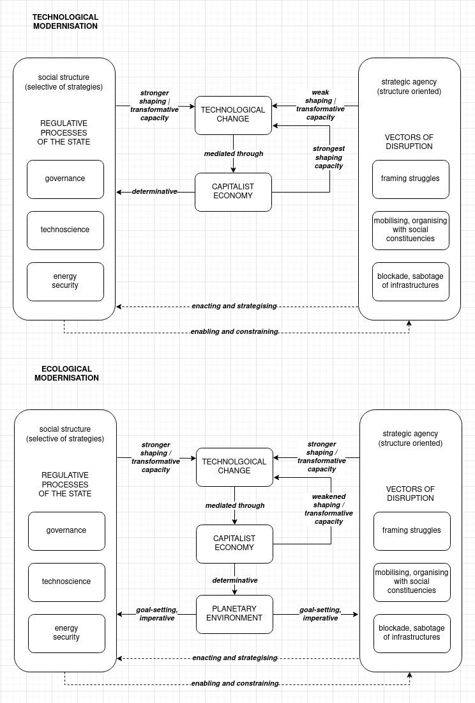

# Technology and agency

\minitoc

This chapter builds on the historical trajectory in the previous chapter to theoretically conceptualise the strategic capacity of actors such as activists, environmental groups, and trade unions to contest the sociometabolic status quo and the technology-first approach to resolving its problems in the context of the climate crisis. It theorises the scale of the present industrial-capitalist social metabolism and the mechanisms of its governance. Its principal objective is to dispel the notion that transition is simply a matter of pushing the best technological fixes to decarbonise the economy, but rather *a matter of ideational and material struggles over the meaning and means of transition that involve wider social actors and constituencies, whose strategic agency is enabled and constrained by social structures dominated by the capitalist economy and the institutions of the state.*

This insight is relevant for understanding the type of agency of the organisations I will discuss later in this thesis. While in the next chapter I will treat them as epistemic and organising actors, straddling the institutional and social terrains of climate change politics, in this chapter I propose *a model that indicates how the shift in the societal definition of the purposes of technological change through the framing of ecological modernisation opens up greater manoeuvring space for these actors to shape and transform the transition processes.* By drawing on three sets of theories that accentuate either agency or structure — science and technology studies (section 4.2), strategic-relational approach (section 4.3), and critical theory of technology (section 4.4)  — the model works as an *analytical framework* that combines their complementary insights to gain a *comprehensive perspective* [@geels_micro-foundations_2020, 11] on the problem of transformative interventions into the transition away from the thermocapitalist social metabolism.

My claim over the next two chapters will be that the discursive, institutional, and political contestations emerging from society's "middle ground" can directly disrupt the invisible operation of fossil infrastructures, shift the technology-first framing of environmental action, and even engage in the processes of social shaping of technology. However, this agency needs to be qualified and theoretically grounded, as not all actors have the same strategic power. The lock-ins into fossil-fuelled technologies (section 4.1) and the power asymmetries created by the social structures of the capitalist economy and the state (section 4.2) result in significantly diverging conditions for different social actors to effectively shape transitions.

To close off this chapter, I contend that despite the clear asymmetries of power between social actors, *the dependence of ecological modernisation on socially-defined goals and the dependence of technologies on energy infrastructures make them susceptible to disruption in the form of sabotage, framing struggles, and bottom-up organising*, opening avenues for non-linear transformation instigated outside of the (trans/sub)national governance process (section 4.5). These forms of agency I will call *vectors of disruption*.

## Industrial-capitalist lock-ins

Before analysing how sociometabolic regimes and sociotechnical transitions can be disrupted and shifted, it is necessary to consider why the presently-dominant industrial-capitalist social metabolism is so entrenched that the efforts of (trans/sub) national governance to change its environmentally destructive footprint are failing to produce adequate and timely action? In the previous chapter, I retraced the historical origins of that social metabolism. As industrial development gathered pace in the 19th century, technology and energy systems became central to the reproduction of capitalist social relations and subject to an increasingly transnational economic and military governance. The growing system of capitalist production was set on a trajectory of continuous growth that necessitated an ever-greater extraction of energy and matter and an ever greater appropriation of non-commodified resources from nature.

This can be immediately intuited from *Figure 3.1*. Over the last two centuries, and particularly since the beginning of the "Great Acceleration" after WWII [@steffen_anthropocene_2011, 805ff], the economic output, demand for energy and materials, as well as polluting emissions have followed tightly correlated trajectories of growth, racing past the sustainable levels in the 1980s and 1990s. Many other sociometabolic factors not represented in the graph suggest the same exponential growth, most notably the transformation of the terrestrial biosphere, the expansion of industrial technomass, and the human population [see @steffen_anthropocene_2011; @ellis_anthropogenic_2011; @hornborg_power_2001]. Since the mid-19th century, the use of energy-dense fossil fuels has enabled the development of a globe-spanning network of interlocking technological systems — including those of manufacturing, infrastructure, transportation, agriculture, services, and communication — that facilitate and require a continuously growing throughput of energy and matter. The accumulated scale of biophysical appropriation and the required technological base, still today powered up to 85% by fossil fuels [@bp_energy_2021], is enormous and presents a daunting obstacle for a transition to a less wasteful technological base and attendant social metabolism.

To account for the attained scale and quality of that technological base, the geologist Peter K. Haff [-@haff_technology_2014] has proposed that we decenter our anthropocentric view that sees technologies primarily in relation to human societies and that we consider the "technosphere" as an autonomous geological paradigm in relation to Earth's atmosphere, hydrosphere, lithosphere or biosphere, on whose sustained functioning human societies depend for their reproduction. The technosphere is already drawing on significant capacities of other geological paradigms, appropriating, for instance, over 10% of their energy flux. The point Haff wants to make is that, given the dependence of contemporary societies on large-scale technological systems and the dependence of these systems on a high-rate throughput of energy and matter, the technosphere might not leave much strategic leeway to either human-centred or nature-centred policy initiatives. Human-built technology is so big and built around self-reinforcing mechanisms that it locks humans into a path of technological development that does not allow for significant shifts in its direction, scale, or dependence on resources. The planetary technosphere thus, in Haff's view, constrains the space of political decisions and social agency to change the direction of the present sociometabolic regime.

Haff's notion of the technosphere has been criticised for its truncated understanding of social agency. In response to his proposition that the technosphere has socially emerged but might no longer be socially controllable, a group of prominent Earth system scientists [@donges_technosphere_2017, 26], have criticised Haff for ignoring the fact that the technosphere has co-evolved with the "collective agency of social macrostructures" and that it continues to be sustained through a dynamic coupling with social and ecological structures. Macro-social structures continue to provide "critical control points" that can trigger non-linear, transformative changes in large-scale technological infrastructures. While, in their view, the agency of social actors at the individual (and organisational) level cannot directly impact the technosphere at the scale that matters for the destabilised Earth system, actions oriented at states, intergovernmental institutions, regulations, and economic entities indirectly can.[^4.1]

Haff's view, I would contend, is deterministic. There are three assumptions that come together in deterministic framings of technological change. Firstly, the assumption that technological change proceeds largely autonomously from the social, political, or even economic factors, following primarily the considerations of technical efficiency, the cues of engineering ingenuity, and the affordances and limitations imposed by other technological systems (this last aspect receives in Haff's account planetary proportions). Secondly, the assumption that technological development is a succession of incremental innovations and radical breakthroughs where wrong turns, dead ends, and major catastrophes have little significance for the course of progress. Thirdly, the assumption that technologies are paramount catalysts of social change and can be relied on to produce solutions to major societal problems. Historically, such notions of *hard* technological determinism emerge from the spurt of innovations that have driven the immense expansion of industrial capitalism since the 19th century [@mumford_myth_1967], the rise of a hegemonic capitalist system of production premised on competitive gains from technological innovation [@postone_time_1995], and the separation of the technoscientific process from the immediate process of production [@marx_economic_1857]. The period of major technological advances between the 1870s and the onset of the nuclear arms race have, particularly in the US, instilled a sense that technology enables endless social progress [@scranton_determinism_1995; @smith_technological_1994]. Regardless of a long tradition in social theory to criticise determinism, starting with William James [-@james_dilemma_1884], technological determinism nonetheless reflects a hegemonic common sense even today, shaping motivations and expectations of technologists, investors, governments, and the public, and thus has to be acknowledged as effective at least at the justificatory level [@wyatt_technological_2008].

But beyond being a hegemonic common sense, there are historically evolved objective factors that I propose we should nonetheless consider before we declare determinism entirely inadequate to understanding how technologies and societies co-evolve:

There is the *scale* of thermocapitalist technomass that is hard to decarbonise and dematerialise — large segments of accumulated technological base built since the Industrial Revolution have to be replaced and retrofitted in a few short decades. A number of *material* challenges have to be overcome in the transition. For instance, the replacement of fossil-fuel systems with clean energy systems requires levels of material extraction to build turbines, panels, or batteries that might not be met with the existing reserves nor without alarming levels of extractive incursion on ecosystems and indigenous communities [@hickel_limits_2019; @riofrancos_resource_2020]. Or for instance, iron smelting requires coal while plastics manufacture depends on petrochemicals, and these feedstocks could be difficult to replace at the present scale despite early advances in renewable feedstocks. To circumvent these challenges requires either a substantial re-engineering of technological systems, a development of new technologies to extract from low-ores, a rapid expansion of renewable feedstock production — or, maybe, a substantial change in the patterns of use and demand for those technologies. To add to the problem, throughout the energy transition, the availability of *energy* has to be stable and — according to the dominant orientation of ecological modernisation — drastically increased to enable continued growth.

In addition to the scale and the corresponding glut for resources, the next constraining factor is that technological systems depend for their operation on other *technological systems and infrastructures* [@hughes_networks_1993]. As a technology grows in its maturity and scale, its replacement with another set of technologies requires a substitution of large accompanying and underlying infrastructures. This is currently the case with the replacement of internal combustion vehicles with electric vehicles that require charging stations and are as clean as the electricity they consume.

Furthermore, sociotechnical transitions are also constrained by a number of functions that technologies perform in the *capitalist economy*. Firstly, innovation responds to the class conflict between labour and capital. For instance, replacing workers with robots can frequently be less productive, but it reduces the capacity of workers to disrupt the production process, organise and, thus, claim better wages and rights [@noble_forces_2011]. Secondly, innovation is driven by the competition between individual capitals aiming to achieve productivity gains. The introduction of new technologies can lead to a temporary increase in profits for an individual capital, but it is quickly caught up with. This dynamic produces an ever-greater magnitude of social material wealth yet keeps the value gains around average and the valorisation process constantly going [@postone_time_1995]. Thirdly, innovation can result in lowered prices or new commodities, entrenching particular technologies through market demand. Fourthly, technological cycles of innovation are backed-up by financial cycles of investment. Once the profit gains from a previous round of technological innovation start to taper off, the financial capital moves on to seek investment in new technologies that promise new expansion [@perez_finance_2011]. Fourthly, advances in innovation can shift larger or smaller quantities of profit from the productive to commercial or financial capital and vice-versa. All these processes intensify technological change yet drive it toward a limited set of social ends — defined by class conflict, competition between capitals, and financial cycles, limiting in return the development of technological alternatives and reinforcing capitalism's hold on social development. As the economic historian Robert Heilbronner suggests, technologies might not be deterministic in the hard sense, but they do "make history" through the mediating structure of the capitalist economy, which has significant determinative effects on social structure [@heilbronner_machines_1994; @heilbronner_technological_1994].

These were the lock-ins disaggregated into their material, energetic, technological, and economic components. Yet, how do they come together to form a self-reinforcing society-technology-nature nexus at the world-system scale that the environmental historian Jason W. Moore has called a world-ecology [-@moore_capitalism_2015]? Another human geographer, Alf Hornborg [-@hornborg_power_2001], in his singular work in the anthropology of technology, investigating how in various social formations powers-that-be use technologies to appropriate the social surplus, has argued that industrial technologies combine three factors: the appropriation of embodied labour and natural resources, technical systems and attendant technical knowledge, and, decisively, the social relations of exchange. Building on the work of political economist Arghiri Emmanuel [-@emmanuel_unequal_1972] on uneven development, Hornborg posits that money, as a symbolic structure mediating exchange between unequal economies, enables a technologically more advanced economy to appropriate embodied labour and natural resources from a technologically less advanced economy at substantially lower prices than the prices the latter has to pay for the commodities produced by the former. What seems like a trade-in equivalent economic units is a trade of biophysically highly unequal quantities. A developing economy has to sell its labour and resources cheaply to buy advanced industrial technology dearly, pushing it down the spiral of underdevelopment and forcing it to absorb the environmental externalities of that process of extraction. These uneven "terms of trade" that create cheap inputs are central to the functioning of large-scale technological systems and industrial capitalism. Thus, Hornborg provides us with an important insight: the technological base premised on high intensity of material and energy flows and the economic unevenness are mutually reinforcing [@hornborg_ecological_2014]. Advanced industrial technology is premised on an unequal social world and degraded nature. Thus, changing one of the three might require changing the other two — doing ecological justice might require changing both technology and social structure.

There are thus at least five historically evolved lock-ins that place *soft* yet significant constraints on an urgent transition to equitable sustainability. A consequence being, as I want to put forward, is that *ecological modernisation has to contend both with continuing these sociotechnical lock-ins and restructuring the fundamental elements of their operation — and this contradictory task creates an opening for re-orienting the sociotechnical transition in another direction.*

These contradictions emerge once technological change can no longer be socially, institutionally, and politically framed — as it was in the technological modernisation paradigm — as a spontaneous process of technological evolution where innovators and entrepreneurs seize opportunities provided by the capitalist market and the regulation remains neutral to the general direction of that evolution. And that is the case with the ecological modernisation paradigm. It is a "goal-oriented" and coordinated process that strives to achieve sustainability at the societal and inter-societal levels [@geels_disruption_2018]. *This change in framing — and this is my central assumption in this chapter — significantly changes the shaping, transformative, and determinative capacities of social actors and structures over the process of transition*. It opens up space for strategic agency to impact the direction of sociotechnical change and potentially shift the sociometabolic regime in significant ways.

The changes in capacities as the framing changes from technological to ecological modernisation are indicated in the model presented in *Figure 4.1*. In this model, strategic agency is enacting social structures and is strategising to transform them, while, in turn, social structures are selectively enabling and constraining the actions of various social actors. Social structures include regulative processes institutionalised through the state, while social agency, for the purposes of my analysis, includes blockades, framing struggles, and organising as forms of disruptive action. In the technological modernisation framing, social actors have a relatively weak, social structures a stronger, and the capitalist markets a determinative shaping power over technological change. The capitalist economy also exerts a determinative effect on social regulation through the dependence of societies on commodity production for the provision for social needs and on capitalist accumulation for stability and taxes, both highly correlated with technological change. Once the framing shifts to ecological modernisation, with its goal-oriented transition, the shaping capacities of the capitalist economy over technological change get weakened, as its impacts on the planetary environment impose imperative goals of environmental action on societies, which in turn have to undertake stronger regulative interventions and transformations. On the other hand, the strategic capacity of middle-ground actors gains greater shaping and transformative power as well, as a window opens for ideational and material struggles over sociotechnical and sociometabolic transitions.

The rest of this chapter is dedicated to theoretically grounding elements of that model and conceptualising the opening for disruptive agency created by these changes in valences.

```{r echo=FALSE, fig.cap="Shifts in the shaping and transformative capacities in the transition from technological to ecological modernisation.", fig.scap="Technological vs ecological modernisation", out.width="100%"}


```

## Agency in sociotechnical transitions

The theories of sociotechnical transitions posit that an incumbent sociotechnical regime transforms through accumulated niche innovations and openings created by upheavals in the broader social and environmental context within the so-called sociotechnical landscape [@geels_micro-foundations_2020]. Interactions between the regime's institutions, technological innovation processes, and external shocks are marked by, amongst others, discursive, institutional, and political struggles that define the direction of a sociotechnical transition. In the model presented in *Figure 4.1*, these struggles unfold between the social structures, capitalist economy, and strategic collective agency, all working to impact technological change. The strategic capacity of environmental groups and trade unions to steer the future transition to a post-capitalist social metabolism unfolds on the terrain of those struggles. Over the next three sections I will theoretically conceptualise that strategic capacity from the perspectives of social agency, social structure, and power.

Haff's radical autonomisation of human-made technology into a geological paradigm is the exact inverse of the dominant approach in science and technology studies (STS) that is focused on dissolving the separations between nature, social agency, and technology. This body of scholarship, emerging largely in the 1980s with the consolidation of the social construction of technology (SCOT) and the actor-network theory (ANT) research programmes [@latour_laboratory_1986; @bijker_social_1987; @haraway_simians_1991; @mackenzie_social_1999; @law_aircraft_2002], has opened up new, highly productive inroads into the social study of technoscientific processes, which it regards as dynamic networks of associations between a range of entities: human actors, artefacts, and non-human nature. By going back to some of the principal tenets of this scholarship, *I want to highlight that social and technological systems are entangled in such a way that a change of interpretation and composition of technological systems can cascade to a social change, and that that agency is a capacity that emerges from relations and interdependences in those entanglements*.

Arguably the field's most prominent protagonist, Bruno Latour has contended that there is a developmental continuity between the social and the technological: once experimental and unstable associations between various entities — both human and non-human — become durable, they become technology [@latour_technology_1990]. The laboratory starts as an association between a microbiologist and bacterial culture to congeal into a stable assemblage that can be considered a technology [@latour_pasteurization_1993, 73]. Along the same line of reasoning, the sociologist Michel Callon has proposed a reversal of perspective in sociological inquiry to suggest that engineers elaborating radical innovations are engaging in sociological analysis and thus studying technology development allows us to observe "society in the making" [@callon_society_1987]. The processes of experimentation and innovation in thoroughly technologised modern societies are thus constructive of new relations.

In the STS scholarship, technological change is conceptualised as collective sense-making, whereby different social groups engage in negotiating the form and function of a new artefact until it has attained a stabilised interpretation and use [@bijker_bicycles_1997]. Thus, STS accommodates and emphasises the participation of different social actors in the process of technological change, ranging from policymakers, the public, producers to users, all of whom partake in negotiating interpretations and thus shaping technologies. This makes insights from the STS scholarship particularly useful for analysing the strategic agency of organisations that are neither corporations nor regulators to impact the direction of sociotechnical and sociometabolic change. In two ways:

Firstly, a reinterpretation of technologies' purposes and uses can have a transformative social effect. In an exemplary exposition of actor-network theory, Michel Callon [-@callon_techno-economic_1990] analyses techno-economic entities consisting of texts, technical objects, human skills, and money that constitute networks of associations in the production of goods and services. In such networks of associations, any intermediary that identifies and organises other intermediaries into a process of translation that articulates and addresses a problem is an actor that defines the network. Boundaries of networks are not stable — various intermediaries might contend for the authorial role of the network-defining actor, and the networks only become consolidated through the processes of convergence of translations until such moment is reached when they attain complete stabilisation and can be taken as black-boxes with a settled interpretation of their agency. Importantly, once they have stabilised, these black-boxes — markets, regulatory institutions, specialisations — can easily collapse if a new technology or a new interpretation comes along and recomposes the existing networks of associations. For instance, solar power generation, if reinterpreted along the "soft energy path" (see section 3.5), can open up avenues for proposals of building distributed, citizen-owned energy system, where significant downscaling, communication of ownership, and redistribution of power becomes possible (see section 7.5.2).

Secondly, agency itself, a central concept to STS, is a capacity emerging through associations. Agency does not inhere in entities, but in relations as capacities constituted through their interactions [@latour_technology_1990]. Agency is, thus, not allocated by pre-defined positions in a social order but constituted in relations and actions. Agential relations are relations of mutual enablement or disablement between interacting entities. This theoretical schema of agency offers distinct advantages in social analysis: it remains close to the material reality and dynamic processes of (de)stabilisation and (re)constitution; social entities at micro-, meso- and macro-levels are analysed as isomorphic; and there is no separation of epistemological and ontological properties. Such empirical relationalism has spawned a number of new theoretical forays in science and technology studies, anthropology, or political science. Some of the most interesting have come from the scholars working in the tradition of feminist epistemology, for instance, in the form of new materialist theories of agential realism by Karen Barad [-@barad_posthumanist_2003], which attempts to supplant the representationalist binary between things and words with a process of differential becoming where objects and subjects that do not exist prior to their relation emerge through agential cuts from the intra-acting matter. Or, of the inter-species hybridity by Donna Haraway [-@haraway_staying_2016], which militates for making kin with other species in order to create refuges for multispecies survival in the period of Anthropocenic instability and pursue new biological-cultural-political-technological recompositions. By decentering the perspective away from the human, actor-network theory, and some varieties of post-humanist theories that have emerged in its wake, have gained an appeal in the epoch of climate change. As the feedback loops between sociotechnical infrastructures and Earth subsystems are gathering force, the notion that humans cannot be understood as the sovereign agents controlling the hybrid constitution of textual, technical, natural, or economic composites they produce or mobilise seems to be correct on its analysis [@latour_facing_2017, 62].

However, these two salient insights of STS scholarship — that agency is constituted in relations and that stabilised social orders can be destabilised by reinterpretation of technologies — need to be critically bracketed. I will highlight three reservations: an inadequate understanding of the emergent properties of higher-level social structures, a disinclination toward antagonisms and distributive conflicts, and a counterintuitive expansion of the notion of agency.

STS scholarship tends to share a concern for destabilising the dualisms between the (categories of) subject and object, human and non-human, society and nature, rational and irrational, macro and micro [@latour_technology_1990]. Criticising the modernist dualisms that exclude from the realm of political representation a plethora of new assemblages and hybrid entities that modernity has spawned by combining social, natural, and technological processes, Latour has developed a counterproject to traditional sociology. In his view, traditional sociology has stabilised the meaning of the social as a form of causality that explains away the specificities of those assemblages by using the generic concepts of society, power, or capitalism that represent tautological "black-boxes" [@latour_we_1993]. The use of these concepts, in his view, does not contribute to sociological analysis. He rather proposes to do away with "the social" and develop a sociology that would take on the task of closely following the associations and, from there, reassembling the social. A methodological priority of Latour's project is not to impose an explanatory or normative matrix onto the social, but rather to lend a listening ear to the actors and start from their understanding of reality [@latour_reassembling_2007].[^4.4]

The problem is that narrowly empirical commitments fail to engage and take an oppositional stance to the black-boxed structures that drive asymmetries of power. Of late, Latour has changed his vocabulary to acknowledge inequalities, deregulation, globalisation, and capitalism as roots of denial and environmental destruction [@latour_earth_2018; @latour_climate_2019]. Latour's position against critique is, however, not shared by the entire STS field, as the sociology of translation that "follows the actors" can very well work as a critique of "black boxes" that need describing and unpacking, as was exemplary demonstrated in the anthropologist Anna L. Tsing's *Friction: An Ethnography of Global Connection* [-@tsing_friction_2005], a study of translations that articulate together the capitalist and non-capitalist labour in the global capitalist value chains. Therefore, I would argue that *macro- and meso-social structures need to be understood as emergent properties of lower social processes with their own organising logic that has enabling and constraining effects on the lower-level interactions*. In short, structure matters. However, the bias for narrow empiricism pushes ANT to readily disregard such higher-level social structures and their attained historical specificities [@elder-vass_disassembling_2015]. It is necessary to distinguish qualitative differences of social structure and economic power from agency.

Secondly, when focusing on deeply material micro-scale processes, as @martin_science_2012 argue, the STS tends to privilege cognitive, cultural, and ideational forms of agency as opposed to confrontational forms such as strategising, struggles, and distributive conflicts that, as I will argue later in this and in the next chapter, are fundamental to environmental politics. Relatedly, the STS practitioners [@geels_micro-foundations_2020: 11] point out that research in STS is more oriented to studying the early stages of elaboration, experimentation and composition of new assemblages and less toward studying how the existing sociotechnical regimes and assemblages are reproduced, destabilised, and overthrown, therefore requiring field-level and structural analysis. Given the potential failing of the technology-first strategies in climate policy, the disruption and sabotage of existing technological systems might have, in the urgency of climate action, equal if not greater importance than the elaboration of new sociotechnical regimes. As do struggles over the material implications of the transition, to start with. Sabotage, organising, and framing struggles matter just as the engineer-driven process of innovation does.

Lastly, the isomorphic ascription of agency in assemblages to humans and non-humans, be they non-living nature, human-built artefacts, living organisms, or symbolic structures, is consequential within the framework of ANT. This proposition attempts to break away from anthropocentric exceptionalism and acknowledge other-than-human agencies that are not grounded in the subject-object separation. However, equating human and non-human agencies is highly counterintuitive, so much so that it has been criticised by many STS proponents [most prominently in  @collins_epistemological_1992; @bloor_anti-latour_1999; see also @sismondo_introduction_2009, 90]. The problems start once we try to unpack the notion of agency. While agency is the capacity between two or more entities to effect change, that notion is grounded but not exhausted in relationality — *it also includes intentionality and emergent meso- and macro-structure*. However, Latour disputes both as constitutive of agency. He thus equates the agency of the Mississippi River and the Army Corps of Engineers trying to damn it in [@latour_facing_2017, 58]. But by positing such symmetry between the social and the natural, he is focusing on the quality of effects of interaction and not the quality of causes of interaction [@bloor_anti-latour_1999, 96]. This is in line with his prioritising of description ("how") over explanation ("why") [@latour_technology_1990]. However, collapsing different qualities of causes into the shared attribute of having effects is inadequate to analyse the causational dynamics of relations and asymmetries of power. If we instead want to account for various qualities of agency, following Hornborg's [-@hornborg_artifacts_2017] helpful discussion of the matter, we should distinguish between objects that provide affordances (as constraints, catalysts, or proxies) for the agency of other entities, sentient living organisms that have purposive agency, and reflexive living organisms that have intentional agency. Finally, we need to acknowledge the *specifically social agency* that is characterised by the capacity to build complex symbolic systems such as language, money or institutions that transpose power — and this type of agency pertains predominantly to humans. Distinguishing between these various types of agency and their respective causal qualities, including vis-à-vis complex social structures, is analytically more plausible than the symmetric ascription of agency to human and non-human, at least for the purposes of discussing climate change.[^4.5]

To explain: it is human activity, structured by capitalist social relations and using technology to appropriate ever-greater quantities of matter and energy, that has caused the release of large quantities of CO<sub>2</sub> into the atmosphere, destabilising the feedback loops between Earth's subsystems on which human societies depend yet have very limited control of. The accelerations on each side of the divide are of a different kind, and their different kinds of causation are necessary to distinguish for any effective climate action. There are no complex symbolic systems such as capital accumulation driving the actions of Earth's subsystems. It is not even humanity as a totality that has been driving the process of accumulation and emissions, but the expansion of industrial and colonial capitalism as a social structure with its internal logic and power asymmetries. As some have argued, the Anthropocene should thus correctly be named Capitalocene or Plantationocene [@malm_geology_2014; @haraway_anthropocene_2015].

It can thus be said that social power (of a personal kind such as in feudal societies, of an impersonal kind such as in capitalism, or of a gendered kind as in patriarchy) wields symbolic systems to concentrate the command over embodied labour and natural resources, both of which are necessary for the reproduction of structures premised on domination. Complex and abstract structures thus define the historically emerged forms of social rationality through which the domination in society and the destruction of nature are articulated together (to different rationalities in relation to nature I will return in section 5.6). Vitally, however, the social processes that have triggered this transformation are challenged by transformations of very different complexity on the other side. Destabilised nature is becoming an imposing presence in human history, from which it was erased with the ascendance of industrial capitalism. And this destabilised nature requires the social agency to reflexively seek new avenues for how to act to urgently transform the industrial-capitalist social metabolism.

To recapitulate, I have argued that in sociotechnical transitions the struggles over interpretation can have destabilising and catalysing effects on social change, but that the *disruption* of the existing sociotechnical systems and sociometabolic regimes and not only the *construction* of new assemblages are necessary instruments for transformative action. Furthermore, I have argued that social agency is relational, interdependent, and *constituted through power asymmetries* (or, as I will discuss in chapter 7, disruptive power emerges from interdependence) and that there is a distinct form of purposive *agency through symbolic systems* that distinguishes the social from other forms of agency. These symbolic systems can encapsulate a specific kind of social rationality that drives the destruction of nature. However, social agency is not a sovereign actor with control over non-human nature. It can strive to transform the society's impact and create a sustaining metabolism with nature. *Thus, stabilising and restoring regenerative metabolic relations with ecosystems is primarily a social task. That work of transformation will need to be paralleled by a collective endeavour to transform the structures that reproduce vested material interest that keep the lock-ins of industrial capitalism in place as they are*. Remaining attentive to the composition of social and technological processes, as STS scholarship urges, will be fundamental to that work of restoration. But to come to an adequate account of that task — as my argument so far has suggested — we need a more qualified notion of agency, an agency that acts through social structures and asymmetries of power.

## Agency in social structure

After having argued that the technological is entangled with the social so that the recomposition of technological systems can trigger social transformations, and that there is a specific form of agency that is social and grounded in complex symbolic systems, in the next section I will draw on the theories that situate agency in social structure to conceptualise the state and the capitalist economy as two dominant structural ensembles that define the strategic terrain where discursive, institutional, and political struggles over just and sustainable futures unfold.

Social structures are enacted and reproduced through human agency. Two things follow from there. Firstly, agency and structure are not two separate entities, where structure is an external force imposed on social actors. The two are immanent to each other. The sociologist Anthony Giddens has described the relation between the two poles of that immanence as duality. Following Giddens's theory, structures can be defined as mutually sustaining rules and resources that enable and constrain practices of rule-aware and resource-commanding human agents, who enact those structures in their effort to reproduce their lifeworld [@giddens_constitution_1984]. The reproduction and repetition of patterns of social action stabilise structures into durable social systems such as language, money, state, or capitalist economy.

Secondly, following the sociologist William H. Sewell's elaboration of Giddens's notion of structure, both stability and change are inherent to the interplay of structure and agency. Structures in society are multiple and interlocking, so when social actors act, they transpose rules and resources from one structure to another [@sewell_theory_1992]. This dynamic intersection of disparate structures results in contestations over rules and resources, resulting in instability of structures and openings for change. Change is thus inherent to the multiplicity of structures. However, it is important to consider that change sometimes arrives in the form of an exogenous incursion such as war, plight, or natural catastrophe. When it does, as in the case of climate change, with droughts, wildfires, or floods, it can become integrated into social practices and governance through the process of adaptation — with significant indeterminacy as to what are the rules of action and the allocation of resources that can adequately mitigate external shock and allow society to reproduce itself in a sustainable way. As various social constituencies negotiate and struggle over adequate and achievable forms of mitigation, future adaptation, and environmental justice, rules and resources of different social structures become contested. *Given that climate action touches on so many aspects of how societies function, this necessarily transforms it into a terrain of broader framing struggles and distributive conflicts across many social structures*.

Agency in such circumstances is not only enacting structures to reproduce or transform them, but it also can assume a reflexive orientation toward them. Namely, social actors actively interpret not only their immediate social contexts that enable and constrain their actions but the social system as a whole that structures their lifeworld. The Marxist historian Perry Anderson [-@anderson_arguments_1980] accordingly proposes to discern three possible orientations that agency can assume toward the social system: private pursuits that act within the existing social order; public interventions of individuals or collectives emerging from the experience of the social order, but not directly aimed at transforming it; and, finally, collective endeavours that aim to make "their initiators authors of their collective mode of existence as a whole, in a conscious programme aimed at creating or remodelling whole social structures" [@anderson_arguments_1980: 133]. The second and third types of agency are marked by social conflict, where collective action is counteracted by structures and conditions not of its choosing. It is, though, these forms of agency — reflexively oriented toward the social whole — that matter in climate conflicts, motivating actors to seek to transform their collective mode of existence and their society's metabolic interaction with nature.

The collective mode of existence in the present is entwined with the state and the capitalist economy as globally dominant social structures. The trajectories of socioeconomic development in the 20th century across both capitalist, (post)socialist, and (post)colonial societies show significant commonalities at whose centre stands the global spread, transmutation, and domination of the modern state. Critical theorist Moishe Postone [-@postone_task_2015] has argued that the state-centric development has since the 1970s, with the gradual convergence of all three variants into an integrated capitalist world-system, entered into a process of permanent crisis. This has important consequences for how climate action is framed and governed. Broader recognition of climate change coincided with the disintegration of socialist projects in the late 1980s, which were at least at their outset oriented toward building social formations that would neither be grounded in nation-state nor capitalist economy. The onset of climate politics could thus be said to overlap with the uncontested hegemony of the *capitalist nation-state*. It is the world-system of states, integrated with the global capitalist economy, that dominates the governance of the future prospects of humanity's shared planetary ecology.

The neoliberalisation that emerged in response to the crisis of state-centric development is a process of variegation of mutually-adaptive regimes of accumulation at the city, region, state, and supra-state scales [@brenner_variegated_2010]. Climate politics thus has significant aspects that play out below the intergovernmental levels. For instance, cities are drawing for their social metabolism on a large network of technological systems that extend across global infrastructural space [@brenner_operational_2016] and are driving the bulk of environmental pollution, accounting for over 75% of global emissions from final energy [@ren21_renewables_2021a]. Therefore, cities can, in relative ways, be a terrain to transform some aspects of the social metabolism such as transport, housing, and energy and even create communal infrastructures to reduce wasteful consumption and create more convivial forms of social life, portending construction of new social metabolisms. However, cities still compete in the global capitalist economy, on which they have little impact and act largely in isolation.

*Thus, in this variegated landscape of climate action, it is the capitalist nation-state, nested in the world-system of states and the global capitalist economy, that still dominates the ideological, regulatory, and fiscal framing for sociotechnical and sociometabolic transitions*. Through his strategic-relational approach [@jessop_state_2008], Bob Jessop has conceived of the state and the capitalist economy as two interdependent and co-evolving autopoietic systems. The capitalist economy depends on the state to smooth out its contradictions, create markets, and safeguard its competitive advantage in the global marketplace. The state, with its attendant political system and set of institutions, in turn, depends on the economy to pursue broader social goals of employment, welfare, population control, and hegemony. The state is here understood as "responsible for the cohesion of the social formation of which it is only a part" (8), integrating conflicting social interests, securing consent by members of society to the dominative social order, and creating pre-conditions for economic growth. However, cohesion it can achieve only through the institutionalisation of conflicting social interests and the re-articulation of positions of antagonistic social groups into a unitary hegemonic narrative. Because it synthesises diversity of interests and positions, the negotiations and struggles over the rules and resources thus make their way into the capitalist state, making it an institutional domain of strategic struggle.

That terrain is marked by power asymmetries. For Jessop, the state as an institutional ensemble does not in itself exercise power, but it is a force field where social forces with their diverging interests act and interact through institutions (29). That ensemble thus sustains and reflects the relational power of diverging social groups. The institutions are the ground upon which they deploy strategies to change the institutions and their social effects, making the existing institutions an evolutionary result of past political struggles. Such historically evolved institutions then enable and constrain different strategies of social actors — they are *structurally selective*. Social actors, in turn, are reflexively analysing these selectivities to devise their *structure-oriented strategies* to transform the political terrain on which they and their antagonists confront each other. The selectivities of institutions privilege those actions that reproduce them, making transformational changes harder to institute. However, the circumstance that these institutions have to integrate diverse social groups, structured along different social and economic inclusions and exclusions, and that the state for its reproduction depends on their participation, is opening up opportunities for contestation, allowing alternative interests, ideas, and strategic propositions to be articulated and mobilised against and within them.

Accelerating climate change is inducing a crisis of governance for many capitalist states and providing openings to instil into the current order counter-hegemonic framings of socially just and environmentally sustainable futures [@quastel_ecological_2016; @jessop_economic_2012]. For instance, states are responsible both for energy security and environmental stability, but in contradicting ways: energy security is imperative now, whereas environmental stability remains largely deferrable to the future. Rapid decarbonisation risks instabilities in the energy supply, similar to those that have struck Europe in the winter of 2021/2022. The lower output from wind production earlier in the year had reduced the natural gas reserves. So, once the natural gas and oil prices started to surge in the post-lockdown upswing and Russia started the war on Ukraine, the governments of Europe had no other options but to resort to increasing subsidies for hydrocarbons and scuppering for any sources of fossil fuel energy available. This situation puts in stark relief what the energy humanities scholars Imre Szeman and Jeff Diamanti have described as: "*[t]he twenty-first century nation-state is saturated in oil and cannot be imagined in its absence* ... key function of the nation-state is to create systems to manage the extraction, distribution, and use of energy" [@diamanti_nine_2020, emphasis in the original]. Contradictions of maintaining stability while instituting change make the state therefore a key lynchpin in negotiations and struggles over the meaning and means of transition.

Facing climate change, states are aligning their social development strategies with the ecological modernisation framing, in which technological and economic mechanisms are purposefully intervened in to steer them toward the goal of achieving decarbonisation in a few short decades. With this policy-driven transition, this point bears repeating, the shaping capacity of the economic processes and the state on technological change are weakening. *This weakening of existing shaping, transformative, and determinative capacities is opening up an opportunity for actors that find themselves in various strategic-relational positions vis-à-vis the state to contest both the continued thermocapitalist social metabolism and the ecological modernisation strategies being devised to transform it*.

## A critical theory of technology

In the previous sections, I have argued that large sociotechnical transitions, such as the one made imperative by the climate crisis, are not only economic and technological matters but also social, institutional, and political framing struggles that involve "wider publics and cultural meanings" [@geels_micro-foundations_2020], unfolding on the strategic terrain dominated by the capitalist state and facing the enormous inertia of the industrial-capitalist social metabolism. In this section I will make an excursus and narrow down my perspective on the development of particular technologies rather than sociotechnical regimes and transitions in general ­— i.e., on how alternative technologies are selected rather than on how the social framing of their development is disrupted and shifted. My intent is to provide a more detailed sense of where and how transformative change can happen in the processes of technological change itself. I will contend that the innovation and dissemination of technologies can be conceptualised as an open, multi-actor social process marked by the structurally-differentiated power of these actors. This I will do through the discussion of the work of the philosopher of technology Andrew Feenberg, who has developed a critical theory of technology by extending the narrowly focused constructivist STS approach with the larger macro-societal concerns of critical theory with power and domination.

In his book *Questioning Technology* [-@feenberg_questioning_1999], a summation of his endeavour to develop a democratic theory of technology, Feenberg starts from a diagnosis of the remarkable absence of technology from political theory, which frequently ignores the central function of technology and technocracy in modern societies. Political theory tends to relegate technology to the economic domain and thus considers technology as neutral and irrelevant to political processes [@winner_citizen_1992]. Failure to understand how political and social processes are extended through technologies leads to a view that "projects the abstract technical logic of the finished object back into its origins as a cause of development" [@feenberg_questioning_1999: 81], thus reinforcing the common determinist view of technological development — technologies are as they are for immanently technological reasons. In opposition to this tendency, Feenberg endeavours to provide a structured account of social agency in technological development, one that both holds the potential for addressing pathologies of instrumental rationality and opens up to an understanding of how technologies can be democratised, a process he names *democratic rationalisation*. In his view, technological systems are essentially underdetermined and politically ambivalent, holding capacity for innovation and the adoption of alternative technological designs with different social and political effects. Social selection of alternative technological designs is a complex and uncertain process of negotiation and struggle between various social actors that stretches from the design table, regulatory conditions, market competition, public contestation all the way to everyday use. The selection process has the following characteristics:

* technological designs are not determined simply by the criteria of technical efficiency or functionality but by the social processes of interpretation and contestation that lead to a selection between viable alternative designs;
* social processes of interpretation and contestation respond to a number of diverging, culturally defined needs;
* diverging needs reflect conflicting visions of the social system that lead to different technological development pathways.

The selection process between alternative designs of technologies and technological systems can thus reflect the diverging needs and comprehensive visions of society of various actors in the various stages of that process — engineers and developers, funding bodies and financiers, managers and corporations, employers and workers, states and users. To this process, they arrive with their different, sometimes highly asymmetric economic power, positions in the social hierarchy, and roles in the social division of labour. In Feenberg's view, it is at this level of power and hierarchy that technology is selected to reinforce domination or, if alternative needs or even visions of the social system prevail, to partake in the construction of non-dominative modes of collective existence. *This struggle between alternatives, it should be added, is possible particularly before a technology has attained scale and locked in infrastructurally and institutionally*, before there is a momentum and infrastructural interdependence behind that technology [@hughes_technological_1994]. That is, importantly, the case with most green technologies today, making their development a terrain of struggle over social alternatives.

Furthermore, for Feenberg, technological objects that surround us in the social world are accretions of conventions, rules, codes, and regulations which reflect previous processes of social selection and the social values behind them. Even when an innovation is a technological breakthrough, it still contains a history of code-made-technology. In fact, a breakthrough becomes a breakthrough only once it is released into the world and various social forces struggle to interpret and settle its use. To give an example of different rationalities built into systems: personal computer, internet, or free software demonstrate how new technologies can be open enough to be a terrain of contestation, where various communities, governments, corporations, engineers, and users contend to interpret their use according to their own needs and visions. Even now as the economic rationality of commodification has played itself structurally out in these technologies, they still remain underdetermined, holding some potential for renewed redefinitions and contestations. The mobile phone is a good candidate to demonstrate the opposite: how a highly closed technological ecosystem has been fully controlled by corporate monopolies from the very start and allowed only a limited and controlled participation through commodified app markets.

Feenberg's theory is constructivist, processual, non-determinist, and non-functionalist, while also conveniently resonating with Anderson's three-tier typology of agency, where change can be driven by both particular needs but also by visions of the transformation of the social system in its totality. Feenberg has cut his theoretical chops largely analysing innovations in communication technologies over the last three decades [@feenberg_questioning_1999; @feenberg_technosystem_2017], where after the break-up of the Bell monopoly, emerging technologies had the benefit of an equal playing field. But once we switch to the climate change arena, we quickly see that innovations in communication are very different from the process of replacement of large-scale technological systems that convert inputs from nature for other material processes. *As I have discussed in section 4.1, the lock-ins, inertia, and incumbency in large-scale technological systems play a significant constraining role.* In the concerted effort to deploy renewables at a rapid pace, the process of technological change is facing challenges of centralised energy generation, path dependence on existing technological infrastructures, and sunk costs and incumbent interests of fossil capital in the existing energy systems.

There are, nonetheless, democratising potentials in decarbonisation. As mentioned earlier, decentralised solar power could have transformative effects on the way in which energy is generated and distributed, making users individually and in community *de facto* generators and the electricity grid a user, and allowing for a common, socialised ownership of energy generation — and alliances with the workers operating these systems (more on that in section 7.5). However, biophysical limitations, path dependences, and incumbents have still a significant influence over the regulation, pace, and direction of change: a gradualism that incumbents can control. No small reason for that is that oil and car industries are a significant pillar of the energy security, gross national product, tax income, and pensions savings in many countries. While renewable energy generation technologies are mature, and economies of scale have made them the cheapest source of energy, most other components needed to fully decarbonise manufacturing, housing, transport, or agriculture, or draw down the atmospheric carbon, are in their early stages and underinvested — resulting in an energy transition that is far from the pace required by climate policy, let alone by climate urgency. *Therefore, democratising impulses for a change that is needed to address the climate crisis have arguably come more from blocking the polluting energy projects and struggles over the framing of the goals of climate action, where forces frequently exogenous to the technological development field have fought to force the difficult questions of transition on the public agenda — the questions of its social and ecological ends*.

Feenberg contends that, unlike democratic electoral systems, the democratic process in technology design can work in deterritorialised, netowrked way. Consequently, technologies and technological regimes can be contested not only in the public arena, where arguments over the framing of technology's social ends can be formulated in a shared discourse — a form of strategic agency that is of interest in this thesis, but also through local mobilisations of activists, workers, communities that threaten the legitimacy and the undisrupted operation or development of concrete infrastructures. Democratic contestation over technological choices is thus not only instigated by the successful articulation and development of alternative designs and framings but to the same degree through a disruption of the existing technological infrastructures and extractivist projects (a process that can be organised across the entire world-system, first and foremost the hinterlands dominated by the extractivism). One has to count on the inertia of lock-ins that are not only imposed by existing technological systems and capitalist economy but the imperative of energy security and growing energy demand that seemingly can only be politicised once they are at risk.

Returning to *Figure 4.1*, with the shift to ecological modernisation, where policy imposes on transition an orientation toward the stabilisation of the planetary environment, the capacities of various actors and structures shift, providing greater influence to vectors of disruption that come from direct action in the form of *blockade and sabotage, mobilising and organising with social constituencies, and framing struggles that work to shift the interpretation of the required transformation away from the technology-first strategies*. The case studies in this thesis are focusing on the latter two vectors, as they operate in the institutional landscape of environmental governance, whose relevance and limitations I will conceptualise in the next chapter. The first of these, however, falls outside of the scope of this research, but in the next section, I will provide a brief appreciation of its significance as a vector of disruption.

## Direct action and disruption

In a storied moment at the 2012 American Geophysicist Union congress, the UCSD geophysist Brad Werner gave a talk "Is Earth F**ked?: Dynamical Futility of Global Environmental Management and Possibilities for Sustainability via Direct Action Activism" in which he presented his provisional agent-based model of a coupled human-environment system that accounts for the agency of mass resistance [@werner_earth_2012; @romm_agu_2012; @mingle_scientists_2012; @klein_this_2014, 449]. His model looked at the diverging effects that the acceleration or deceleration of interactions between the social and the natural components in this system had on the attempts to steer the planetary environment toward sustainable pathways. Werner explains that if the dominant economic system is to continue accelerating at the current pace, the globalisation and intensification of economic processes will expectedly continue to exploit natural resources ignoring both the resistances and the efforts to manage environmental sustainability. If environmental management becomes integrated into economic and political imperatives (i.e., if ecological modernisation is implemented), the destabilising effects might slow down, and the resistance will have a chance to intervene reactively in the dominant economic system. However, only if the mass resistance is significant enough will the dominant economic system be slowed down so that it can be transformed and have a chance to enter into a stable co-evolution with the planetary environment. While there is no documentation of his talk, just news reports, Werner in his abstract concludes: "The transition from unstable dynamics to sustainability is sensitively dependent on the level of participation in and repression of resistance." [@werner_earth_2012]

Resistance of a disruptive kind is exemplified recently by numerous direct actions of environmental activists and land defenders who have been blocking energy infrastructures, for instance Ende Gelände open-pit coal mine blockades across Germany, barricades set up against the Dakota Access Pipeline Extension at the Standing Rock Reservation, Wet'sutwet'en standoff against Coastal GasLink in Canada. But equally, there has been resistance against extractive projects needed for ecological modernisation, such as protests of Bolivians in Potosí against the privatisation of lithium mines in 2020 or mass protests in Serbia against Rio Tinto's lithium mine in 2021. The mass blockades of transit infrastructures and the square occupations organised by the Extinction Rebellion have also drawn on a similar repertoire of direct action. These resistances have been effective both as a disruption and as a delegitimation of the fossil-fuelled and extractive business-as-usual, as well as of the technology-led approach to decarbonisation, highlighting the vulnerability of communities to the degradation of their environment from the leakages of fossil fuels or through extractivism. Their efficacy lies in the fact that technological systems and social structures depend vitally on the continued operation of energy and mining infrastructures.

The protests at circulatory and extractive chokepoints, seemingly short-lived acts of disruption, can thus destabilise the existing technological systems but, equally important, be a test of whether societies are committed to climate action while preserving ecosystems. *By sabotaging the operation and making visible these polluting and extractive projects, these direct actions, performed by relatively small groups, can serve as a vector to jump from their small scale to unsettle the framings of transition politically.* Or, as Andreas Malm exhorts in his *How to Blow Up a Pipeline*, "[t]he question is not if sabotage from a militant wing of the climate movement will solve the crisis on its own — clearly a pipe dream — but if the disruptive commotion necessary for shaking business-as-usual out of the ruts can come about without it" [@malm_how_2021, 70].

The current intergovernmental efforts to mitigate climate change and manage a global transition are an attempt at creating a global governance structure, a "Climate Leviathan", as Marxist geographers Geoff Mann and Joel Wainwright have characterised that process [@wainwright_climate_2018]. However, that process has been in the ruts since at least COP15 in Copenhagen, and it might be superseded someday by a breakdown of all efforts to manage climate change leading to a bellicose "Climate Behemoth", as it threatened to become under Donald Trump's presidency. Against both of these trajectories, only one can remain pluralist and democratic, and as Brader Werner suggests, it is fundamental for a deceleration necessary to achieving a long-term sustainable society-nature interaction — one that is built on mass resistance. This form of agency, dubbed by Naomi Klein "Blockadia" [-@klein_this_2014], is not isolated in its endeavour. The vector of direct action can scale laterally to mobilise other environmentalist groups, labour movements, and communities to join the common struggle and to build from the bottom-up pressure on the public and the states to commit to "rapid, far-reaching and unprecedented changes in all aspects of society" as the science is demanding [@ipcc_summary_2021]. These others can then pursue complementary strategies aimed at the pressure points of (trans/sub)national environmental governance and mobilising broader social constituencies to shift the transition toward constructing ecologically sustainable and socially just futures. The strategic terrain of agency of these others I will theorise in the next chapter.


[^4.1]: I would also add that the dependence of large-scale technological systems on other technological systems makes them also vulnerable to disruption by direct action. I will return to that below.

[^4.4]: Following this commitment, Latour has launched acerbic attacks on critical theory, claiming that its proponents are patronising toward people at whose positions they direct their critique, duplicitous in their methodology as they selectively combine antifetishism, positivism, and realism, and working with ill-conceived concepts of society, discourse, capitalism [@latour_why_2004; also @trexler_integrating_2013]. Concerned by growing climate denialism and the hubris of Enlightened reason, Latour dishes out his critique by comparing critical theory with conspiracy theories. Yet, this is where Latourian theory starts to show its blind spots: it has difficulties to account for its own political concerns and alliances because they are shaped by the very macro-social structures it disparages so easily. For instance, a large body of research on climate denialism indicates that the strongest denialist demographic in the US by a significant margin were "[f]iscally conservative white males [who] have disproportionately occupied positions of power within our economic system" [@mccright_cool_2011]. Capital and power define the climate scepticism and misinformation. At the same time, the global population is largely expressing concern over climate change [@capstick_international_2015].

[^4.5]: I regard human societies as being part of nature. However, human societies are emergent properties of complex symbolic agency of living organisms. There is a difference and discontinuity between their social world and the natural environment in the forms of causation. Exchange value dominating the human transformation of nature is an abstract form of causation — and can be properly described only at some level of abstraction. That does not mean that human and non-human natures are not one substance and that they are not ontologically entangled. But there is an asymmetry: humans, to the extent that they are part of nature, depend on it for their survival. The opposite is not the case — planetary nature would be transformed but could carry on without humans [@soper_what_1995].
