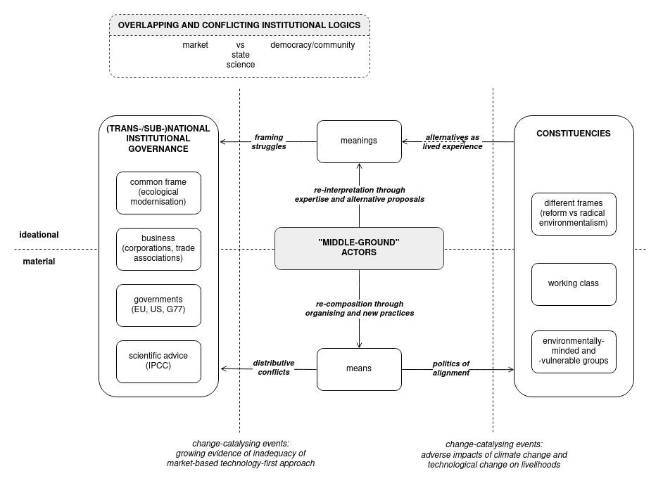

# Political epistemology and distributive conflicts

\minitoc

## Strategic agency in a meso-level perspective

The previous chapter concluded with an appreciative account of the blockade, sabotage, and protest as direct vectors of disruption of the current status quo, which is characterised both by the continued burning of fossil fuels and the rapidly-growing extraction of materials needed for the scale-out of green technologies. The spatial concentration of energy infrastructures and extractive projects, on which other technological and social processes depend, offers chokepoints that social movements and land protectors can exploit to disrupt their continued operation and challenge their legitimacy. Such small-scale acts of negation can catalyse into moments that confront entire societies with the urgency of climate action they nowadays mostly acknowledge but struggle to effectively tackle. Such acts can re-politicise the transition. In contrast to such direct action, @donges_technosphere_2017 suggest — contra Haff — that the technosphere can be steered at the level of macro-social structures, which, however, can only be accessed indirectly through institutions.

Earlier in the previous chapter I have theorised how with the shift in the framing of social development from technological to ecological modernisation, the determinative power of the capitalist economy and the state, hence macro-structures, over sustainability transition is weakened, opening flanks for disruptive and strategic interventions by social movements, environmentalist groups, and trade unions. My analytical framework elaborated relations between the micro-social agency of individuals, groups, and organisations and macro-social structures of the capitalist economy and the state. These relations are mediated through their institutional ensembles at national, subnational, and transnational levels. Accordingly, in this chapter I begin with the exploration of *those vectors of disruption that operate on that institutional terrain with and against other social actors to shift the framing of environmental action toward alternative pathways to sustainability, while bringing together social constituencies to re-align their material interests and their lived experience with transformative environmental politics from bottom-up*. This terrain of agency I define as the "middle ground". Acting in that "middle ground", I will claim, can make manifest distributive conflicts and thus re-politicise the environmental governance from below.[^5.1]

The foil for the focusing of perspective to the meso-level is the question of how science can be translated into political action. The translation of scientific claims into effective political action is the work of *political epistemology* [@friedman_political_2014; @strassheim_politics_2015]. Political epistemology is structured by two demands — the demand for scientific evidence and the demand for political legitimation (democratic or otherwise) [@pedersen_political_2014, 549]. Operating in a highly accelerated, interdependent, and technologically complex world, contemporary societies are dependent on scientific advice to assess the problems they face and to choose proper courses of action. However, while objectives and values can sometimes be easy to establish (for instance, stabilising Earth's biophysical processes within their Holocenic boundaries), selecting between different courses of action to achieve them can be hard [@friedman_political_2014, v]. The policy process of transposing objectives into actions is thus marked by a fundamental uncertainty, particularly if science is assessing non-final, emergent phenomena or if the achievement of objectives requires significant interventions across different social spheres. In situations where facts, actions, and their consequences are uncertain and contested, political epistemology transforms into a field of discursive, institutional, and political struggles through which social constituencies are re-examining, re-interpreting, and re-framing their own normative commitments and the material problems they face [@strassheim_politics_2015, 322].

A case in point is climate change. IPCC as the scientific advising body is appealing for "rapid, far-reaching and unprecedented changes in all aspects of society" [@ipcc_summary_2018], yet the governments-signatories of the UN Framework Convention on Climate Change (UNFCCC) that constitute transnational climate governance are able to translate this appeal, with the political legitimacy they can muster and the challenges of collective action they face, only into an incremental, flexible, and least-cost market-driven technology-first transition. Given that the social impacts of climate change are inchoate, unevenly distributed in societies, and geographically dispersed, the concerns over destabilisation evidenced in scientific analysis do not translate directly into a broad political legitimation, particularly in the polluting Global North, for rapid, far-reaching, and unprecedented interventions. Distributive conflicts caused by weather extremes, crop failures, wildfires, or by mitigation measures resulting in the rising cost of fossil fuels or the closing of polluting industries, are however bubbling up. But in the majority of political contexts they still remain an intermittent concern that can be relegated to the future in favour of more pressing and perennial social and economic matters.

*Against such suppression of distributive conflicts, in this chapter I contend that the framing struggles and distributive struggles can be made to converge and that their convergence forms a unique strategic vantage point of the pro-environmental "middle-ground" actors.* To corroborate that argument, I will first (section 5.2) discuss how ecological modernisation emerged as the dominant framing in (trans)national climate governance, and why its incremental, non-targeted, and least-cost technology-first approach has partly reinforced the fossil fuel lock-ins and slowed down the decarbonisation. Next, I will provide a conceptualisation of the "middle ground" (sections 5.3 and 5.4) and *define the "middle-gound" organisations as epistemic actors whose orientation is grounded both in their expertise-building work and their engagement with broader social constituencies*. Drawing on the institutional logics approach, I will suggest that if the failures of the dominant technology-first strategies and the suppressed distributive conflicts become more pronounced, these actors might gain an opportunity to catalyse a change in the dominant approach within the climate governance field while in the meanwhile organising with social constituencies around social practices and experiences of sustainable and just futures. Arguing from there that the distributive conflicts over climate action are already becoming increasingly evident, I will contend that the liberal international order, which has set the foundations for (trans)national climate governance, has at the same time undermined its effectivity through the parallel processes of neoliberal disembedding of the economy from democracy (section 5.5).

To conclude this chapter (section 5.6), I broaden the epistemological perspective to discuss how diverging cosmologies — capitalist-instrumental, ecosystemic such as Buen Vivir, or biocentric such as various indigenous cosmologies — commonly considered incommensurable, can be compared and assessed based on their implicit ecological rationality.

## Ecological modernisation

Ecological modernisation originated in the early 1980s as a political programme proposed concomitantly by two German environmental social scientists, Joseph Huber and Martin Jänicke. It was formulated in response to the supposedly demodernising tendencies in the environmentalist movement that gained traction in the wake of the publication of *Limits to Growth* and the growing recognition that the modern nation-states are unable to reign in industrial pollution or develop a systemic alternative to industrial capitalism [@huber_ecological_2009; @mol_origins_2009]. Against these tendencies, the proponents of ecological modernisation advocated an "ecological restructuring of processes of production and consumption" [@spaargaren_sociology_2009, 68]. That restructuring rested on three pillars: making polluting industries instead of culprits into active participants in the ecological restructuring, focusing technological innovation policy to create clean production and consumption cycles, and transforming the bureaucratic welfare state into a flexible partner that would be working with business and civil society to advance green transformation. In its early articulations, ecological modernisation tended to embrace technological determinism and disregard the impacts of the technosphere on the sociosphere or the limitations imposed by the entanglements of the sociosphere with the biosphere [@spaargaren_sociology_2009, 71]. However, in its later iterations, it expanded from its initial techno-solutionist positions into a theory of reflexive modernity that sought to analyse how modernisation and industrialisation processes can integrate ecological principles irrespective of the capitalist or non-capitalist relations of production [@mol_origins_2009, 24].

It is in its initial techno-solutionist version that ecological modernisation found its way into the climate governance arena. The early stages of the climate governance process were set in motion by the scientific community, who in 1985 set up the Advisory Group on Greenhouse Gases under the auspices of the International Council of Scientific Unions, the World Meteorological Organization, and the UN Environment Programme. In 1988 the Advisory Group transformed into the IPCC, tasked henceforth with producing assessments that were to establish the state of knowledge and advise governments on climate change. Once the political side of the governance process was formalised with the signing of the UNFCC in 1992, the EU and social movements started to set the tone by advocating a top-down approach to decarbonisation based on binding scheduled targets and the polluters-pay principle [@ansari_constructing_2013]. However, in the run-up to the Kyoto Protocol in 1997, the US insisted that such regulatory intervention presented an economic threat and that binding targets are acceptable only if instituted through flexible market instruments. The acquiescence of the G-77 coalition of lower-income countries to this approach was secured after industrialised countries accepted Brazil's proposal to create a Clean Development Mechanism that would encourage industrialised countries, using the money raised through offsets by carbon-emitting entities at home, to invest in technological transfer and carbon-capturing projects in lower-income countries.

Drawing on the earlier 1987 Brundtland Commission Report [@world_commission_on_environment_and_development_our_1987] that established the notion of sustainable development, proposing to view economic growth and environmental protection as compatible and mutually sustaining, the Kyoto Protocol focused the action of signatories on the reduction of greenhouse gasses in technology-intensive sectors and the creation of emission markets that would give industries flexibility to choose the method and timing of decarbonisation [@backstrand_climate_2016, 130]. In a situation where the Kyoto process was at risk of collapsing, the EU and the NGOs, first and foremost Greenpeace, who were up until that point advocating targeted regulations and stricter transition pathways, had to cave in, thus cementing the political hegemony of flexible, market-driven technology-first strategies. Through their intricate inquiry, the organisational theorists Shaz Ansari, Frank Wijn, and Barbara Gray [-@ansari_constructing_2013] have re-constructed a sequence of shifts in the framing of the policy problem and the changing institutional logics of governments, NGOs, and progressive businesses that finally established a hybrid "transnational commons logic" in climate governance. Through these shifts these actors have gradually come to acknowledge climate change as a shared fate, a common and differentiated responsibility, and, ultimately, a joint object of action.

This sequence of shifts during the Kyoto Protocol process promulgated ecological modernisation into the dominant framing of global climate policy. Yet, that incremental, flexible, and market-driven approach to technological change, judged on its own terms, yielded mixed results. The EU Emissions Trading System (ETS), after it got off to a troubled start with the oversupply of issued permits in the mid-2000s, helped reduce the emissions of some 11,000 power and industrial plants covered under the ETS mechanism and accounting for around 40% of EU's emissions. Since its introduction, the ETS reduced the EU annual emissions by an estimated 3.8% [@bayer_european_2020]. Most of that reduction came from the introduction of renewables and the phase-out of fossil fuels in power generation (down by 34%). The emissions from industrial plants, however, have remained constant [@nicholls_how_2021]. Other polluting sectors such as transport and agriculture were not included to start with.

Yet, the flexible carbon trading system created a framework where the small number of companies that account for the bulk of emissions could evade more rapid decarbonisation. As the political economist Gareth Bryant has analysed, under the ETS no more than 75 companies were responsible for over 75% of emissions, while the less polluting 72% of companies were responsible for only 2% of emissions [@bryant_carbon_2019, 33]. In fact, two of the largest EU polluters, REW and E.ON have exploited carbon-offsetting strategies to keep their most profitable fossil-fuelled installations operational and defer actions that would have driven emissions down much faster. Furthermore, Clean Development Mechanism offsetting opportunities provided them with an additional spatial fix once the internal ETS allowance markets no longer offered enough flexibility, creating a mechanism of "carbon colonialism", a form of ecological unequal exchange whereby emissions are offloaded to low-income countries as natural carbon sinks and labour are cheaper there [@bumpus_carbon_2011].

In terms of sociotechnical transition in general, the least-cost approach encouraged innovations aimed at optimisation and efficiency gains instead of targeting the fossil-fuel lock-ins directly and throwing all investment behind transformative, comprehensive, and context-specific technical and social innovations that would have reduced the emissions more expediently [@rosenbloom_opinion_2020]. Carbon pricing worked for sectors where fossil fuels could be easily replaced, alternative technologies were already mature, and operations could not be moved abroad. But the difficult-to-decarbonise sectors such as transport, agriculture, and heavy industries were left lagging behind — with the result that renewable energy still accounts for only 15% of EU's energy demand [@eurostat_shedding_2022].

Among the different institutional logics structuring the climate governance field [@friedland_bringing_1991], one notably missing in the comprehensive account outlined by @ansari_constructing_2013 is democratic logic, a logic that is premised on popular deliberation and participation. Ecological modernisation, while in its *strong* variant a democratic reflexive theory of modernity [@christoff_ecological_1996], is in the global climate governance process an economistic, instrumental, and technocratic endeavour of "institutional orchestration" [@backstrand_democratic_2017]. There legitimacy is aggregated through intermediaries that might or might not have been democratically delegated to the process and obtained democratic legitimation from their constituencies for their decisions. However, as the impacts of climate change and the costs for climate action are increasing, so are the distributive conflicts over their effects. The price of carbon and other policies are beginning to affect patterns of provisioning for social needs, a tacit change that is sooner or later going to be placed on the public agenda. Ecological modernisation, designed to loop together the technosphere and biosphere using market mechanisms, leaves out the interactions with the sociosphere, which are unavoidably present. But for policymakers instituting technological changes is easy, while instituting economic, social and political change is hard.

## Defining the "middle ground"

These mixed results and lacking democratic legitimacy of the policy-making process call for more scrutiny of climate governance's dominant framing. The question is whether climate politics should not be more directly situated in the everyday socioeconomic and sociometabolic arrangements that concern broad and diverse social constituencies, who might find themselves at the receiving end of distributive conflicts. *I propose to conceive of the terrain between the field of institutional governance — which frames the meanings and means of environmental action — and the popular masses, working classes, social groups, organisations — who approach these meanings and means with their understandings and material interests (predominantly shaped by the industrial-capitalist social metabolism), as a "middle ground" of environmental action*. The organisations that I will engage within the rest of this thesis pursue the task of re-interpreting the framing and re-configuring with various social constituencies their understandings and material interests toward an ecological transformation. They are situated where the work of discursive re-negotiation and practical re-composition of the modes of working and living can unfold collectively and where the capacity to initiate transformations can be given social breadth and depth — a task at which reductivist policy prescriptions that see climate actions primarily through cutting emissions fail.

In *Figure 5.1* I am proposing an analytical framework that maps out that "middle ground". On the side of ideational negotiations and struggles, "middle-ground" actors are *engaging as epistemic actors with the (trans/sub)national governance field through framing struggles* — in the case of the organisations I am researching, with the aim of contesting the dominant market-driven technology-first strategies and developing alternative proposals of how to achieve adequate and timely response to climate change. Parallelly, on the side of material negotiations and struggles, they are articulating the collective material interests of their constituencies in the inchoate distributive conflicts over the costs and benefits of climate action. *With these constituencies they are working to transform the material interests, social needs, and provisioning practices* to sustain alternative proposals of transition they are developing in the framing struggles, thus translating environmental science and transitional proposals into lived reality — and conversely translating lived reality into their proposals and further into framing struggles. By doing so, they are drawing and expanding on the existing, largely tacit environmental values and practices of these groups, their *environmentalisms*.[^5.2] For the organisations I am researching, these are the degrowth and the working-class environmentalisms, which fall between the "radical civic environmentalisms" demanding far-reaching changes to all aspects of society, and the "reform civic environmentalisms" [@backstrand_climate_2016], which are willing to accept some aspects of the present social metabolism and even of the technology-first strategies, but not the market-oriented aspects that preclude distributive justice.

```{r echo=FALSE, fig.cap="The middle ground of strategic agency, situated between institutional governance and social constituencies on one axis and ideational and material negotiations and struggles on the other axis.", fig.scap="The middle ground of strategic environmental agency", out.width="100%"}


```

*I contend that the work of these organisations is future-oriented as they are contesting the present hegemonic context of climate action, whose potential adverse effects — inadequate decarbonisation and unjust transition — might assume their full relief only with time*. Their counterproposals will gain increased relevance and disruptive capacity if the *change-catalysing events* such as climate-induced disasters come to pass, making the adverse effects of climate policies more evident to various social constituencies and the policymakers. However, to shift the framing of climate governance away from the market-driven technology-first strategies, a significant change in the entrenched positions of the dominant actors in that process is needed. Following the *institutional logics* theory, such change can be achieved if the actors within the governance arena, combining in their organisational identity competing logics, move from the domination of one to the domination of another logic [@friedland_bringing_1991, 256; @thornton_institutional_2008, 117].[^5.3] Currently, governments follow science, market, and bureaucratic logics, and to a far lesser degree a democratic logic — this is particularly the case with the governments of the high-income countries that bank on technological and financial fixes to avoid distributive conflicts. But as distributive conflicts in their societies gain ground, they might come under increased pressure to include a democratic logic within the governance process. Similarly, if the technology-first transition continues not to deliver adequate and timely results, they might come under increased pressure to adopt stricter, higher-cost regulatory measures, acting against the market logic, to hasten mitigation and adaptation. These *events* and *shifting logics* might give "middle-ground" actors and their constituencies a greater shaping power over the future of climate policy. They might "bring the society back" into climate action [@friedland_bringing_1991].

If we return to the insights from the macro-social structural perspective, we cannot expect all strategies to be equally expedient and successful: under capitalism strategies demanding "rapid, far-reaching and unprecedented changes in all aspects of society" [@ipcc_global_2018] have less institutional anchoring and resources than strategies that reproduce industrial-capitalist social relations and social metabolism. The existing relations nonetheless depend on the actors reproducing them prevailing over those challenging them. However, power is relational and defined by the interdependence of all segments of society. It aggregates both from the top but also from below. Institutional change depends on ongoing ideational and material negotiations and struggles that actors enter into with their different resources, the support they find in the selectivities of institutions through which they act, and the support of constituencies with which they work. As I suggested in the previous chapter, the change of framing is weakening the strong shaping and determinative capacity of the capitalist economy and the state over sociotechnical transition. Events that prise open the inadequacies of framing can therefore set off "dislocations and articulations of overlapping or contiguous structures" [@sewell_historical_1996, 871], *allowing the proponents of alternative framings to impose them on the field and thus to transform the field.* Through the process of learning and the reflexivity in their actions, contesting actors can improve strategies that might catch on if the turn of events provides an opportunity — thus destabilising and transforming the coherence of social structures that was attained through the reproduction of patterns of conduct [@jessop_economic_2012, p. 51]. Obviously, an environmental organisation or a trade union operate in a structurally very constrained strategic space — dependent on funding and contributions, dynamics of employment and unionisation, alliances with their constituencies and other groups, economic and political conjuncture. Yet even within that narrow operating space, they can fundamentally seize on a change-catalysing event to enter framing struggles with the alternative proposals they are developing over longer periods of time, just as they can seize that opportunity to re-align the material interests of the collectivities that they work with. How they might concretely articulate framing struggles and work to re-align the material interests of their constituencies toward an ecological transformation I will discuss over the following two chapters.

## "Middle-ground" organisations as epistemic actors

I have described the organisations I am engaging as not being scientific organisations. That is not entirely correct. While they are not bodies strictly tasked with conducting science, they have scientists and experts in their ranks studying the impacts, primarily social, of climate change. But more importantly, the science of climate change cannot be adequately circumscribed by placing it narrowly within the confines of the Earth system science or only within the remit of scientific institutions. A large part of research on climate change touches on social causation, sociometabolic processes, sociotechnical systems, social impacts, and social adaptation. As the scientific debates around the Anthropocene indicate [cf. @steffen_anthropocene_2011; @latour_facing_2017; @altvater_anthropocene_2016; @edwards_vast_2010], social sciences can elucidate significant aspects of the interaction between society and nature, but also the ontological and epistemic assumptions of science, and its organisation as an institutionalised process of knowledge production [@merchant_death_1990; @barca_forces_2020; @billi_what_2019]. Indicatively, the IPCC has three working groups: WG I focuses on the physical science basis, WG II focuses on impacts, adaptation, and vulnerability, and WG III focuses on mitigation, of which the latter two are clearly interdisciplinary and dependent on an analysis of social, economic, and political factors. We, therefore, need an expanded notion of where and how the science of climate change happens to give nuance to that co-implication of the scientific and the social. Specifically for the research contributions of the organisations I am engaging, I will qualify that co-implication through two concepts: "post-normal science" and "situated knowledge".

While the fundamental biophysical mechanisms of global warming and its anthropogenic causes are well understood, the dynamics of climate change at lower spatial or at longer time scales are understood with less certainty. To arrive at a greater degree of certainty will require a further deployment of "knowledge infrastructures" [@edwards_knowledge_2017], sophisticated research methods, computing technologies, additional funding, and institutional arrangements. This is the processual and institutional nature of scientific truth-finding. However, the institutional embeddedness of scientific processes makes such processes anything but socially neutral. They necessarily come with individual, organisational, and disciplinary priorities — interests, values, and politics included. Such routine social loading of climate science qua science gets amplified once its findings are translated into political implications. Thus, climate policy prescriptions, as Bruno Latour [-@latour_facing_2017, 25-26] insists, cannot be disentangled from the description of climate facts and therefore scientists — contra those climate sceptics and detractors who criticise them for not sticking only to facts — should embrace the implication that all factual claims already come with political implications. Whether we date the origins of the Anthropocene back to the Neolithic Revolution 8000 years ago [@ruddiman_anthropocene_2013], to the colonial conquest around 1500 [@moore_capitalism_2015], or to the beginnings of the industrial capitalism [@altvater_anthropocene_2016] has very different political implications. Consequently, the IPCC, as a body tasked with producing assessments, not only explores the consequences of different scenarios, including those in which "emphasis on economic growth shifts toward a broader emphasis on human well-being" [@hausfather_explainer_2018], but does not shy away from urging for "rapid, far-reaching and unprecedented changes in all aspects of society".

The philosophers of science Silvio Funtowicz and Jerome Ravitz have proposed to conceive the social loading of scientific problems where "facts are uncertain, values in dispute, stakes high, and decisions urgent" as "post-normal science" [@funtowicz_post-normal_2006; see also @funtowicz_post-normal_2001]. Unlike the situations of normal science, in post-normal science the problems are defined by complex systems, the need to manage the uncertainties that emerge, and the conflictual social implications resulting from policy-making. For this reason, in post-normal science "the problems are set, and the solutions evaluated, by the criteria of the broader communities that are affected" [@funtowicz_quick_2021]. Hence, problem-solving requires the inclusion of larger groups of stakeholders as an "extended peer community" that translates scientific findings into realities of the social world. All starting from their respective disciplinary positions and policy interests, their positions are equally legitimate.

Latour and Funtowicz and Ravitz have in mind the broad participation of different actors in the science and policy-making process. There is no single view on the complex whole of climate change and its implications, thus necessitating a dialogue (and struggle) "among those who have an interest in the issue and a commitment to its solution" [@funtowicz_post-normal_2006]. However, due to the centrality of the global capitalist economy in the causation of climate change and the dependence of contemporary forms of life on the continued stability of that mode of production, the stakeholders (polluting corporations and governments, as well as different social groups) are negotiating their material interests beyond the clearly defined venues of policy-making. Behind-the-curtain lobbying and antagonisms spilling over from other socially-loaded issues interfere into the climate governance processes [@oreskes_merchants_2011], particularly as distributive conflicts resulting from policy decisions are frequently shied away from in domestic policy contexts. *This, I want to posit, is where the nexus of knowledge production and social organising in the messy and antagonistic "middle ground" attains relevance as political epistemology — as a form of re-articulation of the ecological problem through the perspective of socially-grounded distributive conflicts unfolding largely outside of the representative policy-making arena.*

To specify how social situatedness and antagonism is relevant to scientific inquiry and expertise, a detour through the work of the feminist scholar of science Donna Haraway is helpful. Haraway sheds light on the relationship between the objectivity of science and the material politics of stakes, alignments, and antagonisms. In her seminal text on situated knowledge, Haraway is arguing against knowledge claims emanating as if from nowhere, positing that a partial, located, critical knowledge emerging from the embodied position of a knowing subject is a way to ground the "radical historical contingency of knowledge claims" in the "faithful accounts of a 'real' world" [@haraway_situated_1988, 579]. The appreciation of the partiality of knowledge she advocates does not renounce objectivity or rationality but rather makes them possible because it makes reflexively explicit the social life in which positions are grounded and to which they remain politically committed. This enables "power-sensitive" conversations between positions and thus truly rational — i.e., socially reflexive — knowledge claims.

Why is it so important that stakeholders reflect the materiality of their social world in political-epistemic processes? One of the main reasons why climate policies come up against significant obstacles when they meet social realities (as I will shortly discuss with the case of "yellow vests" protests) is that they tend to be reductivist and functionalist in their approach to the problems they aim to tackle: framing the climate problem as a primarily technical and financial fix in separation from its social consequences and reducing the many-sided ecological crisis only to the problem of CO<sub>2</sub> emissions [@hoyer_seven_2010], resulting in measures that are targeted too narrowly to achieve only the desired deep-decarbonisation. However, emitting processes are baked into infrastructures, circuits of production and consumption, and patterns of everyday life. Carbon prices are imposed, hydrocarbons are made more expensive, buildings are retrofitted to be more energy-efficient, yet the decarbonising effects are frequently not deep and quick enough, they are met with indifference and inertia. *The reason for that shortfall is that it is hard to exit from the existing carbon-intensive sociometabolic surround — for as long as alternative infrastructures, patterns of social provision, and forms of consumption, and are not developed, encouraged, and made widely available in a coordinated manner.* The expansion of large-scale energy-intensive systems has transformed how technologies are embedded into the material infrastructures of everyday life. For instance, as modern heating systems developed, we have increased the number and the size of rooms we heat in a home while shedding added layers of clothing, resulting in a total transformation of not only technological systems but also patterns of behaviour whose effects cannot be easily unmade by insulation and energy price hikes [@shove_what_2018]. Similar examples highlighting private transport, throwaway technological objects, or the consumption of meat can be easily made.

*Here the "middle ground", with its politics of re-composing collective experiences, social practices, and lived reality, can directly challenge the reductivist fixes proposed by policymakers and push them to approach transformations in more material, embodied, and integrated ways.* For example, researchers affiliated with the IPE have studied energy poverty in the Croatian countryside only to conclude that the panacea prescribed by policymakers — insulate the home, increase the energy efficiency, and lower the cost of energy — fails to address the greater problem hiding behind energy poverty. Namely, the fact that it affects mostly older people that live in depopulated rural areas, where children have left family homes their parents built a long time ago in search of a better life or fleeing the war in the 1990s. To solve their energy poverty, these elderly people would be best served by relocation to care homes or collective housing arrangements somewhere where there is a greater density of population [@ancic_energetsko_2013]. Or, to give an example from Unite's work, by articulating demands for just transition, trade unions have been drawing attention to the fact that there might be fewer, less skilled, and more casualised jobs in the renewables sector compared to the fossil-fuel sector or at least that they might not be available in the same regions, so that a transition that is just cannot be simply the replacement of one form of energy generation with another, one industry with another, but has to alleviate social impacts through comprehensive social transformations. In this manner, the parallel work of expertise-building and of organising with the constituencies allows the "middle-ground" actors to work toward sustainability transitions that combine fossil-fuel divestment and low-carbon innovation with a strong build-out of social coalitions and new patterns of social reproduction, something that current instrumental and reductivist policies fail to do [@markard_sustainability_2012; @rosenbloom_opinion_2020].

## The shifting tectonics of climate politics

It has been almost 35 years since the climatologist James E. Hansen warned the US congress of anthropogenic climate change. It has been another 30 years since the UNFCCC signed in Rio came into effect. It has been a succession of years of mounting evidence of record temperatures, record ice melt, and record extreme weather events. And yet global annual emissions are not falling. The system of global governance, created through a string of treaties, hammered out in the tugs of war that were the conferences in Rio, Kyoto, and the ensuing Conferences of Parties (COP), particularly in Paris in 2015 where signees have committed to keep the global warming below 1.5°C — that system of global governance has been struggling to produce the urgent action that is needed to stop the global warming. Only economic crises such as the 2008 great recession and the 2020 COVID-19 pandemic have made a serious dent in rising emissions. Arguably the most sophisticated international scientific advisory process the world has ever built, IPCC, and the impressive body of knowledge that it has synthesised since it was founded in 1988 provide proof that knowing does not translate easily into acting.

Over those 35 years, as the understanding of accelerating climate change and its observable impacts consolidated, the urgency of action in the view of the IPCC has increasingly come at odds with the meandering international governance processes. In the late 1980s, the consolidating liberal international order under the US hegemony, still benefitting from the Cold War's orientation toward science in the service of developmental state and arms race [@mazzucato_entrepreneurial_2013], placed trust in the advisory processes initiated by concerned scientists to help governments under the aegis of United Nations to steward the global climate commons. That liberal international order has, at the same time, through the structural adjustment programmes and the integration of the global free market, disembedded the free trade and capital flows from democratic control and popular participation [@polanyi_great_1944], promising to create a global tide of economic growth that would lift all boats. However, the failure of neoliberalism to create a trickle-down economy to distribute the benefits of economic growth widely, the post-industrial impoverishment of former industrial communities, and the first big crisis of the neoliberal regime of accumulation in 2008 have destabilised that order and its hegemony. This crisis of 2008 has triggered a global wave of radical protests and occupations, but once the neoliberal political elites failed to respond and change the socioeconomic course, the destabilisation paved the way for illiberal, nativist, and anti-globalist political forces to ascend to power in democracies large and small, including the UK, the US, Brazil and Hungary. The anti-globalist turn had an immediate effect on global climate governance, with the US announcing its withdrawal from the Paris Agreement and Brazil reopening the Amazon for economic prospecting. The intergovernmental process threatened to devolve into what Wainright and Mann [-@wainwright_climate_2018] have called the chaos of "Climate Behemoth", forcing individual governments and the EU to take the lead on climate action on their home turf. And while transnational governance has been restored in the meanwhile, its temporary devolution has brought to light that the domestic distributive conflicts — struggles over who bears the cost of climate change and climate action — might be a more significant factor in successful attempts to reduce emissions than the coordinated action of governments globally [cf. @mildenberger_carbon_2020].

To shed light on what has changed over the last three decades and the implications for the politics of translation of science into the lived realities of social constituencies, I want to claim that *the disembedding of economic processes and their integration into the global capitalist economy that has unfolded under the liberal international order over the last four decades, has limited and undercut the capacity of societies to transform sociometabolic processes in a purposive fashion.* The shielding of the capitalist market, already written into the Rio Convention that explicitly limited any climate action from affecting international trade or growth [@unfccc_united_1992, Principle 12], has effectively made scientific findings calling for "rapid, far-reaching and unprecedented changes in all aspects of society" difficult to translate into policy that precludes "far-reaching" interventions into the operations of the market and the capitalist economy, the principle social driver of climate change. In fact, with the market-driven technology-first approach to the management of climate crisis, climate governance has embraced the neoliberal regime of accumulation premised on commodification and marketisation. Climate urgency can henceforth only be translated into incremental, flexible, least-cost actions. The implication is that there is no global governance process that would act on the precautionary principle to prevent the threat of climate disaster for the benefit of all, but rather a more fragmented, antagonistic, and messier political outlook where many are left fending for themselves — within and across societies.

To glean what that messier political outlook looks like, it is instructive to recall the "yellow vests" protests, an eminently distributive conflict caused by climate action. In November 2018, the streets of France erupted as the neoliberal government of president Emmanuel Macron decided to introduce a carbon tax on petrol that should have financed the energy transition to renewables. It was a regressive consumer tax, introduced in the wake of tax breaks on assets and capital gains. The "yellow vests" movement spread quickly from the truck drivers to other constituencies of the *peripheric* and working-class France, for whom the increases in the price of petrol had a significant impact on the cost of living, starting with the commute to work necessary to earn wages. Given the share of energy costs in their total household spending, the carbon tax would have been a financial burden five-time greater for lower- and middle-income working classes than for higher-income groups [@dinara_were_2018]. Economic inequalities are tightly correlated with carbon inequalities. To demonstrate this, ahead of the Paris COP21 meeting, Lucas Chancel and Thomas Piketty [-@piketty_carbon_2015] have published a study on emissions and inequality, concluding that inequalities in per-capita emissions between societies are significant (an average US citizen in 2013 emitted 22.5 tCO<sub>2</sub>e/year — compared to the global average of 6.2 tCO<sub>2</sub>e/year), but inequalities within societies are staggering (upper 1% of US emitters releases on average a whopping 318.3 tCO<sub>2</sub>e/year, hundred times the world's average). Globally, the upper 10% emits 45%, the next 40% emits 42%, while the remaining 50% emits 13% of all emissions. In fact, the inequalities of emissions are roughly following the same distribution pattern as inequalities of income. Yet, the costs of living are only a small proportion of costs for high-income groups, who can also easily avoid ecological taxes by buying less-polluting technologies.

Climate change comes with a price tag — according to the 2007 Stern report, the non-action would reduce the global GDP by around 20%, whereas immediate action would require as much as 1% on a yearly basis [@stern_economics_2007]. Fifteen years of growing emissions later, a McKinsey report puts the yearly number to reach net-zero by 2050 at a more substantive 7.5% [@mckinsey_net-zero_2022]. These are obviously investments, not only costs. *Still, the mitigation to drive down emissions and the adaptation to heatwaves, wildfires, droughts, floods, sea-level rise, higher food prices will have a cost that someone will have to pay in money, but in the absence of significant redistribution and precautionary action in health and lives as well*. Just as someone has had to pay for the neoliberal restructuring in industrial economies since the late 1970s [@louis_who_2019]. For many in the streets of France that price tag has a long time ago become part of the everyday. They have learned to calculate the cost of restructuring, lower wages, casualisation, and the reduction of public services. They have witnessed the upward redistribution of social wealth. For them, the transition in response to climate change, as proposed by the Macron government, was recognisably a continuation of that neoliberalisation process. Metaphorically, they have already borne the burden of climate change.

The last forty years of neoliberal restructuring are the legacy of the same international liberal order that is willing but potentially unable to act on climate change by striking there where the pollution reduction to accelerate and the money to finance the transition can be found. The globalisation of capital flows and the concerns over energy security have made it impossible to tax around 100 carbon majors that are responsible for 63% of all historical emissions and 71% of all emissions since 1988 [@heede_tracing_2014; @griffin_carbon_2017]. The shielding of capital from these kinds of interventions is the outcome of the project of neoliberal globalists [@slobodian_globalists_2018], who have constructed an international institutional and legal order that has effectively put the command over capital largely out of reach of democratic law-making. While they have institutionally secured the smooth operation of the global capitalist economy, they have made it impossible to intervene in a substantive way in the operation of that economic system. All global crises now have to be overcome through the conditions set by that system. As the anthropologist Joseph Masco has formulated in his discussion of the changing political valence of the notion of crisis, instead of "the crisis-utopia circuit that empowered the high modernist culture of the mid-twentieth century, we now have a crisis-paralysis circuit" [@masco_crisis_2017, 66]. *With the eclipse of socialist, developmentalist, and post-colonial projects, "futurity" as a horizon of positive social transformation has been increasingly removed from the dominant political discourse, and the crisis narrative serves primarily to amplify the sense of danger that the state is called onto to resolve by ensuring the stability and the continuation of the status quo.* The catastrophist discourse of climate change, as Erik Swyngedouw has been warning [-@swyngedouw_apocalypse_2013, 10], serves to drown out the antagonisms that hide behind the promise of technocratic governance to manage the crisis and to effectively de-politicise conflicts such as the one that has surfaced with the "yellow vests" movement in France.

Where do the stumbling attempts of the (trans/sub)national climate governance process to take decisive action and the receding sense that climate change can be cautiously steered for the benefit of all leave the "middle ground" then?[^5.4] Wither with its materialist politics of knowledge production? First, I would propose to view that predicament as an opening of a horizon rather than a closing. The material interests and values of various segments of societies — their implicit environmentalisms — will continue to bubble up as the impacts of climate change become more pronounced and policies are hurried to address them in a more targeted fashion. The experience of unjust burden for the French lower- and middle-income working classes bears a direct link to their vulnerability in the process of inchoate mitigation and adaptation to the impacts of climate change (see section 7.2.2). "Yellow vests" protests did manage, with the help of climate activists, to articulate their discontent in terms of demands for urgent climate action and just transition. *In such experiential openings, "middle-ground" organising will be able to lead on re-articulating and re-arranging the interests of diverse social constituencies.* Developing a just and sustainable transition through the participation of these constituencies is harder than imposing top-down sustainability measures. However, those demonstrably cannot be imposed on popular masses expecting that they will "pick up the bill". Achieving a just and sustainable transition will entail something that the philosopher of science Isabel Stengers [-@stengers_catastrophic_2015] has called the acts of composition, wherein the experiential and situated knowledge of heterogeneous groups are brought together and made to matter in equal ways, rather than being suppressed as they are in the reductive approach of technocratic governance that abides only by the imperatives of carbon reduction and economic growth — so that, in Stengers's view, we can preserve a chance for a future that is not barbaric. In her account of the enclosure of the commons, Stengers highlights the notion of a common that is inherent to a group — of the knowledge that makes that group "think, imagine, cooperate" [-@stengers_catastrophic_2015, 85]. Therefore, situated knowledges should be seen as the key to survival. The actors in the "middle ground", I would argue, are in a privileged position to develop that knowledge with their social constituencies starting from the existing social experience and adapt the existing social practices to the destabilisation that arrives with growing imapacts of climate change.[^5.5]


## Capitalist cosmology and ecological rationality

To conclude this chapter, I will step away from the entanglements of political epistemology and distributive conflicts in the context of (trans)national climate governance to broaden the perspective. I want to briefly consider how can efforts to construct sustainable ways of living and knowing in societies inside and societies outside of the capitalist world-system of states be read together from the shared planetary ecology. In a plurality of diverging ways of living and their implicit or explicit cosmologies, what is the relevance of struggles against the present industrial-capitalist social metabolism for those who are outside of it and what is the common ground on which to judge the ecological viability of any particular cosmology and social metabolism?

According to the World Bank, around 55% of the global population lives in urban zones, necessarily depending on formal or informal wages to secure significant parts of their subsistence. As part of the 45% of the world's population living outside of urban areas, particularly throughout the territories of Latin America, Africa, Asia and Pacific islands, there are sizeable rural and indigenous populations that still live in subsistence economies. Few of them are, though, untouched by the capitalist exchange economy. A significant part of the global population lives, in fact, in various forms of dual economy — and elements of their local economies are integrated into the global commodity flows [@tsing_friction_2005]. Hence, the large majority of the global population lives, to some degree, in capitalist relations. However, if the capitalist system would conceivably allow for all of the world's population to advance to the status of affluent nations, appropriating an equal share of the bioregenerative capacities of the planet, the Earth's subsystems that cannot sustain the present level of appropriation would be irrecuperably destabilised. The question of changing the course of capitalist development affects thus all of the global population directly, even those who remain largely unaffected by it. This begs the question of how to preserve the diversity of existing and construct the diversity of future ways of living — starting from the societies entrenched in capitalism, but also of how to assess these existing and future ways of living from the point of their local and planetary environmental sustainability and reproduction — and abolish those that are unsustainable.

I want to propose that there is a common ground to compare any cosmology — capitalist-instrumental, ecosystemic such as Buen Vivir, or various indigenous biocentric cosmologies [see @kothari_pluriverse_2019; @danowski_ends_2016], to the degree that, ultimately, it is an account of a society's metabolic exchanges with the environment it inhabits and, thus, an expression of its ecological rationality [this notion is also developed in a slightly different way by @dryzek_ecological_1983]. *If a cosmology is able to conceive of and sustain in practice the dependence of its way of living on the stable variability and regeneration of its environment, taking into account both its direct and indirect impacts, it can be judged as ecologically rational*. Judged on that common rational ground, capitalist cosmology fails miserably, destabilising not only its immediate environment, but a shared planetary.

It is thus not surprising that indigenous populations — the Zapatistas for instance — are frequently some of the most militant champions of abolition of both capitalist cosmology and its way of living. The acts of composition that are the key to survival have to be not only acts of composition and allying with but also composition and allying against — acts of negation and abolition. In *Facing Gaia* Bruno Latour [-@latour_facing_2017, Eighth lecture] elevates this antagonism to no less than a Schmittian notion of war between those who uphold the separation Culture/Nature and those who are reassembling the severed bonds across that dichotomy. Different redistributions of agency, or "cosmograms", are then convoked by Latour's vision into a diplomatic assembly of the peoples struggling for the Earth and representing their own territories. Leaving aside the discussion of the Culture/Nature separation, one only needs to read Phil Neel's account of the US *Hinterland* [-@neel_hinterland_2018] to get a sense of how conservative political forces antagonistic to a plural understanding of the world are also *composing with* for their own survival and *mobilising against* those who are challenging systemic forms of gender, race, and class privilege. It is not surprising that there are many forms of composing with. What is surprising is to think that those forms of composing with would not be overcoded by the structuring social antagonisms of capitalist nation-states. This is the problem Latour faces: we cannot avoid having our skin in the game where capitalist nation-states are calling the shots. Their market-driven technology-first response to climate destabilisation is a threat to all societies.

The conflictual nature of politics in the present makes Latour's preference for a representative assembly in which all positions — in equal measure those of nations and peoples, of modern artefacts, and of non-human actors such as oceans, but probably of polluting industries as well — are brought around the same table and expected to negotiate their interests in full disclosure seem like a deep-ecologist version of liberal republicanism [for his notion of the "Parliament of Things" see @latour_we_1993, 142ff; @latour_realpolitik_2005]. Politics takes many forms, of which diplomatic summits and representative assemblies are only a part, but also in protests, acts of sabotage, migrations, strikes, epistemic clashes, lobbying, money in politics, all that nitty-gritty of political subjectivation and conflict that does not readily enter a parliamentary frame of analysis. *To compose with, one always needs also to compose against.* No matter how we conceive the work of composition, the hard political truth of the matter is that fossil capitalism, if it continues on its present course, will keep spouting emissions until the climate system is locked into a spiral leading to a planetary condition too hot to have any living agency to compose with across many places of the world. The implication is that there is no political way around antagonisms. Acting in alliances between societies and cosmologies on parallel fronts of climate science, climate policy, the composition of different ways of living and knowing, as well as on the disruption of polluting technology systems, their legitimational underpinnings, and inadequate technology-first strategies are all part of the political task of enabling different livable futures, for both the humanity that lives inside and the humanity that lives outside of the "capitalist condition".

In the next two chapters I will delve only into a small slice of those endeavours aimed at re-politicising environmental action — situated in the middle ground, antagonising on the institutional terrain, and composing with on the social terrain.

[^5.1]: Similarly, the historian of technology Thomas J. Misa suggested that changing levels of analysis shifts the evidence of determinism between the technological and the social: the macro-perspective from the angle of social totality tends to support the view that technologies make history, whereas a micro-perspective from the angle of social agency tends to support the view that technologies are instead socially shaped [@misa_retrieving_1994, 117]. However, a meso-level perspective focusing on the institutional terrain between individual actors and macro-social structures can synthesise both perspectives and open the inquiry toward more concrete processes "concerning costs and benefits of sociotechnical change" (150).

[^5.2]: For a definition of varieties of "environmentalism" see Annex I.

[^5.3]: According to @friedland_bringing_1991, societies combine ensembles of institutional orders, each with its separate logic. The notion of institutional logic assumes that institutions are "simultaneously material and ideal, systems of signs and symbols, rational and transrational... supraorganisational patterns of human activity by which individuals and organisations produce and reproduce their material sub­sistence and organise time and space" [-@friedland_bringing_1991, 243]. Western societies combine institutional orders of state, capitalism, democracy, family, religion, and science. Organisations operate in fields structured by overlapping and competing institutional logics whose alternation can explain why organisations change their orientations, work with and against other organisations to instigate a change of their field and potentially societal structures. The institutional logics approach as a meta-theory of change is compatible with the strategic-relational approach in so far as the higher-level structures have their emerged logics, but they are enacted by actors to reproduce structures or to change them. Both meta-theories accentuate ideation, meaning, and culture as complementary to interest, means, and resources as the basis of social agency.

[^5.4]: The gap between the ambition and the results is on display from COP meeting to COP meeting, well condensed in the UN Secretary-General Guterres's COP26 concluding statement: "unfortunately the collective political will was not enough to overcome some deep contradictions" [@guterres_secretary-generals_2021].

[^5.5]: Stengers warns that the threat that a community's world might end, implicit in the destruction of their ecosystems, is not an altogether new experience. For some, it is a continuation (for those who have the collective experience of colonialism, imperialism, or neoliberalism) or a repetition [such as for Amerindians, who have already survived the end of their world once with the arrival of the conquistadors, cf. @danowski_ends_2016].
