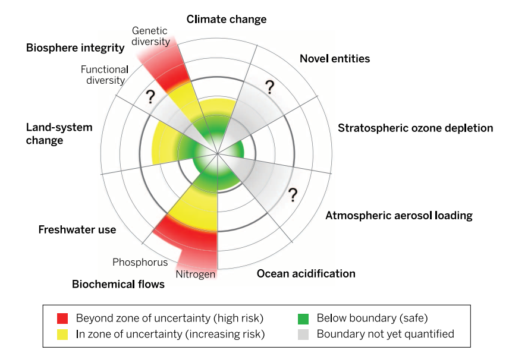
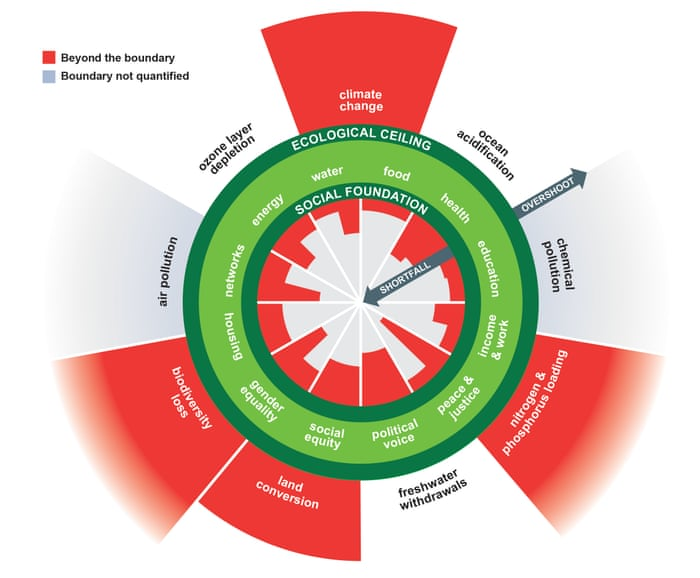
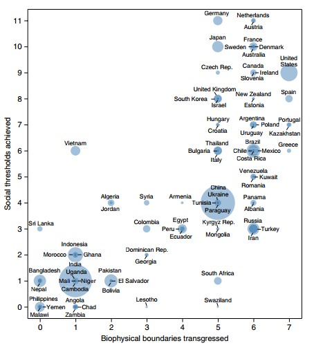
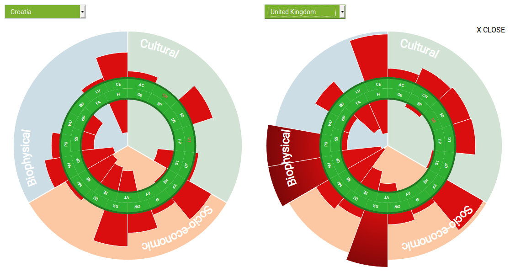

# Degrowth environmentalism — modelling safe and just futures from the semiperiphery

\minitoc

## Introduction: from framework to fieldwork

Over the previous three chapters, I have conceptualised, historically and theoretically, the strategic agency of organisations operating in the "middle ground", situated between the institutional ensembles of the capitalist state and the social constituencies with their ideationally and materially structured social worlds. My objective was to create frameworks that would tease out the structural and conjunctural circumstances that enable these organisations to disrupt the dominant market-driven technology-first approach in global environmental governance.

To arrive there, in chapter 3, I have provided a historical evolution, through class struggle and technological change, of industrial-capitalist social metabolism, characterised by a growing appropriation of resources from nature and labour from the (neo)imperial global geography propelled by fossil fuels. I have highlighted this metabolism's post-WWII consolidation into an economy of growth and wasteful energy systems, subject to transnational governance and militarised geopolitics. In chapter 4, I have proceeded to argue that that social metabolism is organised through large-scale interlocking technological systems and that their attained size constrains — through technical, biophysical, energetic, and economic lock-ins — attempts to transform it. The strategic capacity of social actors aiming to do so is additionally constrained by the actions of other, more powerful social forces through the structures of the state and the capitalist economy. In such technologically and institutionally constrained terrain, the transnational governance process around the UNFCCC has adopted an ecological modernisation framing to mitigate climate change. With the uncertainties of goal-oriented transition aimed at unprecedentedly rapid decarbonisation, the strong influence of the state and the capitalist economy over the direction of transition has weakened, opening up a strategic terrain to contest the technology-first approach in environmental governance. Finally, in chapter 5, I have analysed why such an incremental, flexible, least-cost technology-first approach is resulting in a transition that is failing to keep the global warming down to 1.5°C or 2°C above the pre-industrial levels. This generates a unique opportunity for the "middle-ground" actors to articulate alternative pathways and develop social practices that would allow societies to steer the transition toward ecologically sustainable and socially just futures for all.

Over the next two chapters, I will report and reflect on my fieldwork with two such actors — an environmental organisation in Croatia and an industrial trade union in the UK. The fieldwork was conducted so as to provide concretised answers to what do these organisations concretely do to contest the presently dominant technology-first approach, what are the alternatives they propose to displace it, how they engage their social constituencies to translate these proposals into their lived experience, and what prospects do their proposals open up to in the current conjuncture.

In this chapter, I will engage with IPE and degrowth environmentalism. *I will contend that degrowth environmentalism is the most comprehensive and disruptive attempt at re-framing environmental action because it inverts the terms under which sustainability transition is conceived.* It posits that an environmentally safe — but also socially just — transition can be more adequately and timely achieved by delinking the transition from the imperative of economic growth and a reduced focus on technological restructuring. If the growing demand for energy and materials in affluent societies is throttled down through a democratic transformation of the patterns of production and consumption on the principles of private sufficiency and public abundance, the deployment of green technologies does not need to scale at such a historically unprecedented rate, while the fossil fuels can be phased out more expediently. *As it is significantly focused on framing struggles, degrowth environmentalism places a particular focus on research and expertise.* It draws on a rigorous and non-reductivist scientific understanding of the environmental crisis, models alternative epistemic tools, studies intra- and inter-societal inequities, and articulates integrative North-South perspectives. Beyond these epistemic endeavours, degrowth as a movement also develops and disseminates future-oriented, prefigurative proposals of resilient provision for social needs.

I focalise the account of degrowth around IPE as an important nodal point in the international degrowth movement. I have selected IPE as my case study for four principal reasons:

Firstly, I share research and activist contexts with IPE. As explained in the Introduction in greater detail, from 2013 on I have been involved in the debates organised by the Zagreb-based green-left think-tank Grupa22 [-@grupa_22_us_2018] that have led to the founding of IPE in 2015 and ever since I have been an external participant in the educational, research, and advocacy activities that IPE has been organising — first and foremost through its biannual Green Academy [@ipe_green_] and its involvement in the international Degrowth Conferences. In those exchanges with IPE, I have primarily scrutinised degrowth's approach to technologies [@medak_technologies_2018]. This research is a continuation of that dialogue.

Secondly, IPE is closely connected with the most prominent environmental and spatial justice organisations across Croatia and the neighbouring countries, such as Zelena Akcija/Friends of the Earth Croatia, Pravo na grad from Zagreb, and Ne davimo Beograd from Belgrade, but also with local communities developing sustainability solutions. Beyond the work with these communities and intermediaries, it is involved in institutional framing struggles with its team members participating of the IPCC review processes and a variety of consultation processes in Croatia around climate and environment protection policies, public services, and the commons.

Thirdly, IPE is based in Croatia, a post-socialist, semiperipheral EU country, providing a political and social context that does not fit neatly into the dominant Global North/Global South divide into which environmentalisms are typically separated out, and thus offers its own specific entry-point into degrowth debates.

Fourthly, IPE shares several of its affiliated and core members with the two emerging political platforms of the green-left in Croatia: the municipalist platform Zagreb is Ours! and the national platform Možemo! In fact, since I conducted my fieldwork, its former research co-lead, Tomislav Tomašević, has become a parliamentarian and then the mayor of Zagreb. This close link to municipal politics provides, as the other IPE's research co-lead has highlighted in the interview, a short iterative feedback loop between IPE's environmentalist vision and the political reality it addresses. As it operates in a small political context, the success of these platforms can significantly shift the Overton window of accepted debate on environmental crisis and strategies of addressing it.

I have conducted my fieldwork with IPE over the course of 2019, working primarily with the organisation's research team. The principal methods I have used in preparing and conducting the fieldwork were analysis of primary and secondary documents, participant observation, and semi-structured interviews. In addition, the fundamental positionality of my fieldwork was to contribute with my research to their work on producing research, building expertise, and disseminating knowledge and practices to their own constituencies. That co-research consisted of the following:

* assisting in the development of the Degrowth Doughnut model tool [@ipe_degrowth_2019], which is discussed below in section 6.4;
* lead-authoring an article on "Degrowth" for the *Encyclopedia of the World's Biomes* [@medak_degrowth_2020], which constitutes a part of sections 6.2 and 6.5 (without contributions by my co-authors Mladen Domazet and Andro Rilović);
* contributing in a minor role to an article on "The Degrowth Doughnut Model" for the same *Encyclopedia* [@domazet_mental_2020];
* presenting a paper in the 2019 Historical Materialism conference on "Degrowth - Developing a Future-Oriented Vision of Social Wellbeing within Planetary Biophysical Boundaries".[^6.1]

By drawing on that fieldwork, I will analyse how in its specific inflexion through the work of IPE, situated in the context of a post-socialist society, degrowth environmentalism (section 6.2) suggests that a systemic change resulting in private sufficiency and public abundance might be acceptable to broad segments of the population — assuming a radical redistribution of social wealth that distributive conflicts over future climate action might call for. And in the context of a semiperipheral economy, one that struggles to embed itself into the global capitalist economy, IPE's approach to degrowth suggests that the democratic downscaling and transformation of polluting patterns of production might be more easily achieved if it is developed and spread from a local and municipal level (section 6.3). Provided there are tools such as IPE's Degrowth Doughnut (section 6.4), facilitating a multiscalar understanding of how to reckon with social and biological shortfalls and transgressions, such a transition can also be institutionally governed. It might lead us out of the unsustainable 20th-century developmental trajectory onto a pathway of the mutual flourishing of society and nature, thus presenting a strong framing alternative to the technology-first approach. Lastly, I will discuss some aspects of degrowth critically and, by way of conclusion, analyse its future-oriented, prefigurative experimental proposals as acts of speculative and prefigurative construction for a "rejective future" in a "full world" (section 6.5).

## Understanding degrowth environmentalism

### Origins of degrowth

Degrowth is a social movement and a research framework advocating a transition to forms of social organisation that are sustainable and just. It proposes to achieve this double objective by "de-growing" the energy and matter throughput of the global economic system and re-orienting economic activity centred on resource-intensive production toward socialised provisioning for human wellbeing [@kallis_degrowth_2018]. As a "transitional discourse" envisioning alternative societies built on "ecological integrity and social justice" [@escobar_degrowth_2015, 1], it approaches the transition from a systems-thinking perspective that combines the values of ecology, justice, wellbeing, and democracy [@demaria_what_2013] with a theoretical grounding in Earth system science, ecological economics, political ecology, and post-development.

Degrowth emerged in the early 2000s out of the earlier environmental movements from dissatisfaction with the transnational governance of the planetary ecological crisis. Since at least the Kyoto Protocol, this process has explicitly wedded the action of governments to the commitment to economic growth and technological innovation, although these two pillars of the capitalist system of production have driven a growing appropriation of energy and matter and the degradation of the ecosystems across the planet. The contemporary degrowth movement includes three aspects: theoretical, activist, and political. These are loosely integrated through a continuous exchange in international degrowth conferences, scholarly publishing, and interaction with other environmental and social justice movements [@martinez-alier_sustainable_2010]. Unlike the ideas of sustainable development, green growth, and green capitalism, degrowth insists that environmental stability and sustainability can only be achieved through a departure from the present growth-oriented global capitalist system.

The term draws its inspiration from *The Limits to Growth* report to the Club of Rome published in 1971. It was first coined as "décroissance" by French-German philosopher and political ecologist André Gorz in a debate a year later. The word "officially" entered into English with the first Degrowth Conference held in Paris in 2008 [@demaria_what_2013: 195]. Initially, the idea of *décroissance* rallied together the grassroots activists working on issues such as environmental justice, protection of the environment, or opposition to extractivism with the practitioners of alternative forms of organisation of social production and reproduction like permaculture, cooperatives, ethical banks, co-housing, squatting, and recycling, gradually consolidating into an international social movement [@demaria_what_2013, 202-203]. Regular international conferences crystallised degrowth also as an activist-led research agenda [@martinez-alier_science_2011] and a platform for political advocacy. The research agenda received its provisional manifesto in the lexicon *Degrowth: A Vocabulary for a New Era* [-@dalisa_degrowth_2014], whereas the political advocacy had its first international high-profile foray with the Post-Growth Conference held at the European Parliament in 2018.

### Endless growth on a finite planet

The foundational insight for degrowth is that there cannot be endless growth on a finite planet. While the Earth is not an entirely closed-off system, almost no matter enters the atmosphere, and the incoming solar energy is not readily convertible into work. Thus the regeneration of energy stocks and the recycling of matter available for human use can unfold at a very slow rate.

However, the pattern of continuous economic growth inaugurated by capitalism ignores the limits of planetary stocks and flows. Over the last century, global material extraction and primary energy consumption have grown roughly tenfold to 90Gt/year [@irp_global_2018] and 525eJ/year [@smil_energy_2016, 241]. The world's ecological footprint currently exceeds the annual bioregenerative capacity of the planet by 70% [@global_footprint_network_earth_2021]. Human use has significantly altered 75% of global ice-free land [@ellis_putting_2008] and 66% of marine environments [@ipbes_global_2019] and appropriates around one-third of the net primary production of terrestrial systems [@haberl_human_2014].

This expanding dynamic of extraction has led to a number of negative impacts on Earth's biophysical systems, pushing them beyond their Holocenic variability during the previous 10.000 years that provided a safe operating space for human societies to thrive [@rockstrom_planetary_2009]. The effects of these disruptions are unevenly distributed, impacting the most economically [@diffenbaugh_global_2019] and environmentally disadvantaged communities hardest. At present, no country stays within its "fairly apportioned global biophysical boundaries" while meeting the social needs of its people [@oneill_good_2018]. From a degrowth viewpoint, in order to bring societies within the planetary boundaries, the pattern of expanding extraction has to be reversed, and the provisioning systems addressing societal needs must be organised differently.

The patterns of resource use change throughout history as the modes of production and the modes of social and ecological reproduction come into contradiction [@merchant_theoretical_1987]. These patterns define sociometabolic regimes [@fischer-kowalski_sociometabolic_2014]. Under the fossil-fuelled industrial capitalism, the surplus produced by the workers is appropriated by the owners of capital for private consumption and, fundamental to sustaining the dynamic of growth, for reinvestment into the further accumulation of capital. The process of capital accumulation under the conditions of competition sets an imperative to raise productivity, resulting in growing economic output, i.e., an ever-greater quantity of goods or services produced in a given period of time. As *Figure 4.1* indicates, this growing economy has a strong historical correlation with the increase of material extraction and CO2 emissions (1% increase in GDP resulting in 0.6% increase of material footprint [@wiedmann_material_2015] and 0.5-0.8% increase in emissions [@burke_carbon_2015]). The capitalist mode of production thus destabilises the processes of ecological reproduction.

Economic growth at the national level is measured in GDP. Economic policies are drawn up to keep the GDP growing year on year, and GDP growth is a key performance indicator upon which governments stand or fall. The healthy annual growth rate of an advanced economy is considered to be between 2% and 3%, leading to a doubling of economic activity roughly every 24 to 35 years. The drivers behind this expectation of growth are twofold. On the side of system reproduction, capital is borrowed with the expectation that future growth will repay the debt and interest that, in the next step, serve as capital for future borrowing. On the side of system justification, the competitive forces of the market tend to reduce wages and create inequalities, whereas growth allows policymakers to promise an increase in wages in the future without needing to redistribute the existing social wealth in the present.

However, researchers on the subject of inequality have documented that in middle- and high-income countries the expected trickle-down effect of wealth has not happened since the late 1970s: as growth in wealth and income has concentrated at the top, the wages of the working class have largely stagnated [@piketty_capital_2014; @milanovic_global_2016; @hickel_divide_2018]. For instance, over the same period in the US the wages of the upper 1% have risen by 160%, whereas the bottom 90% have seen a modest increase of 26% [@epi_wages_2020]. Elsewhere around the world, in the decade 1999-2008, the poorest 60% has received only 5% of the global growth [@woodward_incrementum_2015]. Even with the exceptional effect that the reduction of absolute poverty in China has had, relative poverty in the world has increased since the 1980s [@chen_policy_2012]. Alternative indicators of social progress like the Genuine Progress Indicator [@anielski_genuine_2002] reveal that once the negative social and environmental impacts are accounted for, growth beyond a certain level does not bring an increase in objective and subjective wellbeing and is environmentally disastrous [@kallis_degrowth_2018, ch. 4].

While the dominant policy approach assumes that growth can be maintained while making economic processes green, empirically there is sparse evidence that a significant reduction in greenhouse gase emissions and material extraction can be achieved for a sustainably long period of time on a global scale while maintaining growth [@hickel_green_2019]. The hope is that the accelerated deployment of renewables, carbon drawdown, and carbon cap-and-trade schemes might change that in the future. Indeed, a few countries have recently seen an absolute decoupling, with emissions falling while the economy kept growing [@quere_drivers_2019]. However, their observed annual decoupling of less than 1% is far from the annual rates of 14% required to achieve net-zero by 2050 [@jackson_unraveling_2019]. But beyond that small group, environmental policies have so far only been able to achieve relative decoupling, with emissions just rising at a slower rate than the economy [@haberl_systematic_2020, 34]. In fact, the decoupling of growth from the growing energy demand and material extraction might not be achievable at all [@ward_decoupling_2016; @parrique_decoupling_2019]. This suggests that if the IPCC's warnings of a runaway climate change [@ipcc_global_2018] and IPBES's warnings of an unprecedented loss of natural life [@ipbes_global_2019] are to be taken seriously, human action faces a difficult choice between rapid reduction in throughput or the potential collapses of ecosystems. Facing this choice, degrowth offers diagnoses and strategies [@demaria_what_2013, 194] that address major obstacles to transformations that are needed to make global social metabolism sustainable — i.e., how to prevent that the rapid reduction in throughput leads to a reduction in social wellbeing.

### Degrowth economics: bringing the economy back into the biosphere

Degrowth is in principle agnostic as to whether the planned reduction of throughput will lead to a reduction in economic output. Degrowth's goal is certainly not economic depression but long-term sustainability and societal wellbeing. However, the reduction in greenhouse gases needed to stay within the Paris Agreement goals is likely achievable only if the world economy throttles down the present patterns of growth driving the increasing use of polluting energy and extraction. The world would have to cut net emissions to zero by 2050 in order to have a 50% chance of staying under 1.5°C or by 2070 to stay under 2°C [@ipcc_global_2018]. The degrowth scholars Jason Hickel and Giorgos Kallis have calculated that the necessary annual reductions in emissions to achieve those targets at a zero growth rate would have to be 6.8% and 4% respectively, but at a 2% growth rate they would have to be as high as 8.8% and 6% [@hickel_green_2019: 15]. For comparison, in the pandemic lockdown year 2020, the emissions fell by 6.4% [@tollefson_covid_2021]. However, those 6.8% and 4% are equal to or above the most optimistic predictions that put emission reductions at a maximum 4% annually — implying that the target of staying under 2°C might be achievable, but only with a rapid deployment of deep decarbonisation strategies (transition to 100% renewables, afforestation and soil regeneration, and shift to alternative production processes) and, crucially, at a zero growth rate [@hickel_green_2019, 15].

The objective of growth is thus at odds with the biophysical realities of climate change mitigation. It is for this reason that degrowth has taken up the task of challenging the economic orthodoxy that underpins climate change policies. This undertaking necessitates that degrowth mounts a critique not only of growth but also of the economic science for which it is axiomatic. *The critique of conventional economics is the cornerstone of degrowth's epistemic agency.* The economic field is dominated by formal economic analysis focusing on markets and prices while disregarding substantive determinants of economic processes in metabolic interactions between society and nature and the societal purposes of economic processes [@gerber_search_2018].

Historically, the disembedding of the formal economy from its sociometabolic and political determinants began with the emergence of economic science in the 18th century. Until the 18th century, economics was primarily a practical art of managing the resources of land, livestock, and population. With the work of moral philosophers Adam Smith, David Ricardo, and John Stuart Mill, the definition of the political economy gradually shifted away from the substantive concerns of economic activity to the activity's underlying laws [@raworth_doughnut_2017]. With the marginalist revolution of the late 19th century, the discipline completed its boundary-work [@gieryn_boundary-work_1983], differentiating itself out from the fields of political economy and economic history by demarcating markets as its distinct object of inquiry and price theory as its formal method [@gerber_search_2018]. *Thus, as the capitalist mode of production emerged and spread across Europe, the purview of economic science shifted from the management of resources to productivity, laws of market competition, prices, and profits.*

The consolidation of economics thus proceeded apace with the consolidation of capitalism and the modern state. The economy as the object of political and institutional governance assumed its present contours in the 1930s and 1940s in response to the Great Depression, ending the period of *laissez-faire* capitalism. As discussed in chapter 3, the leading economic nations started to reconceptualise the national economy as a dynamic system of interactions between economic actors, whose total output can be estimated by national accounting, measured in GDP and directed by policies that are primarily the responsibility of economic experts who are institutionally safeguarded from direct democratic challenges [@mitchell_economentality_2014].

With this historical development of economics, substantive concerns of human livelihood and interaction with the environment got sidelined. The economy was recast, as illustrated by Paul Samuelson's famous circular flow diagram by [@samuelson_economics_1948, 264], as an isolated system where exchange values circulate between households and firms and no resources are taken from nor waste is released into the environment [@daly_growthism_2019, 10; @raworth_doughnut_2017]. This is a reductive and distorted image that ecological economics has taken the task of setting straight. In his foundational contribution to ecological economics, *The Entropy Law and the Economic Process* [-@georgescu-roegen_entropy_1971], Georgescu-Roegen posited that all economic activity is constrained by the thermodynamically irreversible increase of entropy: it takes matter and energy from nature in a condition of higher-order and availability for transformations – and returns waste and dissipated heat into nature in a condition of higher disorder and reduced availability. The process of degradation is a necessary byproduct of that process and recycling can only be achieved with a significant investment of energy resulting in further degradation.

Georgescu-Roegen thus placed the economic system back inside the biosphere. Human societies — by drawing on water, food, matter, and energy from environments locally and globally — depend for their metabolic reproduction on the exosomatic services of nature. In industrial societies the basic human metabolic rate has thus exosomatically expanded a hundredfold for energy to 100-400GJ/capita and for material consumption to 15-25 t/capita [@krausmann_global_2008; @fischer-kowalski_sociometabolic_2014, 21-22]. Vegetation, soil, and ocean sinks have absorbed around half of all anthropogenic emissions since the beginning of the 19th century [@sabine_oceanic_2004]. All value produced in an economy ultimately depends on nature's sources providing matter and energy and sinks absorbing waste and heat.

I would argue that from the perspective of social metabolism the growth-oriented capitalist mode of production could be read in the following manner: Industrial capitalism transforms growing quantities of matter into products using primarily the energy-intensive stocks of fossil fuels to increase productivity of human labour. Products thus embody energy and matter that went into producing them. Sold as commodities, products can be machines destined to be used in future production or goods and services destined to be irreversibly expended in consumption. Workers sell their surplus-generating labour for a wage to be able to buy products embodying energy and matter that they need for biological and social reproduction. Market competition between capitalist enterprises creates a structural imperative that a large part of the surplus must be re-invested into even more productive processes, mobilising more waged labour, more unwaged reproductive labour, more resources from nature, more cheap and hard labour from poorer economies to extract those resources. This reinvestment ultimately leads to a further surplus, thus engendering a pattern of self-perpetuating growth. However, that growing investment toward productive use also requires growing expenditures on consumption in order to absorb the growing amount of products, resulting in an unstable spiral of overaccumulation and underconsumption that unleashes capitalist crises [@kallis_degrowth_2018: ch. 2]. *Growth thus concomitantly increases environmental destabilisation through the constant spoilation of the conditions of ecological reproduction while aggravating socioeconomic stability through the cyclical degradation of the conditions of social reproduction.*

Degrowth's critique of the economics of growth, and of the larger "culture of growth" [@latouche_farewell_2009], "growthism" [@daly_growthism_2019], and "growth paradigm" [@kallis_degrowth_2018] that assumes that all social and environmental ills will be eventually solved by growth, builds upon the insight that, in the last instance, the decoupling of the economic system from the throughput of matter and energy is impossible. The assumption that all social and environmental challenges can eventually be overcome by sustaining growth ignores the fact that *economic processes will always have environmental costs, which on a finite planet only get displaced from one ecosystem to another as the global system of production expands from location to location and replaces one technological process with another*. Historical evidence at the global level shows that environmental impacts cannot be substantively diminished in a sustainable way while maintaining economic growth in its present form. From the perspective of ecological economics, degrowth thus has the following objectives:

- to re-embed the economy into society, and the society into Earth's systems,
- to re-conceptualize the economy as "the instituted process of interactions between humans and their environments, involving the use of material means for the satisfaction of human values" [@kallis_degrowth_2018, ch. 2],
- to develop policy proposals for the reorganisation of the economy and the attendant political system to bring the sociometabolic processes within the biophysical boundaries,
- to analyze how the growth-oriented capitalist system produces artificial scarcity as coercion to wage labour [@hickel_degrowth_2019] and how it "solves" this scarcity through the massive overproduction of consumer goods and services,
- to analyze how the growth-oriented capitalist system creates dynamics of power, social hierarchies, and oppression through the private appropriation of social surplus [@kallis_degrowth_2018, ch. 2], and
- to develop a social system of distribution that would lead to an economy of public abundance and human wellbeing based on sharing.

## Institute for Political Ecology

The previous section has dealt with degrowth's origins and foundations. Geographically, degrowth spread from the French, Spanish and Italian movements, gradually entering into a dialogue with the post-colonial Global South and expanding across the Global North to include existing and new environmentalist orientations and research agendas. To Eastern Europe degrowth arrived in the late 2000s and early 2010s. In the following sections, I will unfold the perspective that a semiperiphery contributes to degrowth, as presented through the positions and actions of IPE based on my participant observation, analysis of primary documents, and semi-structured interviews with its managing director Vedran Horvat, research lead Mladen Domazet, and research assistant Andro Rilović.

### Introducing IPE

IPE was established in 2015, continuing the work of the Zagreb office of the Heinrich Böll Foundation and building upon its collaborations with the activist groups Green Action/Friends of the Earth Croatia, Right to the City Zagreb, and the think-tank Grupa 22. From its very beginning, IPE integrated itself into the international degrowth movement: researcher Mladen Domazet joined the Degrowth Conferences Support Group, the only standing coordinating body of the degrowth movement, IPE co-organised the 2016 international Degrowth Conference in Budapest, and published the Croatian translation of the *Degrowth: A Vocabulary for a New Era* [@dalisa_odrast_2016]. This placed IPE on the map of the movement but also introduced degrowth to public debates in Croatia.

IPE self-defines as "a research and educational organisation that designs alternative development models and innovative institutional frameworks for a democratic political and economic transformation of society. The Institute addresses contemporary ecological changes as social phenomena that reduce or magnify social inequalities and influence power relations." [@ipe_ipe_] IPE is not formally an academic institution. Rather, it is a civic association aimed, according to Horvat, at "growing epistemic communities between academia, social movements, and politics". However, IPE has a strong research focus, with an in-house research team, an international fellowship programme creating a steady inflow of visiting researchers and interns, and strategic partnerships with formally academic institutions such as the Institute for Social Research in Zagreb, the Faculty of Political Science in Zagreb, and the Sustainability Studies programme at the Furman University in South Carolina.[^6.2]

Beyond the focus on degrowth, IPE has produced studies on the commons, public services, the energy sector, and railways. These studies built upon the research work done by other organisation members and affiliates, including Tomislav Tomašević, Nikolina Rajković, and Jelena Miloš.[^6.3] IPE's research and educational activities are aimed at providing expertise and developing analysis for and with the social movements and their militants, most prominently Green Action/Friends of the Earth Croatia and Right to the City Zagreb, but also political actors on the left and green side of the political spectrum, most recently political platforms Zagreb je naš! and Možemo!. IPE also works with smaller organisations across Croatia, for instance, Pomalo on the island of Vis, or energy cooperatives along the coast. Its most notable international partners are Transnational Institute from Amsterdam, Friends of the Earth Europe, Green European Foundation, and many organisations in the international degrowth movement. IPE's most prominent public-facing activity is their summer and winter academies, titled Green Academies [@ipe_green_], where many of these international actors converge with environmentalists from around Southeastern Europe.

IPE currently has two principal program streams: degrowth with the related topics of climate justice, sustainability, and energy transition and the democratisation of public services with the related topics of the commons, resource management, and municipalism. It approaches these issues from the standpoint of political ecology [@ipe_ipe_]. Political ecology analyses the relations between society and nature as structured by power and economy [@benjaminsen_political_2019], understanding that the environmental risks affect different social groups relative to hierarchies of class, gender, or race. The degrowth stream deals, as Domazet explains in my the interview with him, "with global and national sociometabolic transformations" needed to bring human societies within planetary boundaries, whereas the democratisation stream deals with national and municipal governance of public services and the commons in transport, water, housing, or energy in line with that larger understanding of sustainability. The former, in Domazet's view, provides the "why and where to", whereas the latter provides the "how". Or, in terms of my analysis, the former is oriented toward framing struggles, whereas the latter is oriented toward analysing, supporting, and developing practices of sustainability in the social context and frequently from the bottom-up. However, in challenging the larger hegemonic narrative of growth-driven, unsustainable development and exploring alternatives, IPE is not limiting itself to a degrowth-perspective, but as Horvat highlights when speaking of the diversity of perspectives in the organisation, IPE draws on a variety of legacies of environmental thought.

Research done on degrowth is mostly fundamental sustainability research. It is aimed at developing analytical and narrative models for a subsequent application in degrowth advocacy and environmental policy processes. In the international context, particularly relevant research has been done around attitudes in support of degrowth transition [@ancic_potential_2015] and around the Degrowth Doughnut (see section 6.4). However, such fundamental research also finds its way into IPE's education activities and the studies it publishes.[^6.4]

### Technologies and sociometabolic transition

An essential segment of the democratisation stream deals with intensely technological systems of energy provision and railway transport [@tomasevic_nase_2019], which present some of the most significant challenges for a sociometabolic transition. Specifically, IPE is monitoring how Croatia's public electricity producer and distributor Hrvatska elektroprivreda is gearing for a transition to renewables, reduction of emissions in its own operations, and prevention of vulnerability to climate change, given that changing precipitation might affect the generation of electricity from hydropower. Furthermore, IPE is participating in the mPOWER European Network [@_mpower_2018], developing shared learning and expertise in making cities the drivers of the energy transition, primarily through a remunicipalisation of energy provision, switching to renewables, and reduction of emissions in their public systems. It is also actively participating in processes around citizen energy and energy cooperatives in Croatia.

While IPE's focus in these activities is on political, economic, and sociometabolic aspects, technologies — defined by Domazet in the interview as systems "transforming solar energy (as the primary source of change on the planet) for human use" and understood as not so much the drivers but instruments of environmental degradation — are seen as only one among many factors that shape the terrain of the social process of transformation. To exemplify, in the interview Horvat suggests that an ecomodernist orientation toward technological solutions "neglects fairness, accessibility, and justice", and that the early "debate over energy transition has been captured by technologists". However, in his view, socioeconomic aspects in the process of selection of technologies remain essential. Even when the right technologies with positive environmental and social impacts are prioritised, existing socioeconomic arrangements can limit their effects. Horvat thus cites the example of energy cooperatives, cautioning that they easily become just another for-profit business that seems democratic in how it is managed but is divorced from larger social and environmental goals such as the right to clean energy and fair work. They tend to turn the energy transition into a decision over technology and price for the consumers. However, if the market plunges and they collapse, this risks turning users back to fossil fuels. Therefore, for IPE, the question of public ownership of municipal energy remains essential.

In Horvat's view, financial and technological means do exist to pursue a low-carbon transition. However, the relations of power and economic interests present an obstacle. In addition, we are also facing a "civilisational contradiction" that Horvat illustrates with the overwhelming support of German citizens for bolder measures to tackle climate change (80%) and much lower support for carbon taxes (40%) [@deutsche_welle_most_2019]. This contradiction, in my analysis, is potentially reflecting an implicit distributive conflict that I analysed in chapter 5. It becomes only exacerbated when placed in the context of degrowth that demands a rapid dismantling of highly impactful technological sectors and throttling of certain economic activities.

### Understanding the strategic terrain of a degrowth transformation

As my interviewees agree, this contradiction, however, cannot be resolved if the rapid transition is imposed top-down and environmental impacts are not internalised into more substantive democratic decision-making processes. Therefore, these impacts have to be scaled down and made transparent to, as Domazet calls them, "self-managed metabolic units", which can range from a factory to a city to a country. He further suggests that if a polluting factory needs to be shut down or reorganised, the ambition of just transition proposals that require that each polluting job is replaced by a clean job might not be realistic — such a transition can be thus made much easier with the reduction of the working week, job sharing [@unti_job_2014], and the "redistribution of surplus through a sufficient basic social income". Such radical social reforms might be a prerequisite for a rapid transition to be considered just.

The scaledown and internalisation of justly allocated environmental impacts into democratic decision-making of self-managed metabolic units might also require a reduction of complexity of technological processes, which the third interviewee, Rilović, with his more libertarian municipalist outlook [@bookchin_libertarian_1991], considers a necessity. However, all three of the interviewees share the opinion that the transformation has to start from a local, municipal, or city level, where it more visibly translates into social and environmental benefits. For instance, Horvat sees the potential to drive a larger policy change around renewables in Croatia by motivating the coastal communities, which both experience economic benefits and social and environmental depredations from mass tourism, to invest in satisfying their energy needs independently.

While all three see the coordinated large-scale policy drives at the national and international level, such as the new wave of green new deal proposals made in the US, UK, and EU, as useful instruments in sustainability transition, they see the risk that these will not resolve social inequalities, will not change the existing sociometabolic paradigm, and will not achieve the cultural change that is needed in order to tackle civilisational contradictions. The change cannot be centrally imposed, as centralisation would risk resulting in a non-democratically imposed "austerity" (Horvat). As Domazet states in the interview:

> The transformation has to be global but not centralised. If parts of the world could secure their subsistence within the planetary boundaries and technological base they can govern, implement, and maintain, they would show a type of cultural leadership that would make free riding collapse on its own.

In his view, degrowth thus leads by example and experience of transitional behaviour. It organises sustainable and just ways of production and social provision from the bottom-up, a process that can be replicated across the world. It envisions an affirmative, self-reproducing change that builds out from and between municipalities. Lack of public support for such a vision has to be overcome, following Horvat, by shifting the language from mitigation, which relates to top-down plans, to the language of adaptation that resonates particularly with the realities of local communities. To spur technological change, the paralysis at the systemic level and at the level of decision-making needs to be pierced through. Communities of users who can "dissociate themselves from the ideology of growth and who can transition to alternative common senses" are, according to Domazet, the agents of such change.

The specificity of IPE in the international degrowth movement is that it works against the historical background of Yugoslav self-managed socialism, which makes it less suspicious of modernity and modernisation than the rest of the degrowth movement. As a process of socialist transformation, modernisation did not consolidate through the colonialism that the Global North has perpetrated on the Global South [@quijano_coloniality_2000]. In socialist Yugoslavia, modernisation rather emerged from internal social forces of emancipation and brought advances that have built a social foundation, which has been mostly eroded since the end of socialism. Public infrastructure such as hospitals, schools, energy systems, and transport networks mostly date back to the socialist period, whereas the industries have largely been asset-stripped in the 1990s. This experience of disruptive system change has implications for the popular attitudes toward self-limitation that degrowth proposes. As Domazet and Ančić have argued [@domazet_prosperity_2014; @ancic_potential_2015], the generally lower wealth and economic output of Eastern European countries makes the attitudes of their populations, compared to the populations of more affluent countries, more inclined toward a democratically coordinated degrowth rather than the greening of capitalism. A mostly positive Yugoslav experience of socialist modernisation can be understood as an openness of those communities to alternative development pathways that stand in opposition to the present growth-oriented capitalism, which has brought economic plight to most of the post-Yugoslav societies.

Within this context, IPE is doing the necessary "preparatory work for change to happen" (Horvat). An essential part of that work involves developing governance tools that could help with the internalisation of equitably allocated environmental impacts into democratic decision-making of self-managed metabolic units. IPE has pursued this task by developing the Degrowth Doughnut.

## The Degrowth Doughnut: transcending the opposition of society and nature

IPE's work on developing the Degrowth Doughnut as a non-reductivist and multiscalar indicator of society-nature interactions to help benchmark and democratically steward different transitional trajectories, fits into the recent efforts by the larger degrowth research community to transpose the rationale of degrowth into the conventional instruments of political epistemology used by the IPCC and climate governance. A degrowth integrated assessment model developed by @keysser_15_2021, a societal transformation scenario developed by @kuhnhenn_societal_2020, and a doughnut model of sustainable development within planetary boundaries developed by @raworth_safe_2012 are all quintessentially leverages in discursive and institutional struggles over the framing of sustainability transition. These strategies, in my analysis, are focused on breaking the orthodoxy of global climate governance, *indicating that the pathways focusing on changes in the system of social needs and the socialisation of provision are superior in meeting decarbonisation goals in comparison to the market-driven technology-first approaches and that the "changes in all aspects of society", as called for by the IPCC [-@ipcc_summary_2018], can be broken down into meaningful and context-sensitive decisions.*

### Modeling society-nature interactions

However, before engaging in greater detail with IPE's Degrowth Doughnut, a brief detour into modelling society-nature interactions and capturing the multidimensional anthropogenic impacts on the Earth system is useful. This detour will shed light on the relevance of these scientific models in climate policy and the problems that result from their narrow focus on greenhouse gas emissions, growth-oriented economic modelling, and the society vs nature opposition, aspects that IPE is trying to address through its own doughnut model.

With the expansion of the capitalist instrumental rationality, social production and reproduction have been pitted into a zero-sum game against nature. The expansion of social needs mediated through the industrial-capitalist social metabolism has a growing impact on Earth's regenerative and non-regenerative sources, so if societies wish to limit their impact — in that zero-sum game — they need to limit their expansion in order to leave more space for nature's processes. Degrowth rigorously acknowledges the limits to the material expansion of human needs in nature. However, it also aspires to reorganise the patterns of production and reproduction with the aim of transcending this zero-sum game [@domazet_mental_2020, 283]. The wager is that societies can flourish while nature does so as well. Through the parallel reduction in throughput of energy and matter and a re-orientation of production from material goods toward equitable provision for social needs, the human productive activity would allow biophysical capacities to regenerate while advancing a plurality of projects of social wellbeing.

However, the notion of the mutually reinforcing flourishing of nature and society risks being an idealist, romantic notion, unless the present sociometabolic reality is not analysed as running against the limits of nature's renewable and non-renewable sources — the transformation has to acknowledge and start from the status quo. Arguably, the earliest attempt to analyse and understand interactions between society and nature at the planetary scale in a systemic manner was the integrated simulation model *World3* developed by the pioneering cybernetician Jay Forrester and the System Dynamics Group at the MIT, designed specifically for the purposes of *The Limits to Growth* report [@meadows_limits_1972], which would later inspire the degrowth movement. Forrester's model included five subsystems (natural resources, population, pollution, capital, and agriculture) connected through a number of feedback loops. These loops included variables for which the team had to reverse-engineer almost non-existing world-scale datasets [@edwards_vast_2010, 366-372]. For all of the scenarios the authors of the report Donella and Dennis Meadows and their team ran across long time scales, the model famously predicted that the dynamics of exponential growth in population, pollution, and resource use could not be sustained on a finite planet and would by the mid-21st century lead to major pollution (measured in CO2 emissions) and starvation. While the lack of accurate real-world data and a simplistic model made their simulation quite unrealistic, the resulting predictions have not been totally off the mark. More importantly, their work has lodged the integrated dynamic model as the paradigm of global assessments of society-nature interactions for the decades to come [@purvis_modelling_2021]. Climatology and Earth system science, and consequently, our understanding of climate change, would not have been possible without such models. Nowadays, the transnational governance process around the UNFCCC relies on integrated models of society-nature interactions to advise global climate policy. Integrated assessment models can combine a range of physical, economic, and social variables to allow scientists to assess what impact different socioeconomic pathways (i.e., trajectories of global social development that include mitigation measures) will have on achieving the set targets.

The six dominant integrated assessment models used in the IPCC process combine two components: an economic component accounting for mitigation investments and economic growth and a physical component with a simplified climate model estimating emissions from energy consumption and their effect on temperature rise [@purvis_modelling_2021]. Economic models used in these models assume, without exception, that future scenarios, so-called shared socioeconomic pathways, sustain economic growth. They thus consider economic growth as the optimal outcome of decarbonisation scenarios, while scenarios leading to a reduction in GDP are seen as negative, displaying a bias against substantial changes in the societal patterns of production and provision.

Furthermore, approaches focusing on one headline indicator, such as emissions, veer toward reductivism, in the case of integrated models "carbon reductivism" [@hoyer_seven_2010]. "Carbon reductivism" disregards the fact that the planetary environmental crisis is a combined crisis of a number of Earth's subsystems and not only of a warming climate. To account for the multifaceted environmental crisis, the team of scientists around the Stockholm Resilience Institute have isolated nine biogeophysical processes (see *Figure 6.1*) whose limited variability over the last 10.000 years of the interglacial Holocene period has allowed human societies to flourish [@rockstrom_planetary_2009; @steffen_planetary_2015].

```{r echo=FALSE, fig.cap="Visualisation of planetary boundaries, source: Steffen (2015).", fig.scap="Planetary boundaries", out.width="100%"}


```


The Earth system model defines boundaries of that limited variability as "a safe operating space for humanity". However, this model does not reckon with the complexities of social systems. To rectify that shortcoming, Kate Raworth [-@raworth_safe_2012] has proposed to integrate the planetary boundaries model with the indicators of social priorities under the UN Sustainable Development Goals, thus creating a model of "safe and just operating space for humanity".

### Doughnut: between the social foundation and the environmental ceiling

Raworth has advanced her integrated model to highlight that while the effects of historical and present transgressions of planetary boundaries endangering "safe space for humanity" have to be brought back within the pre-industrial era limits, never has all of humanity lived inside the "just space" of the fulfilment of social needs — and thus her framework provides a tool to benchmark different trajectories of social transformation that would enable all societies to reach that goal [@raworth_safe_2012, 8]. Doing so, however, would require a departure from the present economic system toward a system that would equally:

* pursue the social, economic, and environmental goals of sustainable development;
* re-orient economic activity away from growth for the sole purpose of growth;
* and measure achievement in indicators other than GDP [@raworth_safe_2012, 8].

In designing her model, Raworth has used the planetary boundaries model not only as a point of departure but also as a representation from which to formalise her own model. Interpreting planetary boundaries as an environmental ceiling that should not be breached, she has inscribed inside that ceiling an inner circle of social foundation that societies should not fall short of. These two circles form a doughnut-shaped space representing the "safe and just operating space".

```{r echo=FALSE, fig.cap="Raworth's doughnut model, source: Raworth (2017).", fig.scap="Raworth's doughnut model", out.width="100%"}


```

Raworth's doughnut (or lifebelt) integrates environmental and social realities. It also acts as a policy tool to develop, steer, monitor, and compare future transition scenarios, filling the space between the description of the present reality and the aspirations of achieving social wellbeing within planetary boundaries. It sets two normative constraints on those scenarios: that everyone should be able to achieve the social foundation, while everyone should remain within their environmental ceiling. However, an environmental policy might have negative social impacts (e.g., regressive carbon tax), just as a social policy might have negative environmental impacts (e.g., fossil-fuel subsidy). There are only certain strategies within those constraints that do not come with such a trade-off (e.g., corporate carbon tax with an earmarked dividend or closing of a polluting factory with the opening of jobs in ecosystem restoration). The doughnut thus defines a narrow bandwidth of possible strategies of transition, but it still leaves space for different strategies that can be specific to different contexts. Also, it was developed with different scales of application in mind — from global to national to regional to local. For instance, Raworth has been tasked by the City of Amsterdam to adapt the model to steer its sustainability transition so as to secure the wellbeing of its citizens, while remaining within its justly apportioned global share of planetary capacities.

Dan O'Neil and his team [-@oneill_good_2018] have assembled the dataset for Raworth's initial model for all countries, concluding that at present no country fits within the doughnut (*Figure 6.3*). For good measure, the universal achievement of some of the more demanding goals of the social foundation, such as democracy, equality, or secondary education, would require, using current technological and institutional provisioning systems, "resources 2-6 times the sustainable level" (88). That is a daunting prospect if it is to be achieved for a global population. It would require a drastic restructuring of provisioning systems (infrastructures, technologies, manufacturing, governments, communities, markets...) and a re-orientation of social needs toward sufficiency instead of maximisation of needs-satisfiers. It also indicates that the most affluent nations that do well on those goals of the social foundation, such as Nordic social democracies, do not offer a scalable model of development for the less affluent nations, requiring us to re-think what post-development in global terms might be.

```{r echo=FALSE, fig.cap="No country reaches the social foundation while remaining within the biophysical boundaries, source: D. W. O’Neill et al. (2018)", fig.scap="No country reaches the social foundation while remaining within the biophysical boundaries", out.width="100%"}


```

### The Degrowth Doughnut

The research team around IPE, led by Mladen Domazet, has acknowledged the conclusions of Dan O'Neill's team that the maximisation of needs satisfaction achieved by efficient provisioning might not bring us into a safe and just space for humanity, so we might need a conceptual model that starts from sufficiency rather than technological and economic efficiency and needs maximisation. Furthermore, Domazet and his team have, in their contribution to the *Encyclopedia of the World's Biomes*, argued that Raworth's doughnut, by placing the overshoots of the environmental ceiling on the outer rim and the shortfalls against the social foundation on the inner rim, proposes a conceptual model that simply assumes a "zero-sum trade-off" [@domazet_mental_2020, 7] between society and nature, a binary opposition characteristic of the capitalist ecology that has dominated modernity hitherto and that has to be transcended if humanity is to transition toward a safe and just space for all. To reckon with these two shortcomings of Raworth's model, the researchers at IPE have developed their own doughnut.

Unlike Raworth's, the Degrowth Doughnut (*Figure 6.4*) places biophysical and socioeconomic indicators, to which it adds a third set of cultural indicators, both at the outer and inner rim. The biophysical segment includes indices for climate change, biodiversity and agriculture, the socioeconomic segment for material security, health, energy & materials, and democracy, and the cultural segment for wellbeing, environmentalism, and democratic potential. In contrast to Raworth's model, some biophysical indices, such as afforestation or organic soil, register shortfalls in human restorative action addressing measures which would be equally beneficial for society and nature. Conversely, some socioeconomic factors such as overwork or cultural factors such as anthropocentrism can have overshoots that result in negative impacts on both humans and the environment.

```{r echo=FALSE, fig.cap="Degrowth Doughnut: comparison between Croatia and the United Kingdom.", fig.scap="Degrowth Doughnut: comparison between Croatia and the United Kingdom.", out.width="100%"}


```

The Degrowth Doughnut includes indices that were selected to reflect sufficiency rather than needs maximisation. For instance, instead of absolute life expectancy, the Degrowth Doughnut includes an indicator of healthy life expectancy that deducts years of poor health from the years of healthy life. Health rather than longevity is a better indicator of wellbeing, although the former can lead to the latter. Furthermore, among cultural indicators, it registers pro-environmental attitudes toward climate change, democracy, ecosystem restoration, and degrowth that are a prerequisite for an ecological transformation.

The outer rim defines the constraints between society and nature, whereas the inner rim highlights the restorative actions that lead to the mutual flourishing of society and nature. The inner rim includes thresholds as diverse as "ecosystem restoration, sustainable food and energy provision, social equity, democratic participation, human health, wellbeing, and pro-environmental activation" [@domazet_mental_2020, 284]. Such a dialectical model, positing a connection between the necessity of limitation and the potentiality of restoration, defines "the basics of 21st century just and sustainable life on which no society should be reneging" [@domazet_mental_2020, 284].

However, it needs to be noted, the Degrowth Doughnut has certain limitations. Firstly, datasets for the indicators, particularly cultural, are lacking for many countries. One indicator, support for degrwoth, was developed by IPE and has data for only eighteen countries [@ancic_potential_2015]. This limits the ability to compare countries on that indicator. However, the missing indicators can be conveniently omitted from the doughnut to still allow for comparison between indicators that do exist. Or, they can be substituted with other indicators that reflect pro-environmental attitudes that are specific to a context to track the progress of a transformation over time that is specific for that context. Secondly, this begs the question as to why these indicators were selected. Raworth's indicators draw from two major research and policy efforts: the planetary boundaries model and the Sustainable Development Goals. But for this reason, they remain beholden to the assumptions of existing models, which do not factor in the change of sociometabolic system — exactly the problem that is also reflected in Raworth's binary opposition between society and nature. Indicators in the Degrowth Doughnut are less grounded in the pre-existing analyses but have the benefit that they are more programmatic in their orientation toward degrowth and allow for plural future society-nature development trajectories while still retaining a universal framework of global constraints for those trajectories. Thirdly, an integrated assessment should satisfy a number of criteria [@pulselli_need_2016]: it should be based on systems-thinking, be oriented toward the long-term transformation while offering guidance for localised action, consider equally production and consumption patterns, consider a fair distribution of burdens, address abosolute instead of relative indicators and causes instead of symptoms. While Degrowth Doughnut certainly does cover many of these aspects, it requires further research to establish if particular indicators are absolute and benchmark causes instead of symptoms. But as @domazet_mental_2020 discuss, the Degrowth Doughnut is more akin to a scientific principle theory that offers "a breakout from a conceptual impasse", and generalises abstract space of possible changes in the causal interactions, which ultimately points toward the transformation of the global social metabolism that all doughnut models aspire to.

While offering a conceptual model that integrates findings from environmental science and social sciences, doughnuts are primarily developed as a governance tool that might help develop, steer, monitor, and compare strategies to transition societies toward safe and just futures. Therefore, I would argue that they are a form of participation in the debates of the scientific "extended peer community" that advises policymakers, but also as *an attempt to practically shift the frame of the debate and dominant institutional logic around climate action from reliance on the market to democracy at various scales of governance.* Doughnuts can visualise for everyone both the downscaled global environmental responsibilities and internal social responsibilities. They can be scaled down from countries to regions, and even smaller self-governing metabolic units, provided there is adequate data, and it is IPE's expressed intent to develop the existing online visualisation tool into a tool that could draw doughnuts for datasets at various scales.

## Degrowth as a new political imaginary

With that experience of IPE's degrowth advocacy from the semiperiphery and against the background of the framework of the "middle-ground" strategic agency I devised in the previous chapter, in this last section I will discuss the transformations that the degrowth movement is proposing and the scales on which it is proposing them. Furthermore, I will argue through some of the criticisms of degrowth. And, finally, elaborate how its non-reductivist, multidimensional, and prefigurative strategy opens up to compositions of livable environmental futures — in a "full world" that, as I will contend, has become rejective of most future-oriented strategies of social development.

### Proposals for a socially sustainable economic degrowth

Degrowth's double objective of reducing ecosystems' overuse while achieving wellbeing is primarily addressed at affluent societies. It is the affluent societies that should lead the way in throttling down growth and redistributing social wealth domestically and internationally. By doing so they would relieve other societies from the competitive pressures of the capitalist growth-oriented system and allow them to pursue their own pathways to sustainable wellbeing, thereby securing a horizon of environmentally safe and just futures for all societies. Unless affluent societies lower the level of resource appropriation in a planned way, environmental degradation might reduce the economic base of many societies to a much smaller level [@stern_economics_2007]. In fact, climate instability has already widened the inequality between more affluent and less affluent societies by 25% [@beuret_global_2019]. But also, in more affluent societies, a scaledown, if accompanied by a democratically deliberated redistribution of income, wealth, and power, might make sense for the many. For instance, after a certain level of affluence, it is not a higher level of income but a lower level of inequality that leads to higher life expectancy and better educational attainment [@wilkinson_greater_2011]. Welfare states with stronger public provision for social needs contribute to a greater sense of social wellbeing [@okulicz-kozaryn_subjective_2014]. Lower disparities in income and power lead to greater environmental protection [@boyce_power_1999; @raworth_doughnut_2017, ch. 3]. As IPE researchers have found out in their study of 18 European countries, if a pro-environmental scaledown is implemented with a redistribution of wealth toward wellbeing and equality, a substantial part of the population might find it politically acceptable [@ancic_potential_2015].

What follows from there, and as I have argued in chapter 5, is that *environmental action has to be wedded to the problem of distributive justice and embedded into the everyday experience, addressing the apprehensions of popular masses over who is going to carry the cost of transition and instilling a practical grasp of the improvements to their social reality.* To instil that grasp of how a post-capitalist social metabolism can be evolved within a capitalist world, degrowth has devised a variety of proposals of "non-reformist reforms" [@gorz_strategy_1968, 6ff], including:

**1. Economy and economics:** The economy has to be made substantive by capping resource use based on the limits imposed by planetary boundaries, while allocating those resources for human needs democratically and equitably [@gerber_search_2018]. The system of production should have collectively agreed purposes and be maximally localised. It should be centred on social and ecological reproduction, prioritising relational and ecological goods — such as care-labour and ecosystem restoration, and placing sufficiency before efficiency and productivity.

Fractional reserve banking, the creation of money by private banks, and debt above what is needed for intergenerational redistribution should be abolished to limit the financial rents that drive the dynamics of growth. Concurrently, the state should take control over the issuing of "public money" [@mellor_future_2010] to finance a social economy: "a basic income or a job guarantee or to subsidise cooperatives, care services, environmental conservation or renewable energy" [@kallis_introduction_2014, 13].

GDP should be replaced with indicators that measure social and ecological integrity, such as the Genuine Progress Indicator or Index of Sustainable Economic Welfare, or more ideally, with multidimensional indicators such as doughnuts.

Polluting segments of the economy, such as the fossil-fuel industry, need to be rapidly divested from or repurposed for the provision of clean energy.

**2. Employment:** Lowering of economic output can lead to unemployment. However, the replacement of energy-rich fossil fuels might require more human labour [@sorman_energetic_2013]. The working week should be reduced, workplaces shared [@shor_work_2014], and jobs guaranteed to anyone who seeks employment [@unti_job_2014].

**3. Investment:** Investments should be redirected away from unnecessary and harmful activities such as military, fossil fuel, and polluting industries, and toward achieving environmental sustainability in agriculture, technology, the built environment, and infrastructure. Investments should also be redirected toward financing public services and a cooperative solidarity economy [@johanisova_co-operatives_2014].

**4. Income and taxation:** Societies should establish a universal basic income and universal access to goods such as food, housing, and care to meet the basic needs of all its members while also placing a cap on maximum income and taxing wealth to limit disparities. Taxes should shift from taxation of labour to taxation of resources and pollution.

**5. Technologies:** Green technologies should replace polluting technologies, however gains in efficiency and productivity should be translated into caps on resources and reduction in working hours to prevent a rebound effect or the expansion of extractive production [@alcott_impact_2010]. Technologies should be developed under open license arrangements and should be manufactured locally, while research and development should be done through a global collaborative effort [@medak_technologies_2018].

**6. Restoration of ecosystems:** Downscaling the global throughput of matter and energy will not be enough to ensure planetary ecological stability – halting the sixth mass extinction and arresting the climate change. Degraded ecosystems need to be restored in order to effectively remediate the destructive effects already unleashed by the growth imperative. Expanding nature's protected areas, afforestation, agroecological farming, and the development of other mutually restorative practices between society and nature are the way to increase ecosystems' reproductive capacity.

**7. Democracy:** Degrowth assumes that social transformations cannot be implemented top-down but require a collective transformation of ways of living built on private sufficiency and public abundance. To achieve a transformation and evolve new patterns of production and provision will require a collective deliberation over those processes and a direct democratic power of members of sociometabolic units. This has led to a growing recognition of the importance of "direct democracy" [@kallis_degrowth_2018] and "democracy in the workplace" [@barca_labors_2017] within the degrowth movement. While capitalism is premised on the institutional separation of the economic from the political [@meiksins_wood_separation_1981], a key condition for a degrowth transition is to re-embed economic processes within the realm of social needs and political deliberation. In more radical proposals, this calls for a devolution of power to smaller political units of social organisation such as local communities and municipalities, along the lines of communalism or ecological municipalism where democratic municipalities confederate [@bookchin_social_2007].

**8. Decolonial pluriverse:** The degrowth movement maintains solidarities with the environmental justice movements and livelihood environmentalists of the Global South [@martinez-alier_socially_2009]. Affluent societies should repay both colonial and environmental debt through reparations and reparation ecology [@moore_unearthing_2017] while fostering global collaboration in shared technologies for localised systems of clean production and globally coordinated efforts of cleanup. They should acknowledge colonial and racist legacies by creating preconditions for non-competitive development. However, rather than imposing a unitary developmental model imported from the Global North, post-development allows for a pluriverse of cultures and economies [@kothari_pluriverse_2019], where societies get more leeway from the global capitalist economy to create their own pathways to locally just and globally sustainable futures.

### Scales of transformation

These proposals are not without contradictions. On the one hand, they aspire a global transformation, or at least a coordinated action between the Global North and the Global South. But to become politically feasible, the transformation has to start from national or preferably local metabolic units. However, this contradiction between the global condition and the local contexts as parallel grounds of action is inscribed in the "middle ground" where most of the degrowth actors are situated — i.e., between the poles of largely (trans/sub)national governance that promulgates policies and of largely intra-social lived realities and distributive conflicts involving different social constituencies (see *Figure 5.1*). What the discussion of IPE's work and the set of proposals listed above indicate, with important implications for my "middle-ground" strategic agency framework, is that *the gap and struggle between the global governance and the local social realities is not mediated through and resolved only on the policy terrain, but equally on the institutional terrain of the economy, welfare provisions, and infrastructural arrangements — at all of which degrowth targets its many proposals and innovations.*

However, as a strategy of global transformation, degrowth has been vehemently criticised by the scholar of global inequality Branko Milanović. Milanović claims that degrowth is magical thinking because it, supposedly, entails a convergence of income of global populations to the world median of US$16/day [@milanovic_illusion_2017a; @milanovic_illusion_2017; @milanovic_degrowth_2021]. In Milanović's' view, it is a politically unfeasible proposition as it would require 86% of the population of the higher- and middle-income countries to renounce their higher incomes. It could be debated if this is a fair representation of degrowth positions, as degrowth envisions a plurality of socioeconomic pathways that do not fit the pattern of resource-intensive capitalist development — if for no other reasons, at least for the reason that this developmental trajectory is for environmental reasons not available to the entire humanity. Nevertheless, @kuhnhenn_societal_2020 propose two comprehensive societal transformation scenarios focusing on transport, housing, food production, and technologies — and not income — that would lead to a convergence between the degrowing Annex I countries under the Kyoto Protocol (i.e., industrialised and industrialisng) and the growing non-Annex I countries to more easily achieve the decarbonisation goal of staying below 1.5°C.

Still, it remains a non-trivial task to orchestrate societal changes and socieconomic redistribution at a global level. But if we view this predicament from the perspective of the future degradation of planetary ecosystemic resources, there might be magical thinking in the assumption that the distributive conflicts over the access of economic resources can be avoided at the international level. The continuation of fossil-fuelled "business-as-usual", but also an inadequate and untimely growth-oriented transition might, as scientists warn, result in significant costs, reduction of GDP, and displacement of people under climate stress. Assuming that the capacity of adaptation to climate change impacts such as heatwaves, floods, and droughts is also dependent on economic resources, the global poor will struggle to adapt. They might, however, contra Milanović's crown argument suggesting that migration is motivated by a desire for a better life and the ability to buy more stuff [@milanovic_illusion_2017], be forced into migration not only because the grass is greener in the affluent North, but because no grass can grow in the climate-stressed regions of the South. The redistribution will thus necessarily happen in the form of climate migration if no other. The question is, therefore, whether the inter-societal redistribution of costs and capacities for climate action will unfold in a coordinated or a chaotic way, and whether the Global North can leave some of its carbon budget for the poorer nations, allowing them to pursue their own pathways and help them achieve sustainability through social, financial, and technological support. *That question of inter-societal redistribution, as I analysed in the previous chapter, might become only politically feasible once the frame-shifting events, i.e., climate change-induced disasters, intensify.*

Another common critique of degrowth is that decarbonisation, ecosystem restoration, or economy of care all require investments and economic activities that will necessarily generate economic growth [@pollin_de-growth_2018]. However, beyond the propositions of a steady state-economy that form one branch of the degrowth's pre-history [@daly_steady-state_1993], degrowth has largely focused on criticising growth for the purposes of growth, growthism as an economic and ideological imperative, and the mechanisms of capitalist accumulation that are indifferent to the social and environmental purposes of economic activity. The purposes of economic activity — an issue that Milanović's perspective of dollars and cents occludes — should instead be sustainability, wellbeing, and justice, and not growth. A reason for concern from degrowth's perspective might be the ambitions of unprecedented scaleup of renewables and negative emissions technologies that will require a significant expansion of dirty extraction of clean metals risking an incursion on ecosystems and indigenous communities. However, the far greater and more immediate problem is that the continued extraction of fossil fuels contributes around 4% of the global GDP and requires another 6.5% of the global GDP in subsidies [@bailey_still_2021]. Rapid and deep degrowth in that segment of the global economy would result in enormous benefits, but to reap these benefits in a timely manner, some reductions in energy demand and accumulated financial wealth might be necessary [@semieniuk_stranded_2022]. *Therefore, degrowth needs to specify its call to de-grow to specific sectors and forms of the economy, not only economic growth in general.*

Finally, the degrowth research community and its policy proposals can be criticised for having increasingly focused on the policy arena of mitigation rather than the practices of resilience and adaptation. However, this seeming bias is the consequence of dominant tendencies in climate governance. The potential failure of the technology-first approach and the growing distributive conflicts will make climate change politics messier but, as I have argued in the previous chapter, might open up space for proposing alternative pathways. Degrowth actors as political epistemic actors are justifiably engaged around framing struggles, as they might bring in significant long-term effects. Still, given the incumbency of economic interests and the weakened yet strong influence of the capitalist economy over transition, such alternative proposals might not get the governments to move their positions toward a more democratic-redistributive climate politics until it is too late. Eventually, I would argue with IPE's Vedran Horvat, *that devising resilience and adaptation strategies might be just as significant to addressing distributive conflicts as the strategies of mitigation and the struggles over their costs.* With the strand of the degrowth movement that has been exploring "nowtopias" [@carlsson_nowtopia_2010; @demaria_geographies_2019], i.e., practices of communitarian sufficiency, vernacular resilience, and prefigurative social organisation [@boggs_marxism_1977a; @rowbotham_fragments_2013], oriented toward developing and supporting mutually sustaining relations between society and nature, the degrowth movement all this time did work on combining the registers of mitigation with adaptation necessary for communities pushed over the ecological brink.

### A utopian horizon of rejective future

Given that the domination of the capitalist state as social formation has foreclosed the horizon of systemic change (see section 3.4), there is an urgency to re-instil into the political life a future-oriented, utopian yet practicable possibility of systemic transformation that can give plausible hope to the many. The climate crisis need not lead into the "crisis-paralysis circuit" [@masco_crisis_2017, 66]. However, the future as a dimension of transformation can no longer be assumed to be what it was in the past. The future connoted as endless progress emerged with Modernity, characterised by capitalist dynamism, growth, and expansion [@rosa_social_2013]. With the overcoming of the old pre-capitalist order built on stability and hierarchy, the future became a projective empty time-dimension that was open to different trajectories of social development. But beyond Europe, it also opened an empty space-dimension, a frontier of colonial, imperial, and neo-imperial conquest. From a decolonial perspective, that future never was a progress but a concomitant imposition of feudalism, slavery, and capitalism premised on the racialised division of labour that continuously thwarted the attempts at national liberations and social revolutions across the colonial world [@quijano_coloniality_2000]. The sense of progress implied a growing colonisation and destruction of the natural environments and of indigenous communities, of what was legitimated as empty territory.

The concept of the future in the present is radically different. It is a rejective future of a world that is full with the growing detritus of capitalist pollution on the planetary scale. Ecosystems have been exhausted beyond their regenerative limits, some irreversibly so, making only some futures livable in that "full world" [@daly_economics_2005]. This rejective future is unwelcoming, threatening with uncertainties of tipping points that even scientists are at pains to predict [@lenton_climate_2019], facing us with the risk of inhabitability of densely populated regions of the world. It is, therefore, ecologically discriminatory of different strategies of future-oriented action.

One unsustainable yet unrelenting future trajectory is the continued fossil-fuelled frontierism that persists in the drilling and fracking, expansion into the Arctic, slashing and burning of the Amazon, landgrab in Asia and Africa. The land prospecting that the US, Russia, China, Brazil, some EU and Gulf countries are currently pursuing across the world is placing economic pressure on low-income countries to allow continued extractivism. The other side of that land grab is the displacement of people, the erection of border walls, and the build-out of "armed life-boat politics" [@parenti_tropic_2012; @mitropoulos_lifeboat_2018]. Against this frontierist trajectory of "business as usual" stands the trajectory of a market-driven technology-first transition that risks being neither adequate nor timely to prevent global warming significantly beyond 1.5°C. That risk thus enjoins the future-oriented action to the difficult combination of urgency, precaution, and experimentation in discovering and devising alternative trajectories.

Degrowth's response to that difficult challenge is threefold. Firstly, a response of, in Isabelle Stengers words, learning to compose with "the voices of many peoples, knowledges and earthly practices" novel trajectories, "the terrible difficulty of which it would be foolish and dangerous to underestimate but which it would be suicidal to think of as impossible" [@stengers_catastrophic_2015, 50]. Secondly, a response of transforming the existing institutions and social structures through "real utopias", i.e., viable social innovations that instantiate under present conditions institutions of sustainability and justice [@wright_transforming_2013, 17]. Thirdly, a response of changing the terms of the debate around future-oriented action, from a reductivist action narrowed down to decarbonisation, to one of integrative sustainability, wellbeing, and justice.

Politically and ecologically, having available ever greater quantities of cheaper consumer goods whose globally organised production accrues wealth to the few is not what sustains societies. This is the dynamic of a system of capital accumulation and not the dynamic of a system of social needs. What sustains societies is a collective deliberation on how the necessary social labour of providing food, shelter, health, care, education, and a couple of other things can be organised so as to restore our planetary environments and leave us more free time from the necessary labour for our self-determinative individual and collective engagement with the world. The responsibility that this time is well spent is ultimately what defines our finite time [@hagglund_this_2019] and a commitment to livable futures in this world we share. As I have shown throughout this chapter, degrowth largely offers a strategy that attends to that responsibility. The question is, however, will the unwelcoming and rejective future that interpellates us to experiment and act with urgency and precaution make its sobering, unpopular, and radical call to throttle down growth in destructive parts of the economy enough of a necessity before a large part of the living world risks being rejected from that future. After all, to serve as a cautionary tale, the last 35 years since James E. Hansen warned the US congress of anthropogenic climate change have largely been spent in inaction.

[^6.1]: In the spirit of collaboration, I have also assisted in other activities of IPE throughout that year, which did not directly contribute to my research, such as translating texts for their website, giving presentations on technology and ecology in their academic and public outreach programmes, or contributing in the programme of their Green Academy.

[^6.2]: Alongside Domazet, who formerly held a position at the Institute for Social Research, and Rilović, there is a team of affiliated scientists who work on a regular basis with IPE, most prominently Branko Ančić, Marija Brajdić Vuković, Danijela Dolenec, and Brannon Andersen.

[^6.3]: A number of IPE research team members and affiliate researchers have since my fieldwork become politically involved and hold a variety of political positions in the City of Zagreb. Tomislav Tomašević went on to become the mayor of Zagreb and Danijela Dolenec his deputy. Jelena Miloš, Marija Brajdić Vuković, and Branko Ančić are all currently members of Zagreb's city assembly.

[^6.4]: IPE's research publications include most notably: *Sustainability Perspectives from the European Semi-Periphery* [@domazet_sustainability_2014]; *Ecology and Justice: Contributions from the Margins* [@domazet_ecology_2017]; *Commons in South East Europe: Case of Croatia, Bosnia & Herzegovina and Macedonia* [@tomasevic_commons_2018]; *Naše željeznice: Analiza upravljanja željezničkim uslugama u Hrvatskoj uz komparativni pregled zemalja EU* (*Our Railways: Analysing the Management of Railway Services in Croatia with a Comparative Overview of EU Countries*) [@tomasevic_nase_2019]. Most notable articles in scholarly journals include: "How Far for the Money? Affluence and Democratic Degrowth Potential in Europe" [@domazet_how_2016]; "Do We See Climate Change in Croatia? Research of Attitudes on some of the Aspects of Climate Change in Croatian Society" [@ancic_we_2016]; "Values Underpinning a Degrowth Transformation of the Socio-Political System" [@vukovic_values_2020].
