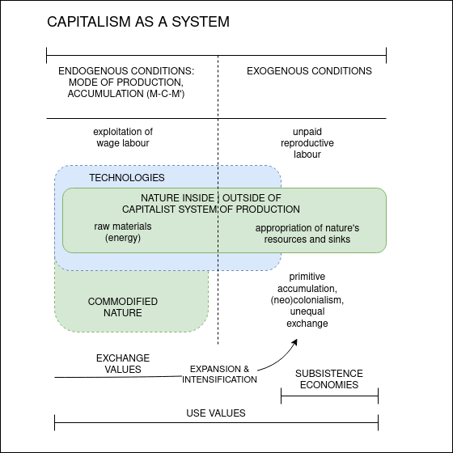

# Working-class environmentalism — environmental agency of an industrial trade union

\minitoc

## Introduction: conflicting environmentalisms

In this chapter, I am continuing with my exploration of the "middle-ground" actors and their respective varieties of environmentalism. In the previous chapter, I have discussed degrowth as a movement and a disruptive reframing of environmental action that approaches the planetary environmental crisis with rigorous scientific realism. Degrowth is advocating that affluent societies throttle down their demand for energy and matter and redistribute social wealth domestically and internationally. This would open paths to social metabolisms whose environmental impacts are brought back within the limits of planetary boundaries and allow all societies to achieve environmentally safe and just futures in the destabilised "full world" [@daly_economics_2005].

However, degrowth's proposition is frequently viewed, even by its proponents, as a political hard-sell: the transition it envisions would require a voluntary limitation of impactful processes and thus a radical transformation of patterns of production and provision that shape the everyday realities in affluent societies. Its critics on the left, notably the Marxist geographer Matthew Huber [-@huber_ecological_2019], fault degrowth's vision as negative and incapable of popular mobilisation — because the working class in the affluent capitalist countries has over the last four decades been subjected to a depression of wages, unemployment, and austerity, leaving it in a growing need for more of the material wealth that their increasingly unequal societies have accumulated to the few.

While degrowth advocates have placed the redistribution of social wealth front and centre, according to Huber it is the concentration on the excesses of consumption and the virtues of subsistence economies — in short, on middle-class "lifestyle" and minoritarian "livelihood" environmentalism — that make it inadequate in addressing how the planetary ecological crisis impacts the lives of the majority of the global population whose subsistence is dependent on selling their labour in exchange for wages to buy commodities.[^7.1]

With this criticism in mind, in this chapter, I am shifting the focus to working-class environmentalism. Borrowing the notion, in fact, from the degrowth scholars Stefania Barca and Emmanuele Leonardi [-@barca_working-class_2018], I want to contend that *the two sites of environmentalism — social movements and the working class — are in the present conjuncture in need of a unitary analysis of struggle against the tradition that regards them as separate forms of struggle located in distinct social spheres — inside and outside of the sphere of capitalist production*. This chapter works toward that goal.

The environmental movement started to coalesce into its present form in the late 1960s and the 1970s as a critique of industrial society and its depredations on nature. It joined a tide of emerging social justice struggles against patriarchy, racism, and imperialism. Disenchanted with the waning militancy of organised labour, the failure of the industrial working class to build a larger opposition to capitalism, and the inability to transcend the gendered, racialised, and imperial forms of domination that persisted inside and outside of the factory, the new left shifted its interest from the tradition of working-class organising toward a movement of movements inclusive of a variety of struggles: feminist, anti-racist, anti-imperialist, indigenous, environmental, and, now on equal footing, labour. André Gorz, who coined the notion of degrowth, argued at the time that the desire for socialism oriented toward growth-based middle-class social patterns is "the continuation of capitalism by other means" and that the ecological struggles have to remain separate for as long as the radical left has not embraced ecological principles [@gorz_ecology_1980, 13]. The conflicts over polluting industrial activities have frequently pitted environmentalists against the material interests of workers whose jobs depend on polluting industries.

And yet, while the environmental movement — and increasingly the mainstream of environmental science — see it as necessary to radically transform the existing capitalist societies, for Huber [-@huber_ecological_2019] both the movement and the scientists fail to grapple with the fact that system change "requires a confrontation with some of the wealthiest and most powerful sectors of capital in world history"  and that this momentous task necessarily involves the working class. In fact, the last half a century of post-working-class environmentalism has seen "a massive shift of power toward the capitalist class" (28), while failing to do enough to prevent the accelerating planetary ecological destabilisation.

Contra Huber, one could contend that the problem is that working-class organisations were not capable of preventing that power shift either and that today the most militant elements of environmental organising are far removed from the workplace. They are, on the one hand, spearheaded by grassroots protest movements such as Extinction Rebellion and youth-led Fridays for Future; and, on the other, directed by campaigns aimed at the chokepoints of extractivist infrastructures such as Ende Gelände or NoDAPL, frequently led by indigenous land protectors. Furthermore, with the rout of the Labour Party in the 2019 UK parliamentary elections and the defeat of Bernie Sanders in the 2020 US presidential primaries, the working-class-oriented Green New Deal (GND) politics has suffered significant setbacks. This defeat has again ceded the terrain to the proponents of green capitalism that are pushing for flexible, least-cost technology-first approaches while insisting on safeguarding economic growth and largely disregarding the environmental impacts beyond greenhouse gas emissions. While trade unions have a venerable history of environmental agency, for reasons related to the crisis of trade unionism, which I will discuss in this chapter, they came to climate action relatively late. Now with the waning fortunes of the political forces backing GNDs, they will have to re-orient themselves and find new alliances with, amongst others, environmental movements if they do not want to cede the terrain to the market-driven technological restructuring that portends another weakening of the working class and trade unionism. Toward the conclusion of this chapter (section 7.5), I will grapple with the strategic outlook of working-class environmentalism in the wake of these events.

But before I arrive there, at the centre of this chapter will be my case study of Unite the Union (section 7.4). In the early autumn of 2019, I conducted interviews with the representatives of Unite, planning to undertake in the ensuing months an exchange and collaboration within its internal environmental working bodies and discussions. The onset of the COVID-19 pandemic has disrupted this plan. At the same time, the convergence of the Labour defeat, Brexit, and the pandemic in the span of a mere year has significantly complicated the discussion of any future-oriented action for a trade union whose membership is through the convergence of these three factors facing significant uncertainties in the near-term. For these conjunctural reasons, the empirical evidence I will include will have limited scope. Instead, in an acknowledgement of these interceding developments, this chapter will bracket my case study of Unite as a "middle-ground" organisation with, on the one hand, a discussion of the environmental vulnerability of the working class (section 7.2), the structural underpinnings of the disruptive power of working-class environmentalism (section 7.3), and a future-oriented speculative reflection on the opportunities it can seize on in the present conjuncture (section 7.5).

I have chosen to analyse Unite, as a large industrial trade union in an affluent country of the European capitalist centre, for three principal reasons:

Firstly, Unite represents workers in some of the most polluting, difficult to transform or phase-out sectors such as coal mining, car manufacture, air transport, or agriculture. While it strictly acknowledges the necessity of urgent climate action, its groundedness in constituencies vulnerable to the sustainability transition implies that it navigates some of the hardest contradictions between the urgency of action and the long-term security of those workers and their communities.

Secondly, strongly in favour of tighter mitigation targets and coordinated government investments into innovation and just transition, trade unions such as Unite are ambivalently positioned toward the dominant ecological modernisation framing of climate governance. Sometimes they even advocate for technological solutions to create lifelines for existing industries, but are strongly rejecting market-driven solutions that shift the power over the transition into the hands of corporations.

Thirdly, Unite is affiliated to the UK Labour Party, allowing it to significantly impact the political terrain and help shift the framing of climate action while exposing itself to the pressures of progressive grassroots party-member initiatives such as Momentum [-@momentum_us_2021] and Labour for a Green New Deal [-@labour_for_a_gnd_who_2021] that work to impact trade unions' pro-environmental orientation.

By drawing on the analysis of the disruptive power of the organised labour and my engagement with Unite, I will claim that, as "middle-ground" organisations, *trade unions are responding to the market-driven technology-first policy approach with epistemic interventions that highlight the central distributive aspect of industrialised formal economies — that of stability and quality of waged employment*. Thus they are demanding a transition that preserves jobs and provides socialised security there where those jobs need to be phased out. On the terrain of policymaking, particularly in the corporatist contexts dominated by the tripartite social partnership, such as the UK, trade unions have the strategic position they can use to shift the dominant market logic of how governments approach climate action, but that shift is largely not away from growth or even productivity-enhancing technologies. The GND conjuncture has built partly on that frame-shifting capacity, aiming to depose the dominant market-driven approach and open space for a negotiation over different pro-environmental strategies.

Furthermore, judging from Unite's work on organising professional training programmes, *trade unions can empower workers through reskilling and the greening of their workplaces to not be destined to polluting jobs and potentially become agents of pro-environmental action themselves.* The restructuring of the workplace and working knowledge can potentially mobilise broad working-class constituencies into environmental action starting from their working lives. Finally, trade unions in many countries, including the UK, are limited in using the disruptive power of strike without a demonstrable dispute with the employer, making it difficult — even when there is willingness, as in the case of Global Climate Strike in 2021 — for them to act as a vector of disruption in mass organising. Thus they remain reliant on wildcat strikes and social movements for disruptions, expansion of the right to unionisation, and larger political mobilisations.

## Understanding working-class environmentalism

In defining working-class environmentalism and the strategic environmental agency of organised labour, it is useful to first flesh out the relations of society and nature as structured through capitalism. To do so would imply starting from the system of production. Why production? — Because, as I have argued, production is central to organising the metabolic exchange between a society and its environment, and thus it causally defines the patterns of social consumption as well. By combining human labour and technologies in certain ways, production processes structure the way capitalist societies appropriate nature's resources, transform them for human use, and disrupt their reproduction. However, not all of the planetary nature is included in capitalist processes. This requires us to specify that inside-outside boundary separating external from economically-integrated nature, the value of that external nature to capitalism, and how its destabilisation impacts capitalism. Given that the dynamic of capitalist accumulation is driven by cycles of expansion and crisis, the question is how the two types of crises — the economic and the environmental — are related and how they impact the lives of workers and their communities.

### Nature inside and outside of capitalism

Following Foster and Clarke [-@foster_robbery_2020, ch. 1], capitalism can be considered a system that has an internal structure and external conditions of reproduction (see *Figure 7.1*). The internal structure, or, in Marxian terms, its mode of production, is premised on the process of capital accumulation. The process starts with money being invested into labour and technologies in order to produce commodities. The value in this process is generated through the exploitation of workers, i.e., the use of their labour to produce commodities in excess of what is necessary to cover the cost of investment into labour and technologies. However, to generate a surplus, a capitalist enterprise has to sell more commodities than the workers, capitalists, and investors combined can buy from their past wages, profits, and interests. Thus, to prevent a crisis of aggregate demand and overproduction, the money to generate that surplus has to be borrowed from the future, and the process needs to continue growing in order to remain sustainable. This growth, however, can only be maintained through either the expansion or the intensification of the system: ever-greater geographies and ever-broader aspects of life have to be drawn into capitalist processes.

```{r echo=FALSE, fig.cap="Nature inside and outside capitalism and the processes of capitalist expansion and intensification into non-commodified social and natural domains.", fig.scap="Nature inside and outside of capitalism", out.width="100%"}


```

To keep expanding and intensifying, the system thus always needs an outside. There are at least three ways in which capitalism invades that non-capitalist outside:

* through the appropriation of the products of unwaged reproductive labour that takes care of biological, physical, and social reproduction of the workforce,
* through the appropriation of sources and sinks that are not yet included in capitalist relations and are the free gifts of nature,
* or the violent acts of enclosure and primitive accumulation, colonial plunder and slavery, or unequal exchange.

Thus, in opposition to the endogenous processes of the system's reproduction through economic accumulation stand the exogenous processes of its reproduction through accumulation by dispossession [@harvey_new_2003].

As *Figure 7.1* indicates, nature is not only on the outside. The extraction of raw materials that are needed in the production of commodities is itself a commodified production process. Primary commodities that are extracted through mining, drilling, fracking, and farming provide raw materials for sophisticated industrial processes. Among them of particular significance are fossil fuels. The enormous expansion and intensification of capitalist growth since the beginning of the 19th century were made possible by fossil-fuelled technologies, leading to the development of one of the most profitable sectors of the capitalist economy — fossil capital (see chapter 3).

The industrial transformation of raw materials, use of artificial fertilisers, forest clearing, and the burning of fossil fuels have produced pollution concentrated largely inside and around the place of production, leading to toxic workplaces and sooty towns. Yet after two centuries of growth, the indirect impacts have reached the planetary scale. Still, the effects that the production processes have on the inside and the outside of nature are different. The commodified inputs of nature that go into capitalist production are subject to economic rationality, and their use can be curbed by making — be that through protest, labour organising, regulation, or pricing — the pollution and harm to workers and communities expensive for companies. Conversely, the impacts on external nature accumulate over decades while the costs for societies are deferred a long time into the future. In particular, the depletion of natural sinks, such as the capacity of vegetation, soil, and oceans to absorb atmospheric carbon dioxide and warming, remains invisible for a long while. Capitalist production thus uses such free gifts of nature to externalise its detrimental effects. However, they cannot be externalised forever.

The significance of this dual position of nature — inside and outside of the capitalist relations — accounts for the historically dual sites of environmental organising: the workplace and the social movement. And while working-class environmentalism initially emerged localised around the workplace, today it is no longer so. As Huber [-@huber_ecological_2019] points out, the majority of the global population lives inside the capitalist commodity economy, and unlike the populations in the subsistence economies, they encounter nature — food, energy, matter, and environment — primarily mediated through the commodity-form. The processes inside the system of production are the structural drivers of anthropogenic ecological destabilisation. However, the effects of externalised disruption of nature, regardless of their delayed manifestation, necessarily return back to where they were produced. The problem, which Huber, speaking from the US, tends to underplay, is that it does so in a highly uneven fashion for the working-class communities across the globe, particularly as the polluting industries have become increasingly based outside of the Global North. Instead, as I will contend, *for the effects of the planetary ecological crisis to register as affecting the working class, the working class composition has to be considered from a global uneven and combined perspective.*

### Uneven and combined vulnerability of the working class

This chapter, with its focus on Unite and the GND, will be primarily discussing organised labour in the affluent countries of the capitalist core, but the majority of the global working-class is not living in those countries. Thus when discussing working-class environmentalism, we have to consider how a variegated and interdependent geography of ecological degradation affects the working class differently in a world where its sections are both connected and separated through a highly unequal yet combined global system of commodity production.

The first vector of the working-class vulnerability is resulting from the rise and the subsequent crisis of industrial development. The secular decline in the post-WWII capitalist growth generated by the dissemination of the industrial development model to Western Europe, Japan, South Korea, and then across the world, has by the 1970s led to the crisis of overproduction and profits in the Global North [@silver_forces_2003, ch. 2; @brenner_economics_2006]. This crisis was in the 1980s temporarily patched through a fiscal shakeup, followed by the massive relocation of manufacturing to China, the build-out of the logistical networks, and the ascendancy of information and communication technologies [@cowen_deadly_2014]. These parallel processes resulted in the de-industrialisation and the abandonment of large swaths of formerly industrial landscapes, leaving in its wake toxic ruins and ruined communities across former industrial belts and infrastructural hinterlands [@brenner_operational_2016; @neel_hinterland_2018]. *The de-development of industrial urban centres and extractive hinterlands has combined with a withdrawal of social safety nets and a growing inequality, reducing the capacity to bear the cost of and adapt to wildfires, droughts, and heatwaves resulting from climate change.* These processes, I contend, define the principal characteristics of the working-class vulnerability in what was once known as the "First" and the "Second Worlds".

The second vector of working-class vulnerability affects the parts of the world that Christian Parenti has pithily named the *Tropic of Chaos* [-@parenti_tropic_2012]. *These are the sacrificial zones of the planetary mid-latitudes where the colonial conquest and post-colonial wars over the last centuries have crippled the countries from pursuing the pattern of Northern industrial development while at the same time undermining the resilience of native communities facing rapid changes to their habitats due to environmental destabilisation.* In those countries the stressors such as droughts, floods, land grab, and forest clearing are driving the internal migration, creating slums across growing megalopolises, pushing a small segment of that displaced surplus population to desperately attempt crossing deadly land and sea borders in the direction of affluent countries northwards in order to secure their own survival and the survival of their families. And yet, while the migration regimes of the Global North have changed over the last half a century, leading to the criminalisation of cross-border migration, their economies have welcomed this illegal migration to continue to exploit cheap labour, particularly in low-paying sectors such as farming. This border geography of criminalised yet encouraged illegal migration sustains the agricultural sectors in the south of the US and southern Europe, although it is also present in many other places where migrant populations offer a cheap reserve army of labour.

The third vector of vulnerability comes from the destabilisation of external nature. The last four decades have seen a two- to three-fold increase in zoonosis – leaps of pathogens from animals to humans [@berger_man_2020]. Degraded ecosystems, with their complexity reduced to benefit the monocropping and industrial farming of animals, have a lowered inherent capacity to halt the spread of epidemics among the wild species [@wallace_dead_2020]. Therefore ecosystem destabilisation is expected to spawn incidences of zoonosis at an increasing rate. The health of humans, livestock, and wildlife is connected through the stability of ecosystems. The historical processes of extraction of natural resources, reduction of complexity in habitats, and exploitation of labour in the present need to be viewed, as epidemiologist Rob Wallace [-@wallace_dead_2020] proposes, in terms of relational geographies of circuits of global capital where, for instance, pig farming in China is financed by the likes of Goldman Sachs and cattle farming in Amazon by the likes of Blackrock. The zoonotic leaps are intensifying in the interface zones in wild forests, but their structural drivers and social effects are primarily elsewhere.

In the pandemic, the working class across the globe has experienced a radical loss of security. Massive threat to health and life has been accompanied by massive furloughs. The lockdowns have revealed the fundamental dependence of societies on "essential services". The frontline workers in health and elderly care, in cleaning and agriculture, or in transport, whose work is mostly invisible, devalued, and precarious, had no choice but to continue to go to work not to lose employment and income. As these low-paid "sacrificial" workers — working-class people, overwhelmingly women, migrants, and people of colour — could not afford to lose their income, their communities were impacted the hardest by the pandemic. The disease has largely remained on their side of the class, gender and race divide. At the same time, those who could shelter in place have experienced a rapid digitisation of most aspects of their everyday lives [@graziano_care_2020]. The pandemic has thus catalysed a situation where the planetary environmental degradation has returned back to the sender through the global variegated and interdependent geography: *from the global centres of the capitalist system of production — to the interface zones between the internal and external natures — back to the highly unequal urban landscapes and abandoned migrant populations. A complex yet unitary crisis for the global working class.*

### Two environmentalisms, one struggle?

Now, the question is how the terrain to act on that accelerating uneven and combined crisis is then structured from the perspective of the working class's strategic agency.

In the 1980s, the Marxist ecologist James O'Connor posited that the capitalist mode of production is characterised by two kinds of crises, two structural contradictions, and two paths that can lead out of those contradictions [@oconnor_capitalism_1988]. The first contradiction is the traditional Marxian contradiction between the forces and relations of production, resulting in cyclical crises of aggregate demand and overproduction, which can spill over into debt crises. These crises are resolved either through a restructuring of the forces of production — by means of the international division of labour and labour-substituting technologies — or through a restructuring of the relations of production — with greater state interventions into the markets and more planning. In O'Connor's view, both restructuring tendencies lead to greater socialisation of production and pre-conditions for the transition to socialism. But these are just pre-conditions, not an immanent tendency — more flexible capitalism is just as likely an option. And indeed, the neoliberal period has seen a restructuring of the forces of production that has led to greater global integration of production processes while resulting in social decomposition and worsening conditions for parts of the ever-larger global working class.

The second contradiction is between the capitalist system of production (wherein the first contradiction unfolds) and the general pre-conditions of this system in the form of human labour and external nature, which are produced and reproduced outside of the capitalist system of production yet appropriated by it. As capital expands, appropriating human labour and external nature without investing enough resources into reproducing them, it degrades them and creates crises of underproduction of its own pre-conditions. However, environmental and social degradation exerts risings costs on society, leading to the formation of social movements that struggle to force the capital to pay for those costs. *The reproduction of these pre-conditions is regulated by the state and is hence ideologically and politically determined, fought over in a struggle between the "political power of capital" and the "political power of social movements" — thus on the "middle ground".* While these concerns cut across class lines, "problems of the natural and social environments are bigger problems from the standpoint of the poor, including the working poor, than for the salariat and the well-to-do. In other words, issues pertaining to production conditions are class issues, even though they are also more than class issues, which becomes immediately obvious when we ask who opposes popular struggles around conditions? The answer is, typically, capital..." [@oconnor_capitalism_1988, 37].

From there, I would argue that while the perspective of the social movements might not be a class-based perspective, and in fact, there is a legacy of disagreements between the labour and social movements, effectively the working class faces both crisis tendencies — in the factory and in the community. As they scale, they become a single crisis of the capitalist system and a single crisis for the working class, which is affected both *as a result of the degradation of working conditions and the degradation of living conditions, creating a solid foundation for the two environmentalisms to intersect and act together*. O'Connor conjectures that over half of the total social product in the 1980s might be going into protecting and restoring pre-conditions of production and that capital shifts these unproductive expenditures to the credit system and fiscal sphere, deferring them into the future and passing them on to the state — with redistributive risks for the working class, citizens and poorer nations.

## Strategic environmental agency of the working class

In the previous sections, I have outlined how the capitalist system of production drives the planetary ecological crisis and the exposure of the working class to various dimensions of that crisis: in the workplace, in their community, in the international division of labour, and through the ecosystem destabilisation. In the second part of this chapter, I will explore the working class's strategic agency in the changing political terrain of environmental action. Firstly, I will situate in historical and structural terms the working class's capacity to collectively act and change the trajectory of social development. From there, I will narrow my focus specifically on the environmental agency of trade unions as organisations of the working class, teasing out the faultlines that shape their orientation in the environmental action arena. Finally, I will concretise and complicate such analytical framing by discussing the climate policy and environmental activities of Unite, the largest industrial trade union in the UK.

In the final part of this chapter, I will then proceed to reassess the strategic terrain for the working-class's environmental action in the present conjuncture marked by the political defeats of progressive green new deal forces and the potential failure of the technology-first strategies.

### Working class' collective agency and social change

As I argued in chapter 4, the capacity of social actors to transform the structures of a society they live in is constrained and enabled by the interaction with other social forces through the institutional ensembles of the state and the capitalist economy. Their power is fundamentally relational, structured, and strategic. The relative power of various social actors is conditioned by the selectivities of those institutions and their own material and ideational resources they can draw on from other structures. These selectivities are predisposed toward actions that reproduce existing structures, but once their conditions of reproduction are in crisis, a larger strategic terrain opens up, allowing structural change. That relational agency in structure can be concretised through the working class's collective capacity to use the material and ideational resources it has attained in the workplace to disrupt and instigate larger social change.

The modern capitalist state, with its attendant political system, has co-evolved and is thus interdependent with the capitalist economic system. To achieve these integrational goals, the state wields coercive mechanisms of law and violence, as well as non-coercive mechanisms of ideology, civil rights, or welfare. These mechanisms have their own evolutionary trajectories, thus making certain aspects of the political terrain partly autonomous from the economic system. However, their relative autonomy implies that, inversely, significant aspects of the political terrain are directly entangled with the economic system. The most salient being those that define the relations of production: private property, limitations on intervention into the economy, and the labour market.

The strategic power of the working class emerges there where the political and the economic interact most tightly. The ascendancy of industrial capitalism, employing an army of labour attending to increasingly complex machinery, created a mass basis of workers who, by dint of their numbers and their skills, could pool together material resources and use their indispensability to the production process to organise, set demands, and, ultimately, withdraw their labour. *The concentration and specialisation of industrial workers created prerequisites for the exercise of "power from below"* that the political scientist Francis Fox Piven [-@piven_can_2008] has also analysed as interdependent or disruptive power. As discussed in chapter 3, the introduction of coal as a primary energy source created chokepoints along the extraction and transport lines that allowed miners and railway workers to disrupt key nodes in the expanding system of industrial production and thus set demands that led to gains in labour, social, and democratic rights in 19th century Britain [@mitchell_carbon_2011]. That disruptive power of industrial labour had structural effects on the development of capitalist societies at large.

The sociologist Adaner Usmani's cross-country analyses of the changing historical patterns of employment suggest the trajectory and scope of that power [@usmani_rise_2017]. Comparing the employment structure data he has assembled for a number of countries dating back to the 19th century, Usmani has demonstrated that the relative size of the workforce employed in manufacturing, mining, construction, and transport, measured against the workforce employed in agricultural, services, commerce, and other occupations, is a structural indicator of the working class's disruptive capacity. When defined in those terms, the disruptive capacity is strongly correlated with both the levels of unionisation [@usmani_fortunes_2020] and the levels of democratisation and equality in societies [@usmani_democracy_2018]. In fact, social and democratic gaps in late-developing economies turn out to be strongly correlated with the low levels of unionisation, while the low levels of unionisation turn out to be strongly correlated with the late start and early peaking of industrial development. Finally, the fall in unionisation turns out to be strongly correlated with the de-industrialisation in the high-income economies over the last fifty years. These findings indicate that capitalist development, with its large-scale and capacity-enhancing industries, has created pre-conditions for a growing disruptive power of the working class, enabling it to achieve democratic and social gains in the countries that have industrialised early.

*Unlike the elite theories of power that see the strategic terrain of institutions dominated by the political and economic elites, the theories of non-elite power or power from below highlight the capacity of disruption — the collective breaking of rules and the withdrawal from interdependent relations in complex institutional setups.* Here power is relational, strategic, and distributive, grounded in the combination of heterogeneous interests and interpretations in institutional ensembles of modern society. The central, material aspect in a distributive conflict is the capacity to threaten cost on the opposing side. To be able to level a significant "disruption cost" [@mcalevey_no_2016] on a more powerful corporate or political actor — that is, to be able to withdraw labour, risking wagelessness and unemployment, or cripple infrastructure — requires mass organising that can pool together collective resources and communal solidarity to buffer those risks. That solidarity needs prior organising, consciousness-building, and community work. And that was the principal historical achievement of the working class organising into trade unions.

### Trade unionism and environmental action

However, over the last half a century, in many high-income countries, union membership has fallen off the cliff. While the unionisation levels have always varied significantly between OECD countries, with the process of de-industrialisation and tertiarisation, large-scale industrial armies have been reduced in size and deskilled between the 1970s and 1990s [@troy_us_1990]. The restructuring was driven by the changing market forces and relations of production [@silver_forces_2003]. The rising costs of wages, social protections, and environmental regulations achieved by labour militancy, accompanied by a profit squeeze resulting from growing international competition, resulted in a backlash of anti-labour actions and policies promulgated by the governments of that period. Probably the most prominent has been the war waged on the National Union of Miners by the Thatcher government over the closure of collieries in 1984-1985, which eventually resulted in the obliteration of the 200.000 worker-strong UK mining sector. Arguably, the early exit from the then nationalised coal allowed the UK to become an early leader in decarbonisation. However, the defeat of organised labour led to the subsequent economic and social plight of entire regions of the UK that is felt to this day. As they were taught a lesson through that history, the potential of another restructuring of the fossil-fuelled industries as part of the current transition is justifiably perceived by trade unions as a matter of some risk — both for the rights of the workers and for trade unions' own capacity to organise. Jobs in well-unionised and high-skilled sectors such as power generation, car manufacture, and aviation sectors are on the line, whereas green jobs concentrated primarily in the construction, agroforestry, conservation, and the emerging green tech sectors present a challenge to achieve the same level of quantity, quality, and unionisation.

The developments in the 1980s have put trade unions between a rock and a hard place. By the 1990s, the embattled situation narrowed the scope of trade-union activity to prioritise job, wage, and workplace protections. While the neoliberal retrenchment was rolling back the collective gains in labour and social rights, the trade unions' disruptive power seemed on the decline. The narrow focus of business unionism conflicted with the understanding that a renewal of trade unions' capacity to pull in an increasingly fragmented workforce and to struggle to maintain larger social protections for labour requires them to expand their work to communities and build out social movement unionism. That need for renewal, married with the growing climate change consensus, motivated the trade-union movement to become involved in the global environmental arena and to start creating alliances to prevent that climate action results in a detrimental impact on the working class [@snell_unions_2010, 413]. However, as international trade-union structures started to integrate climate action into their strategies, e.g, the International Trade-Union Congress adopted in 2010 a resolution on "combating climate change through sustainable development and just transition", *trade unions remained caught in a dilemma whether to retard changes or to push for changes in a specific direction. In that conflicted situation, the strategic choices of individual trade unions aligned largely based on two factors: their strategic orientation toward social, market, or class actors and the expected distributive effects of environmental action.*

Richard Hyman proposed to view the historical orientations of trade unions along three tangents: social partnership with the state and the employers, bargaining oriented toward private employers, or class-based antagonism [@hyman_understanding_2001]. While corporatist capitalist economies tend to favour the first and liberal capitalist economies the latter two, the strategies most trade unions pursue are varying degrees of all three. In response to climate change, trade unions have largely tended to follow a similar pattern of strategies. They were aligning more with the social-democratic politics that aims for continued growth with a socially managed technological restructuring, or more with the neoliberal politics that stresses multi-stakeholdership and norm-setting for equitable participation in the market-driven transition, or more with the class-oriented and socialist politics that is sometimes critical of the technologies and productivism and sees the radicality of crisis requiring a transformation of the relations and the purposes of production based on the socialisation of production and re-orientation towards social needs [@hampton_trade_2018; @felli_alternative_2014].

To complicate the terrain, effective climate action seems to be largely defined by distributive conflicts and not by consensual collective action [@aklin_prisoners_2020]. Climate action commitments in some countries have proven to be effective regardless of the fact that other countries have reneged on international agreements. The temporary exit of the US from the Paris Agreement has not deterred other nations from pursuing strong commitments. The reason for this is that pro-climate action forces have prevailed over the interests of the anti-climate action forces. The implication is that certain economic sectors and workers in those sectors within those countries are bound to end up on the losing end of the climate action — and that is determined on the political terrain. Environmental politics, therefore, sometimes cuts orthogonally to the left-right and capital-working class divides [@mildenberger_carbon_2020], hence progressive environmental policies require strong redistributional social policies [@bergquist_combining_2020]. Trade unions with large constituencies bound to end up on the losing end of climate action, as the example of Unite will show, can embrace progressive environmental positions and actions primarily if such redistributional policies are in place.

### The workplace and the community

The environmental action of trade unions frequently has to navigate those conflicting orientations and alignments. Still, as discussed earlier, working-class organisations can and have long acted on environmental issues both inside and outside of the workplace. In the 1960s, a number of large US industrial trade unions started to amplify concerns of their rank-and-file over occupational health and safety hazards in the mines and factories [@gordon_shell_1998]. They played a notable role in the passing of water and air pollution legislation in the early 1970s. A groundbreaking industrial action over workplace pollution took place in 1973 against Shell, as the Oil, Chemical and Atomic Workers' Union (OCAW) led a strike and a boycott that was joined by a number of prominent environmentalist groups, including the Sierra Club, which entered the campaign aiming, amongst others, to foster trust with labour organisations. The campaign led the president of OCAW Al Grospiron to state: "Organised Labor must emphatically support environmental cleanup efforts and must never get into the position of opposing such efforts on the grounds of economic hardship... Our position must be that nearly all polluting facilities can be corrected without hardships to the workers and that in those few cases where corrections are not possible new job opportunities or compensation must be provided for the workers." [cited in: @gordon_shell_1998, 460]

This was an early formulation of a *just transition* principle. The OCAW took to operationalising that principle into a strategy in the 1990s by developing a proposal for a "Superfund for the Workers", which would use a part of federal funds allocated to the environmental cleanup to finance the retraining of workers displaced by the environmental regulation. This was an effective instrument to advocate a strong green industrial policy aimed at shifting production to less toxic processes and products while providing occupational reskilling and social safety for the workers and their communities [@stevis_global_2015, 2]. However, such policies, which also included universal healthcare and the founding of a socialist party (thus, in many respects precursors to the present new green new dealism of democratic socialists), promoted by the OCAW throughout the 1980s and 1990s, fell on deaf ears. This was already the period of a steep decline in its membership, eviscerating the strategic capacity of OCAW to carry out those plans. Just transition proposals were thus left by the wayside only to return in the second half of the 2000s, first internationalised through the work of Sustainlabour - International Labour Foundation for Sustainable Development founded in 2004 by Spanish trade unionists, and then diffused through the International Trade Union Congress and introduced in the UNFCCC Conference of Parties documents in 2010. This time, however, less as an effect of workplace militancy and more as a result of the combination of *a strategy for trade-union renewal and a strategy to avert the detrimental effects of climate action on the working class*.

For as much as the unionisation and disruptive capacity seem to have waned from their heyday, trade unions still continue to be the largest non-religious membership-based civil society organisations. For instance, the UK Trades Union Congress has around 5.5 million members, whereas the International Trade Union Confederation has over 200 million members in 163 countries. That is a significant basis that could oppose climate action if conducted unfairly, but also a significant disruptive power to achieve decarbonisation on just and sustainable terms. To fully appreciate the potential reach of that disruptive power, I would suggest that it is important to consider the interdependence of the worker and the community, as well as the capacity of working-class organisations to mobilise beyond the workplace. The labour scholar and activist Jane McAlevey's influential *whole worker model* suggests that a successful industrial action has to overcome the hurdle of organising the majority of workers in a workplace, but the disruptive power grows so much stronger if the workers organise with the support of their communities [@mcalevey_no_2016]. Thus, a key tactic in a labour dispute for workers is the ability to mobilise other members of their community, either individually or through organisations in the community — religious, cultural, environmental. What matters to workers is not only wage and workplace conditions but the wellbeing of the community they live in. In turn, what matters to the community is the wellbeing of workers who are part of it.[^7.2]

It is not surprising that the struggles McAlevey analyses have largely been organised in the public sector in professions dominated by the care labour of women. The growing fragmentation and precarity of the working class are resulting in a growing societal crisis of reproductive labour and care [@fraser_contradictions_2016; @huws_reinventing_2020]. This contradiction, *amid high levels of commodity overproduction contrasted with high levels of societal and environmental underproduction — O'Connor's double crisis — can be resolved through a fundamental reallocation and revalorisation of labour.* This calls for a major shift in how production is organised and what it produces, following degrowth's proposals — a shift from material to relational goods and a care economy, but also for weakening the centrality of competitive labour market in social integration. The reduction of working hours, more equitable distribution of care labour, and guaranteed basic services could be just some of the approaches.

## Unite the Union

However, trade unions' environmentalism starts from the existing labour relations, technological base, and social metabolism. To understand both how their positions and actions reflect the distributive conflicts and the political, economic, and technological realities of that terrain, I will profile the strategies of Unite, a large industrial trade union in a country of the capitalist centre, with a significant part of its rank-and-file employed across polluting industries. This profile is based on an analysis of primary documents published by Unite, interviews conducted with its Director of Education Jim Mowatt and its Research Officer Colin Potter, and secondary publications.

### Introducing Unite

Unite is the UK's largest industrial trade union, comparable in size to the UK's largest public-sector trade union Unison. It currently represents around 1.4 million workers from over twenty sectors, including aerospace, shipbuilding, and car manufacturing, chemical, cement, and steel industries, civil air transport, freight and logistics sectors, energy and utilities, engineering and construction, as well as agriculture. However, it is not exclusively oriented toward private industrial sectors, as its membership also counts workers in health, postal, and local government sectors. Unite was formed in 2008 through the merger of the Transport and General Workers Union and the Amicus union, and was subsequently joined by a number of other unions, including the Union of Construction, Allied Trades and Technicians. According to Unite's head of education, Jim Mowatt, the unions that merged into Unite had in the early 1980s a combined membership of 6.8 million. In my interview with Mowatt, as the primary reason for the membership decline he cites the changes in employment patterns due to the offshoring of manufacturing, technological change, and the replacement of old, unionised sectors with new, non-unionised sectors. Fragmented and smaller workplaces made it harder to unionise. Nonetheless, over the last couple of years, Unite has been successful in slowly growing its membership by around 200.000 [@unite_the_union_community_].

Unite self-defines as an open, diverse, and democratic trade union, focusing on workplace bargaining, industrial action, and public campaigning while being a progressive force for a fairer society [@unite_the_union_vision_]. The three complementary aspects of Unite's work are international alliances, education, and political representation. On the international front, Unite is pursuing trade-union alliances, advocacy work, and campaigns to advance international solidarity, joint collective bargaining with common employers, and struggles against cuts in pensions, social services, and labour rights. To this end, with its US counterpart United Steelworkers, it has formed a global trade union Workers Uniting [@unite_the_union_workers_]. On the educational front, it maintains two training centres, organising annually around 12.000 accredited courses both for union representatives and occupational training. Importantly, this includes environmental representatives and occupational training for climate jobs. As tends to be the case with large, established, and hierarchical membership organisations, many aspects of its self-definition are contested: for instance, the never-ending tenure of the recently retired General Secretary Len McCluskey or the political affiliation to the UK Labour Party [@mcnally_big_2021; @sparrow_unite_2021]. On the other hand, such large organisations frequently contain a plurality of parallel structures that are built to complement the central mission of the organisation. In Unite's case, those can be evidenced in community organising such as through the Grenfell community organisation, which was formed before the tragic fire and was there ready to provide support to the survivors.

However, the affiliation to the UK Labour Party merits particular attention. The affiliation of trade unions to a single party is a peculiarity of the British political system. While these forms of affiliations do exist elsewhere, for instance between the French CGT and the French Communist Party, they are rare in industrialised economies, where trade unions tend to maintain distance from political parties, as they do not want to wed their interests to a political party's fortunes regardless of ideological affiliations. The affiliation of labour unions to the UK Labour Party, however, emerged historically, as the party "was formed out of the trade union movement to give working people their own political voice. The link from the workplace to the party through the affiliated trade unions is what makes it unique to this day" [@labour_party_affiliated_]. Unite maintains a separate Political Fund for political campaigning and assisting MPs, MEPs, and councillors to get elected. During McCluskey's tenure, it had a strong say in Labour's internal politics and policies. This nexus, as my interviewees attest, has enabled trade unions to secure historical gains on employment rights, safety, and welfare while continuously giving them a seat at the political table for the benefit of the working class. This has had significant implications also on the environmental front, as the radical green new deal and green industrial revolution policies that promised to take the UK to net-zero by 2030 were hammered out and pushed through into the 2019 Labour Manifesto owing to the joined effort of the grassroots organisers acting through Momentum, Labour for a Green New Deal, and progressive trade unions, including Unite. However, Unite's arguably biggest success in political lobbying was pushing the third runway at Heathrow through the parliament — an environmentally dubious decision [@mcnally_big_2021].

### Unite's environmentalism

Well before the 2019 Labour Manifesto, Unite has been actively articulating its own science-based climate policy and has been working with the UK Labour Party, public bodies such as Climate Change Committee, and industry bodies, advocating its own national-, sector-, and workplace-level proposals [cf. @unite_the_union_hope_2015; @unite_the_union_response_2019]. With a diverse constituency, Unite can draw on technical expertise and factory-level experience from various industries. Furthermore, it is collaborating with a number of academic institutions, including King's College in London and Edinburgh University, to research particular issues such as agricultural policy or workplace environmental safety. Unite's current position is encapsulated in its policy paper *Tackling Climate Change Crisis* [@unite_the_union_tackling_2019]. The principal concern of Unite's position is that if global warming has to be limited to 1.5°C, the required pace of decarbonisation cannot be achieved using flexible, least-cost market mechanisms, while the blind imposition of such mechanisms will necessarily have detrimental effects on workers and their communities.

The strategy to tackle climate change in Unite's view has three major planks: "a balanced energy policy, a just transition to a low carbon economy, and the growth of climate jobs" [@unite_the_union_tackling_2019, 5]. Let us quickly go through them as they are articulated in that position paper.

**A balanced energy policy:** A rapid phaseout of coal provided a low-hanging fruit for the initial decarbonisation of the UK's energy sector. It also left the workers and communities stranded, with no just transition plan by the government to help them out. The next phase of decarbonisation should not repeat that pattern. For the next phase, Unite envisions investments into new and old renewables, the build-out of a new generation of nuclear energy with small modular reactors, and, as a stop-gap, the retrofitting of the existing gas energy capacities with carbon capture, utilisation, and storage infrastructure to reduce their emissions. Unite is proposing that the government builds a national pipeline network to transport captured emissions and store them underground in abandoned oil wells, reducing the impact and extending the life of carbon-intensive manufacturing and energy generation [@unite_the_union_response_2019]. Mining is, as Colin Potter writes in his response to my interview questions, a "necessary evil", given that recycling does not provide enough materials [per @hickel_less_2021, the world's recycling rate was at 9.1% in 2018], while coal continues to be necessary to produce coke as feedstock in steel, glass, and chemical industries. To phase out coal feedstock in blast furnaces, it is necessary to first develop hydrogen as a secondary energy source. Hydrogen can currently be either produced through the expensive water electrolysis process powered by renewables ("green hydrogen") or through the cheaper burning and carbon capture from fossil fuels ("blue hydrogen"). Adding up to 20% hydrogen to natural gas could reduce by an equal amount the CO2 emissions in domestic heating. Unite's balanced energy policy is, thus, characterised by a gradual change of technologies, including the introduction of negative emissions technologies that make coal and gas cleaner and allow them to stay longer in use, giving more time to transition the workers in the coal mining and polluting parts of the energy sector to new, cleaner industries.

**Innovation and just transition:** Government needs to impose tight targets and steer the innovation in hard-to-decarbonise sectors [@unite_the_union_response_2019]. Aviation is projected to be the most difficult mode of transport to decarbonise, and it is reckoned that it will not be carbon-neutral before 2050 or even later. In Unite's view, aviation is essential for the UK, given its insular territorial position and the need to connect with world economies. Thus, Unite has joined the aerospace and air carriers consortium Sustainable Aviation that seeks to reduce emissions from air travel by means of designing more energy-efficient fleet and airport operations, producing alternative fuels from domestic waste and promulgating an industry-wide emissions offsetting scheme. However, these advancements require public investment in R&D. As do other industries that might be hurt by rapid decarbonisation, such as car manufacturing which is struggling to meet the goals of the internal combustion engine phaseout, or carbon-intensive metals, glass, ceramics, and paper industries. These industries need government support in R&D and reskilling to retain their internationally competitive position. In highly polluting industries that are facing phaseout, the government needs to secure retraining or new jobs there where the workers are based, protecting wage levels, labour conditions, and community welfare.

**Climate jobs:** Lastly, decarbonisation will create new jobs in construction, plant decommissioning, engineering, energy, and transport. That transformation would benefit from the on-shoring of production of steel and wind turbines, efficiency improvements to homes and factories, adding new jobs. As per the One Million Climate Jobs campaign, supported by Unite, by 2035 these measures would create an additional one million jobs while reducing emissions by 86% [@neale_one_2014; @jeffrey_climate_2021]. An important element in that strategy is the nationalisation of public transport, water, and energy sectors.

Beyond the policy and campaign work around climate change in the UK, Unite is also active on the international front, pushing for a managed energy transition as a part of the Trade Unions for Energy Democracy, an initiative advocating democratic management and public ownership of energy infrastructures. However, unlike TUED, Unite in its documents does not make a mention of distributed, community-led generation of energy that could be enabled through a nationalisation, localisation, or commoning of energy production, nor does it discuss the modernisation of the power grid necessary for such a transformation. Its strategy pivots around large-scale, commercial, and centralised energy production.

### Situating Unite's environmentalism

Viewed from the perspective of the Hymanian triangle of trade-union orientations toward the market, society, or class, *Unite is articulating its climate policies overtly in social-partnership, anti-neoliberal, state-led yet frequently technology-oriented terms*: "The UK must look beyond narrow 'market-based solutions' like carbon trading schemes or a simplistic target-driven approach and commit to working on a tripartite basis with trade unions and industry to devise a more effective strategy" [@unite_the_union_tackling_2019, 10]. The focus is on public investments into technological change and upskilling, a managed transition of workers from phased-out to new industries, and the re-nationalisation of large infrastructures. On the positions where Unite diverges from other progressive trade-union and environmentalist initiatives, such as advocating a balanced energy mix that includes nuclear energy, continued use of fossil fuels with carbon capture technologies, or on the continuation of open-pit mining and the extension of Heathrow, it does so, as both of my interviewees indicate, not only to protect the jobs of its constituencies but also for reasons that the social, economic, and technological realities of quick transition would inadvertently produce perverse environmental effects: limiting Heathrow expansion would move air traffic to other runways in the UK, increase taxiing time, and increase in-country flying, whereas phasing out coal mining would lead to less environmentally controlled imports to sustain feedstock needs. In Unite's view, investment in technologies such as carbon capture or the development of alternative fuels can significantly reduce the negative effects and extend the lifetime of polluting industries under terms that, for a period of time, can contribute to the Paris Agreement commitments.

As I pointed out in chapter 3, negative emissions technologies play a significant role in the national decarbonisation scenarios pledged under the Paris Agreement, allowing an overshoot in carbon emissions that can be later compensated for by these measures that are, for the time being, far from the maturity, investment, and scale required to fulfil that promise. And while Unite does not advocate direct air capture but rather capture in the controlled industrial processes, there is a lack of technological development, high deployment cost, and risks of leakage involved in capturing, transporting, and storing emissions [@anderson_trouble_2016; @moch_carbon_2022]. Similarly with aviation, as recently analysed by the political economists Gareth Dale and Josh Moos, strategies advocated by Sustainable Aviation are highly speculative and face significant biophysical and technological limitations [@dale_jet_2021]. Thus these solutions risk perverse environmental effects as well. Changes in corporate and collective behaviour such as greater recycling or caps on business travel, subsidising of land and sea travel, and longer holidays to account for slower travel might prove quicker in meeting the goals of rapid decarbonisation. However, *policies aimed at reducing demand, barring major climate-induced social disruptions, present an even greater challenge for policymakers to embrace than the targeted and just transition policies, although I would see them both as necessary given the urgency to prevent runaway climate change and biodiversity loss.*

Furthermore, investments in retrofitting the existing carbon-intensive industrial processes and infrastructures to reduce emissions might prove economically and environmentally too costly as they retard the transition to cleaner technologies that are getting cheaper. Retrofitting might end up being a sunk cost without the competitive advantage that new technologies bring. However, the dropping price of wind and solar might not be a boon for the working class unless the state coordinates a just transition and maximises the benefits for the workers from the transition. Unite had witnessed that first hand when the Danish wind turbine manufacturer Vestas closed its UK plants in 2009, at the very moment when the government was announcing its plans for a large-scale renewable build-out. In spite of a wildcat occupation at the Isle of Wight plant and joint protests of trade unions and environmental groups, Vestas laid off 465 workers citing planning regulations and NIMBY-ism that made manufacturing in the UK unsustainable. However, according to the trade-union scholar Paul Hampton [-@hampton_trade_2018], facing an "extremely anti-union" company, Unite grappled to adequately support workers' occupation, and for this was criticised by the activists as "business unionists and social partnership bureaucrats" (166). Therefore the workers of Vestas joined the more militant Rail, Maritime and Transport Workers union. As is characteristic of transport trade unions, including the International Transport Workers Union, RMT was a more radical, class-oriented, and socialist trade union [@felli_alternative_2014].

There is no doubt that Unite's orientation is strongly corporatist — particularly as it holds strong leverage over political actors. The Labour affiliation and calls for nationalisation give that corporatism a democratic socialist outlook, but, to state the obvious, in the Conservative-dominated period, that has its limits. Even so, the Vestas occupation unfolded during the New Labour tenure, and the calls for nationalisation were dismissed. In that situation, the wildcat militancy, with its temporality of confrontation, could have politicised the matter. But the short-lived militancy has to alternate with a strategy how to create arrangements that can sustain jobs at risk or provide alternatives to workers over the long run, which Unite is keen on developing. Therefore, no one orientation can do both on its own.

There are elements of social movement unionism in Unite's environmental work as well. For instance, Unite is building on the long-standing activities around health and safety, initiated in the late 1980s within the Trade Union Congress, to extend union representation in the workplace to environmental issues. These activities expanded the health and safety representation in the late 2000s, under the heading of *Green Workplaces* [@tuc_greening_2010; @hampton_trade_2018], to activities aimed at combating climate change by reducing the environmental impact of the workplace, generating "an unusually high level of engagement from both members and potential members" [@tuc_green_2008, 8]. Unite is not only pushing for such environmental representation but has, in fact, included environmental representation and just transition into all its training courses, empowering workers to act as subjects of ecological transformation.

If analysed from the framework of a "middle-ground" agency that I have developed in chapter 5, Unite can be viewed in three distinct ways. Its political affiliation with Labour, its active participation in national policy consultation processes, and the stances it takes on climate action and just transition in public, position it as an epistemic actor within framing struggles. Unite can use its institutional leverage and its mass constituency to push the government and policymakers to move away from the dominant market logic toward a redistributive-democratic logic and to regard distributive concerns over job security and transitioning of workers to new climate jobs as central to sociotechnical change. Secondly, through its active participation in industry bodies such as Sustainable Aviation and the advocacy of innovations in carbon-intensive industries, it is partnering with industries vulnerable to decarbonisation policies seeking to help them transition, thus actively impacting the direction of sociotechnical transition. Thirdly, through its professional training programmes, it empowers workers through reskilling and the greening of their workplaces to not be destined to polluting jobs and, at the same time, to become agents of transformation in their workplaces and communities.

To Unite's great merit, rather than resisting decarbonisation, it has embraced its objectives even for its constituencies in industries that risk being phased out or reduced in the process. It even backed and then worked to persuade other unions to stand behind the radical 2030 net-zero goal of the 2019 Labour Manifesto [@waugh_labour_2019]. *As an epistemic actor, however, it is forced to articulate and balance out often conflicting realities of job security against adequate and timely climate action.* Given that the just transition agenda is not receiving an outright acceptance within the governance arena, Unite has to bank on lifeline innovations and longer transition periods for polluting industries, even though this might work out against the interest of these industries and their workers as renewable and green technologies become cheaper and gain a competitive edge. Particularly, after the loss of the 2019 elections, the odds are stacked against the transition strategies focusing on equity and justice, weakening further the position of trade unions and workers in polluting industries. But, instead of withdrawing from politics and focusing primarily on workplace trade-unionism, as seems to be the predilection of Unite's new General Secretary Sharon Graham [-@graham_sharons_2021], *trade unions might in the post-GND moment need a renewed transformative vision, a re-orientation toward climate-vulnerable working-class communities, and a re-alignment with social movements to shift the terrain of environmental politics again to benefit its constituencies*.

## A challenging future ahead of working-class environmentalism

In this chapter, I have argued that the two environmentalisms — working-class environmentalism and social-movement environmentalism — are structured around the dual position of nature in capitalism. Resources that are extracted, processed, and integrated through human labour and technology into the system of commodified production constitute the nature internal to capitalism. Conversely, ecosystems serve as a sink into which that system can offload its heat, waste, and pollution; it is an external nature that the system can appropriate as a free gift in the process of expansion and intensification. Both of these aspects make this external nature a condition of possibility for capital accumulation. The growing degradation of external nature has destabilising effects on communities and entire societies. Given that the reproduction of external nature historically has not been a direct cost to the process of production, these destabilising effects had and still have to be addressed on the political terrain of the state — where the working class, social movements, and scientists struggle with capital and policymakers over the internalisation of social and environmental costs of that degradation. Therefore, from the thriving global cities to the de-industrialised hinterlands of the Global North, from the sacrificial environmental stress zones in the "Tropic of Chaos" to the migrant landscapes of slums in metropolises of the Global South and routes that lead northwards, environmental conflicts are inter- and intra-societal distributive conflicts over who gets to thrive and who gets to bear the cost of environmental destabilisation.

The working class's strategic capacity to contest social domination and ecological degradation on that terrain roots in its collective disruptive power that emerged in the context of mass industrialisation and has historically allowed the working class to make significant gains in labour, social, and democratic rights beyond the narrow remit of the workplace. Accordingly, the growing environmental degradation in the industrial economies in the 1960s and 1970s transformed working-class organisations into environmental actors concerned with a range of vulnerabilities from occupational health hazards to pollution affecting their communities. However, the ensuing period of neoliberal restructuring saw manufacturing relocate to countries with fewer environmental protections and a less organised labour, while the automation, tertiarisation, and emergence of new, non-unionised sectors, decimated trade union membership, forcing unions to drop the environmental concerns over more pressing issues — only to return to them as the debates around climate change and just transition gained momentum in the aftermath of the 2008 global financial crisis.

That watershed moment of 2008, marked by a convergence of jobless recovery and the growing evidence of climate change, birthed in the US and across Europe a configuration of progressive social forces and progressive environmental proposals that coalesced around the idea of a green new deal. Around the same time, in the wake of the Copenhagen COP15 meeting's failure to achieve binding commitments to emissions reductions, groups of indigenous peoples, campesinos, and climate justice activists from around the world descended on Cochabamba, Bolivia for World People's Conference on Climate Change [-@world_peoples_conference_on_climate_change_rights_2010] to forge a radical pluriversal environmental vision declaring equal rights of all beings and Mother Earth. These two transformative visions would shape the next decade of progressive environmental politics, garnering the support of democratic socialist political candidates and governments of the Pink Tide, respectively. However, fast forward ten years, with the electoral routs of democratic socialists in the US and the UK, and the economic realities and coups that befell the Pink Tide governments in South America, the new decade seems to have overturned the momentum of progressive environmentalism. In this concluding section, I will analyse some of the implications for the future working-class environmental strategies from the present conjuncture, characterised by a reconsolidation of market-driven technology-first strategies and the growing gap of climate change mitigation that they are resulting in.

### The waning prospects of a managed transition

GND proposals, as initially formulated by the European Greens [-@european_greens_manifesto_2009] and a decade later by the UK Labour Party [-@the_labour_party_manifesto_2019], US presidential candidate Bernie Sanders [-@sanders_green_2019], congresswoman Alexandra Octavio-Cortez [-@ocasio-cortez_text_2019], Diem25 [-@diem25_green_2019], and many others, called for a transition that would be actively managed by governments and not left to the markets. While these proposals varied in fine print, their central tenet was an expansionary public spending programme aimed at greening the economy and infrastructure while at the same time creating quality jobs and addressing consequences of growing inequality. Modelled on the 1930s New Deal, they wedded public works, social programmes, and just transition to ambitious climate goals and ecosystem restoration. Measures such as job guarantee [@tcherneva_job_2018], public housing, healthcare, and education, or levies on fossil fuel companies for their past emissions were radical for the existing policy context as they were, but the more radical proposals also included nationalisation of rail and energy networks and the redefinition of green jobs to include socially and ecologically reproductive care-labour [@aronoff_planet_2019]. Some included substantive commitments to internationalism, anti-extractivism, climate justice, and support for political sovereignty in the Global South [@ajl_peoples_2021]. Others placed indigenous and migrant struggles front and centre [@the_red_nation_red_2021].

GND thus spawned a plethora of more or less radical comprehensive proposals for social transformation that were faulted by sympathetic critics for their unrealistic techno-optimist assumptions, green growthism, and throwback welfarism [@beuret_green_2019; @kallis_green_2019; @bernes_devil_2019]. Yet, by virtue of their heterogeneity, they effectively created an opening, a "new terrain of politics", where mobilisations could happen around a rough consensus, while disagreements and solutions could be hashed out later [@riofrancos_plan_2019]. *Green new dealism included the participation of many actors in the "middle ground" — environmental groups, trade unions, political factions, and even technologists — organising diverse social constituencies around different re-interpretations and re-compositions of what constitutes a democratic and just sociotechnical and sociometabolic transition.* In many of its articulations, GND portended a strong, reflexive ecological modernisation, an ecological restructuring not only of technologies but also of institutions and provisioning systems of the modern state [@christoff_ecological_1996]. The effervescence around GND proposals was made possible by their political-strategic character: the assumption that a truly progressive environmental policy necessitates a progressive social policy for the many, that sustainability depended on equity and justice. The hope was that this could create a virtuous cycle — bold social policies would bring in the votes of the working-class and frontline communities for progressive candidates, who would, in turn, make their livelihoods and planetary environment better. That virtuous cycle would make those communities vote again for progressives allowing them to continue with their bold commitments. However, that virtuous cycle for the GND and its proponents, including Unite, did not pan out: the UK Labour Party under Jeremy Corbyn lost the 2019 parliamentary elections and Bernie Sanders failed to win the 2020 Democratic primaries.

Despite the electoral defeats of GND proponents, environmental politics is becoming hegemonic. The European Union passed an ambitious Green Deal (with no *New* in the mix, implying very limited social spending), promising to make Europe the first carbon-neutral continent by 2050. Joe Biden took on board many GND elements while renewing the commitment of the US to become carbon-neutral by 2050 as well, backing that promise with a historic programme of federal spending amounting to US$1.7 trillion of investments over the next five years (although only one fifth from what is deemed necessary to achieve carbon neutrality, cf. @kaufman_biden_2021). Even Boris Johnson conjured an anaemic green industrial revolution ten-point plan. However, the reality is that none of those foresees a managed, government-led transition combined with a significant redistribution. These are primarily investments incentivising technology change, financial mechanisms, and markets to deliver climate goals, with no clear commitment to phasing out subsidies and fossil fuels. That strategy is gradualist yet riskier for stabilising the climate. Unless the spigots of investment are turned off on fossil fuel industries expediently, investing in cleantech will hardly get the world to carbon neutrality quickly enough to keep global warming under 2°C, let alone 1.5°C [@niklas_even_2021]. Over the last decade, despite the enormous expansion of renewables, the share of fossil fuels in final energy demand has remained constant at around 85%, with renewables contributing only 25% of the 60 exaJoules of new demand [@ren21_five_2021]. The growth in renewables is thus barely outpacing the growth of energy demand (indicating that the growing demand might be the problem). Even once the speed of replacement of fossil fuels by renewables gains pace, that will not be adequate and timely. In fact, if one looks at the COVID-19 recovery packages, investments to salvage the fossil-fuel industry remained larger than investments into cleantech [@ren21_renewables_2021], with the International Energy Agency expecting oil demand swiftly to surpass the pre-pandemic levels and calling on the producers to "open the taps" — only a month after it had called for ending all new fossil-fuel exploration [@raval_oil_2021]. The plans abound, yet hard commitments are in short supply.

For working-class organising, however, this reliance on technologies, financial mechanisms, and markets spells great uncertainty. Unionisation in emerging sectors is harder than in existing sectors, and that is nowhere more evident than in Big Tech, which has a long history of resisting unionisation. Trade unions fear that this might obtain for Green Tech as well, although a 2020 study of 3.3 million workers in the clean energy sector in the US established that wages, benefits, and unionisation are actually slightly better than in the oil, natural gas, and coal sectors [@e2_acore_celi_clean_2020]. Furthermore, with the transition to renewables, large segments of the skilled workforce will necessarily lose employment and take significant pay cuts [@ferris_oil_2020]. Absent just transition provisions and incentives for unionising in Green Tech sectors, trade unions will remain wary of the fossil-fuel phaseout.

That strategy, however, might not work to the benefit of workers in the long run. Given that the prices of energy from renewables are beating out all other sources, the transition in the energy sector, even at market-pace, will be accelerating as other sectors electrify. There is no escaping electrification, and the temporality of transition is working against those who are resisting. What I want to put forward for consideration is that for trade unions, the priority therefore might not be resisting the transition to clean technologies. Rather, it might be mobilising the disruptive power of their rank-and-file to push political decision-makers to lower barriers to unionisation in general and thus strengthen trade unions' strategic power for organising workers in new sectors. And to push governments to hammer out just transition plans that could allow trade unions to take an active role in the reskilling of their rank-and-file and include trade unions in the development of new publicly and community-owned sustainable infrastructures guaranteeing good jobs. In the medium term, both might prove to be more conducive to working-class interests than resisting technological transition. Not doing the utmost to accelerate targeted instead of flexible decarbonisation policies at the inadequate pace dictated by the market spirits is, in the long run, a hazard for the working class. Acting now is better than acting later.

### Commoning the transition technologies

The second shift in trade-union strategies moving ahead might concern the issue of ownership. Traditionally, the public sector has much higher levels of unionisation and workplace protections. Trade unions are well aware of that, and that is a large part of the reason why they have been rooting for government-coordinated transitions, or even, in some cases, such as Unite's, advocating the nationalisation of infrastructures. The build-out of public and municipal infrastructural systems is not off the table even in the post-GND era. However, as I want to outline here, there is a more radical approach to ownership that trade unions should not shy away from, and that is the involvement of communities and citizens in such build-out. The combination of public and common ownership might work better, as it both empowers the users who need a service and the workers who produce a service. For instance, distributed citizen, co-operative, or — as IPE's warnings of risks of cooperativism indicate, particularly — public municipal electricity generation, embedded into national public grids and public regulation, could have potentially very different outcomes than the concentrated electricity generation and distribution owned by for-profit corporations. *With the expertise they are building internally and with their rank and file, trade unions can act as enablers of communal and municipal electricity generation, advocating that electricity be treated as a public good* — rooted in the needs of communities to have access to clean, affordable, and guaranteed energy while securing unionisation [@dawson_peoples_2020].

There is a history of trade unions acting as enablers for the benefit of their communities once they broaden the scope of their bargaining beyond workplace disputes. As nurses and teachers' strikes in the US over the last years have demonstrated, they can bring to the bargaining table concerns over the wellbeing of their communities and "bargain for the common good" [@caputo-pearl_there_2019]. Addressing the wellbeing of a community in a bargaining process is obviously easier in the educational and healthcare sectors than in manufacturing, as education and healthcare have human wellbeing at their centre, and care-receivers are directly affected by the wellbeing of caregivers. Nonetheless, most labour is, as David Graeber insisted, "the work we do ... on each other" — the work of mutual creation and caring, which the working class does a disproportionate share of yet receives little recognition for [@graeber_caring_2014]. While that work "on each other" might not be direct for most economic activities, but rather work mediated through a complex system of production, most of which is shaped by the priorities of the market and capital accumulation, the collective wellbeing and metabolism of society with nature depends on the transformation of such work. It thus, for instance, matters whether technologists choose or refuse to develop technologies that drive ecological degradation, overproduction of goods, militarisation, or surveillance. Similarly, large industrial trade unions can advance the necessary know-how to impact technological development, as Unite does with sustainable aviation. To benefit communities and ecosystems, however, that vision of technoscience has to avoid cyclical short-termism of technological development and pivot toward the longer-term perspectives and temporalities of social and ecological systems [@puig_de_la_bellacasa_matters_2017, ch. 5], toward technologies that foreground stability of social and ecological tapestry over disruption, that are geared toward maintaining, repairing, and restoring the social and ecological interdependence, that see the economy as dependent on society, and society as dependent on nature [@raworth_doughnut_2017]. Large industrial trade unions such as Unite can act, with the composition of their various technical expertises, as epistemic actors to support communities and municipalities in co-developing sustainable infrastructures in energy, transport and agriculture, thus creating a virtuous cycle between jobs and the democratic climate action of communities.

The question of ownership concerns not only who owns the infrastructural and technological systems but also extends to the process of innovation. What I want to argue is that the trade unions can act as actors in the process of technological innovation as well, directly impacting the regulatory requirements vis-à-vis the issues such as health hazards and pollution. They can also shape the attitudes of their members towards technologies and their social effects, thus indirectly impacting the development, deployment, and adoption of certain technologies. Consequently, that agency in the process of technological innovation, which is mostly underdeveloped and unused, begs the question of their stance on intellectual property and technology transfer. The development of COVID-19 vaccines has, *ex negativo*, demonstrated the import of open innovation. The close-patented innovation process in developing COVID-19 vaccines has resulted in difficulties to produce vaccines at scale: many vaccine producers struggled to advance quickly enough in their development and would have benefitted from the sharing of discoveries and patents. On the other hand, once the first vaccines were out, vaccine plants that had no licence to produce stood idle as those that did struggled to produce enough. This has been a boon for the bottom line of those who were successful in developing the vaccines first: they have both benefitted from public investment into vaccine development and from advance orders while being allowed to keep their profits private and their patents closed. Ultimately, this model of technological development has resulted in a slower rollout of vaccines with a negative effect on the global population in general and the working class in particular, as large segments of the working class had no choice but to go to work and thus remained the most exposed to the infection.[^7.3] Obviously, workers at successful pharmaceuticals that have been the first to deliver vaccines might be benefitting from the boon as well, but the workers elsewhere are not, and that is why, I would argue, trade unions should see open innovation as a necessity to maximise the use of technologies for the global working-class.

### Solidarity and internationalism

However, expecting trade unions to act as a strategic force with a view toward long-term transformation and with the wellbeing of community and ecosystems in mind, is a tall order for the embattled reality these organisations face. *While they have a capacious expertise-building and mobilising power, trade unions need a capacious support to be able to continue acting, as I have argued for, in the political arena outside the workplace. A support that can help them win guarantees for the working class so that they are able to reasonably focus on the long-term interests of their members*. This requires other environmental actors to build that framework of support. The GND has provided such a framework where different "middle-ground" organisations met each other halfway. With that framework having lost its political momentum, the onus is again on social movements and progressive political forces to forge a framework of joint action and of proposals that would foster greater security for the working class, create avenues for international solidarity in green transition, and thus ease the environmental resolve of trade unions.

How can that be done for the workforce that is being displaced from an old into a new sector? With Big Tech and its priorities becoming increasingly entwined with the emerging Green Tech (in energy generation, car manufacturing, urban sustainability), struggles over Green Tech for equitable labour and livable ecological futures might benefit from learning how social movements have aided working-class organising in the Big Tech sector. If there was one agenda to start, I would argue that it would have to be the lowering of barriers to unionisation and greater statutory labour protections. The defeats of unionisation efforts in 2021 at Amazon.com in Alabama or legislative proposals to secure employment benefits for gig workers in California indicate that technology companies will do their utmost to prevent workers from organising and gaining strategic power. Obviously, these are particular defeats that might not obtain across the globe, yet with technological sectors, they tend to set the expectations on other regulatory contexts.[^7.4] Thus, what I want to put forward is that some of the transnational social-movement organising in support of unionisation in the Big Tech might blaze a trail for struggles in the environmental arena. For example, the Transnational Social Strike Platform, with its Amazon Workers International campaign, has been mobilising and coordinating workers at fulfilment centres in Poland, Germany, France, Italy, and the US, successfully organising transnational strikes against Amazon.com [@tss_transnational_2020]. Emerged from alter-globalisation struggles in the 1990s, at the centre of their activities for years had been precarious migrant workers and logistical supply chains. Thus they were well poised to tackle a logistical behemoth employing an army of underpaid labourers.

On the other hand, there are social movements helping the working-class organising and changing the regulatory context closer to environmental issues. An illuminating example is Sezonieri [-@sezonieri_campaign_2020], a cultural activist-led campaign for the rights of seasonal migrant workers in agriculture in Austria, initiated in collaboration with the trade union PRO-GE. As part of its policy to close the borders, Austria, like most European countries, has illegalised and policed migrants, and this, in turn, has led to shortages of exploitable labour. In the midst of the pandemic, Austria has therefore had to organise a special fly-in visa regime for workers from Eastern European countries so that they can pick its veggies. Sezonieri have seized on this moment to assist migrant workers in putting onto the political agenda a list of demands — for higher wages, better sanitary conditions, and compensation for health risks, as well as for the abolition of nativist and anti-migrant discourses, the decriminalisation of migration, and the creation of a more just and sustainable system of food production.

However, struggles over green transition cannot remain limited to the Global North. Organising solidarity along logistical supply chains and routes of migration throws sand in the gears of global unequal exchange that extracts labour and resources cheaply from the poorer nations [@hornborg_global_2012]. Around 40% of global shipping cargo are fossil fuels [@unctad_review_2020]. The mining of minerals needed for Green Tech is a new extractivist frontier centred on Latin America [@riofrancos_resource_2020]. It is pitting the emerging Green Tech, international mining corporations, indigenous communities, and governments of the Global South against each other in a complex struggle where the priorities of climate action, conservation of ecosystems and right to non-imperial modes of living come into conflict [@brand_imperial_2021]. Rapid decarbonisation will require troves of solidarity along logistical supply chains, accompanied by support for self-determination of peoples and climate debt payments for past emissions [@ajl_peoples_2021], unless climate action is to become a continuation of neocolonialism and militarism. Decarbonisation strictly through technological change will be pushing against the limits of extractable minerals and will have adverse effects on communities and ecosystems, so decarbonisation (as well as societies) might benefit from limiting demand for energy and changing patterns of provisioning for social needs [@hickel_limits_2019]. There might not be enough minerals readily available to replace all internal combustion engine cars, but there might be enough for a robust system of public transport. International solidarity thus works both ways — it reduces the downward pressure on wages created by the unequal exchange, benefitting the workers in the more affluent nations to set demands, but requires them to make their own societies more sustainable in ways that do not rely on easy fixes. That is, however, a complex equation, one that trade unions might not be able to contribute to without a larger social and political mobilisation.

[^7.1]: As discussed in section 5.6, the majority of the global population living in urban settlements depends to some degree on the commodity economy, as does a large segment of the global population living in the countryside.

[^7.2]: This is evident in some of the largest labour disputes over the last decade in the US, some of which McAlevey has taken part in organising, which were successfully fought by teachers and nurses. They were able to mobilise parents and patients into their disputes by articulating them as struggles for better education and medical care in their communities. McAlevey, a former environmental organiser herself, is highly critical of liberal strategies aimed at achieving social change, which start from calling on external experts to do advocacy on behalf of workers or professional organisers to mobilise workers into a conflict to swing the opinion of the decision-makers, businesses, and media. A maximum power to achieve social change starts from organising the oppressed to be the agents of change.

[^7.3]: In addition, as the closed-patented messenger RNA technologies will form the basis of future precision medicines [@martin_mrna_2020], the private, venture-capitalised model of development will continue to have a negative impact on equitable access to healthcare and medicines, impacting, specifically, the working class and the poor across societies.

[^7.4]: As I am doing final edits in May of 2022, the workers at the Amazon warehouse in New York have won a watershed vote for union representation.
